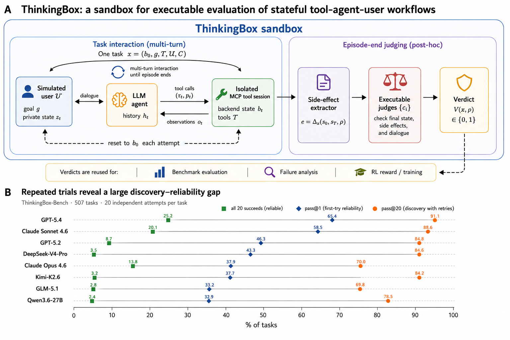
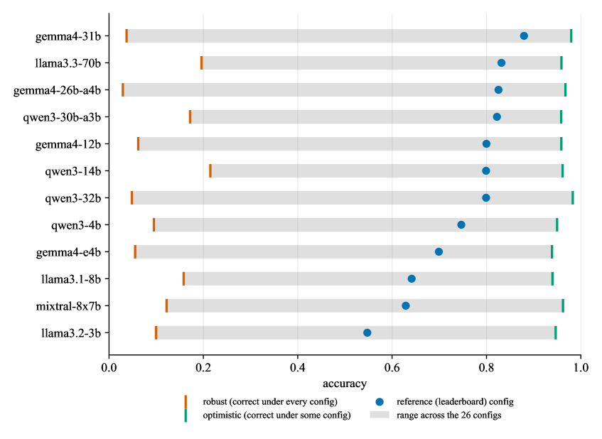
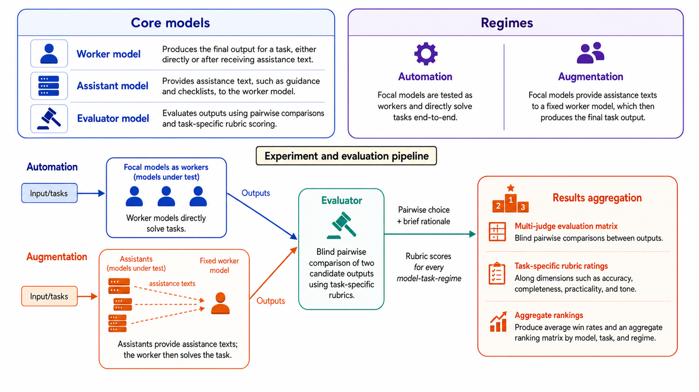
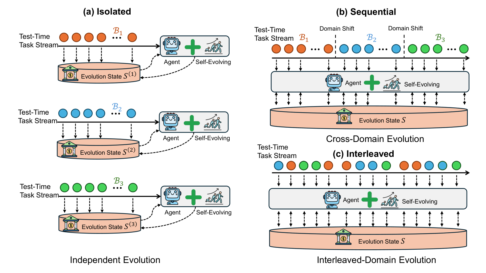

# エージェント評価 研究トレンド（2026年8月）

> 対象：[evaluation](../../capabilities/trust/evaluation.md) の 2026年8月論文（15本）。主要論文は arXiv HTML 本文を読み、背景・考察・限界まで踏まえてまとめた。

## 先月からの差分

[7月](../jul_2026/evaluation_trends.md)は「評価スコアは傷みやすい知識である」という反省が中心だった。8月はその反省が2つの具体的な形をとった。

一つは**測る対象の作り直し**だ。研究者が選んだタスクではなく、市場で実際に使われている製品のワークフロー（StartupBench）、本番プラットフォームの実セッション（DuMateBench）、方針つきの業務手順（Thinkingbox）、20年分の経営判断（FM-Bench）——実世界の仕事の形をそのまま持ち込むベンチマークが一斉に出た。

もう一つ、そしてより重いのが**測定器そのものへの疑い**だ。There Is No Neutral Harness はリーダーボードの順位がハーネス設定で入れ替わることを項目単位で示し、Jagged Judges は LLM 判定者が押し返しに遭うと 25〜71% の割合で判定を翻すこと、しかも**翻った判定はほぼ常に正解から遠ざかる**ことを示した。CentaurBench は「自動化がうまいモデル」と「他者を補助するのがうまいモデル」の順位が別物だと示し、AgentStream は自己進化の改善幅が分離評価で誇張されることを示した。

共通するのは、**モデル単体のスコアという単位が壊れている**という認識だ。測定結果はモデルとハーネスと役割と評価者の合成であり、そのどれを固定するかで順位が変わる。

> ※数値はモデルとデータの条件を添えて記す。1本の論文だけの結果は末尾に「要追試」としてまとめた。

## 3行サマリ

- 「一度成功した」と「毎回成功する」の差が主要な指標になった。Thinkingbox は GPT-5.4 の pass@1 65.36% に対し pass^20 が 25.25%——同じタスクの20回すべて成功は4分の1しかない。
- 測定器そのものが疑われ始めた。ハーネス設定が順位を作り（There Is No Neutral Harness）、判定者は押し返しで翻り（Jagged Judges）、評価の並べ方で自己進化の効果が変わる（AgentStream）。
- ベンチマークが実世界の仕事に寄った。StartupBench・DuMateBench・Thinkingbox・Business Arena・FM-Bench が揃って、市場や本番運用に由来するタスクを持ち込み、最強のモデルでも3割前後という厳しい数字を出した。

## クロス論文で見るトレンド

**継続する傾向（過去号からの延長）**

- 実行可能な環境に評価を接地する流れは[7月](../jul_2026/evaluation_trends.md)から続く。8月の違いは、環境の出どころが**研究者の設計から本番運用のログへ**移ったことだ（DuMateBench は本番プラットフォームの匿名化済み実セッションを復元し、StartupBench は採用実績のある AI プロダクトのワークフローから起こしている）。
- 長期タスクの評価も継続。FM-Bench と Business Arena がともに「遅れて効いてくる結果」「相手が適応してくる市場」を組み込んだ。

**今月明確になった点（複数論文で裏付け）**

1. **信頼性は成功率とは別の量である。** Thinkingbox は pass@1 と pass^20（20回すべて成功）を並べ、65.36% 対 25.25% という差を「発見と信頼性のギャップ」と名づけた。安全性号の PolicyGuide も Pass⁴ を主指標に据え、0.42→0.62 の改善を報告する。DuMateBench は厳密なタスク完了で見ると大きな隔たりが残ると報告する。**平均成功率で報告する慣行が、実運用の判断材料として不十分だ**という認識が3本で共有された。
2. **測定は「モデル×ハーネス」の合成である。** There Is No Neutral Harness は選択式ベンチマークで、どれも正当な26設定のもとで 12モデル中4つが1位になれることを示した。DuMateBench は環境の乱れ（情報不足・不安定・雑音）を注入した実験で、成績が **LLM の能力とその周りのフレームワークの両方で決まる**と結論する。StartupBench は「統一したエージェントハーネスのもとで」評価したと明記し、[8月ハーネス号](harness_trends.md)の HarnessOpt-Bench は「最適化者のモデル差のほうが、それが使うコーディングハーネスの差より大きい」と報告する。モデル単体を測っているつもりの数字が、実は合成の産物だという指摘が4本で重なった。
3. **判定者が信用できないという証拠が積み上がった。** Jagged Judges は9つのフロンティアモデル・14の判定タスクで、静的な押し返しに対して 25〜71%、敵対的な説得者に対して 62〜91% の割合で判定が翻ることを示し、しかも**翻った判定はほぼ常に正解から遠ざかる**とした。ハーネス号で扱った「ラベルなしで学習ハーネスを評価する」研究も、同程度の強さのモデル同士では LLM-as-judge が使える信号を出さないと報告している。CentaurBench は判定者パネルを使いつつ、判定者間の一致率が 71% にとどまることを限界として明記する。
4. **評価の並べ方が結果を変える。** AgentStream は同じ自己進化手法を、ベンチマークごとに分離して評価する場合、順番に流す場合、混ぜて流す場合で比べた。改善の平均は分離で +1.37%、逐次 +0.75%、交互 +0.90%。改善が正になる割合も 75.7% 対 62.3% と落ちる。GPT-5.4 に至っては全条件で負（−0.35〜−0.78%）だった。**自己進化の報告値は分離評価という条件に依存している**という指摘だ。FM-Bench も同じことを時間軸で示していて、5年目時点の順位と最終順位の相関は 0.19、20年目で 0.78——短い評価なら別の勝者が出る。
5. **「何がうまいか」は役割によって変わる。** CentaurBench は、モデルが単独で解く（自動化）場合と、弱いモデルを助言で助ける（補助）場合の順位を比べた。相関は ρ=0.48（p=0.187）にとどまり、7タスク中5つで勝者が入れ替わる。極端な例では Claude-Opus-4.8 が市場分析の自動化で平均順位 2.05 なのに、補助では 8.15。さらに、助言なしの GPT-3.5-Turbo が3タスクで1位になった——**助言が害になることがある**。

**単発だがインパクトの大きい結果（裏付けは弱め・要追試）**

- Business Arena は15のフロンティアモデルの最終純資産に9倍の開きがあり、最良のモデルでも人間が設計した戦略に届かないと報告した。実データ（Alibaba.com の調達データ）に接地した長期の商取引環境という設計は説得力があるが、1つのシミュレータでの結果である。
- FM-Bench は「トークン消費量は成績を予測しない」（ρ=−0.19）と報告し、代わりに終盤の投資判断・遊休資金の比率・契約更新の先手といった経営行動が成績と相関するとした。長期評価で「考える量」ではなく「行動の型」が効くという主張は面白いが、サッカークラブ経営という1ドメイン・3シードでの結果だ。

## 数字で見るインパクト

| 論文 | 数字 | 初見の読み方 |
|---|---|---|
| Thinkingbox | GPT-5.4：pass@1 65.36% に対し pass^20 25.25%（507タスク・各20試行） | 「一度は解ける」タスクの3分の2のうち、「20回すべて解ける」のは4分の1だけ。運用で使えるかの判断はこちらの数字で行うべき |
| Thinkingbox | 失敗の 77.5% がツール使用の誤り、12.1% が状態更新の誤り、7.9% が要望の取りこぼし | 応答やツール呼び出しが表面上は正しくても、永続する状態が違っている |
| Thinkingbox | ドメイン差：小売 約52% 対 自動車保険 約23%（pass@1 平均） | 同じ「業務ワークフロー」でも倍以上の開き。単一スコアでまとめる意味が薄い |
| Jagged Judges | 静的な押し返しで判定が 25〜71% 反転、敵対的な説得者相手では 62〜91% | 評価インフラそのものが揺れる。判定を主張で覆せる |
| Jagged Judges | 判定を変える圧力は、正解に対してほぼ常に有害 | 「議論して考え直した」のではなく「押されて崩れた」 |
| CentaurBench | 自動化と補助の順位相関 ρ=0.48（p=0.187）、7タスク中5つで勝者が交代 | モデル選定の答えが用途で変わる。リーダーボード1位を選べばよい、ではない |
| CentaurBench | 助言なしの GPT-3.5-Turbo が3タスクで1位、全体でも4位相当 | 助言は平均すると害になりうる。10モデル中1つしか無助言に勝てない |
| There Is No Neutral Harness | 12モデル中4つがどこかの設定で1位、隣接モデル差の 95.7% が設定で答えが変わる問題由来 | 選択式リーダーボードの順位はハーネス設定の産物 |
| AgentStream | 進化の平均改善：分離 +1.37% → 逐次 +0.75% / 交互 +0.90%、GPT-5.4 は全条件で負（−0.35〜−0.78%） | 自己進化の効果は「ベンチマークごとに分けて測る」条件で膨らむ |
| StartupBench | 最強モデルでも完遂は約30% | 市場が実際に金を払っている仕事は、まだ7割が完遂できない。部分的な進捗は多い |
| Business Arena | 15モデルの最終純資産に9倍の差、最良でも人間設計戦略に届かず | モデル間の差が大きく、天井はまだ人間側にある |
| FM-Bench | 5年目時点の順位相関 0.19 → 20年目 0.78 | 評価期間を縮めると別の勝者が出る。長期能力は短期では測れない |
| FM-Bench | トークン消費と成績は無相関（ρ=−0.19）、価格発見に中央値30回の提示（理想は1.0） | 「たくさん考える」ことは長期の成績を説明しない。数百回断られても市場の隠れ価格を学べていない |
| FM-Bench | 記憶運用：追記のみ（前後の類似度 0.91）も毎回書き直し（0.20）も失敗、勝者は 0.39 | 自己管理の記憶には「捨てすぎ」と「溜めすぎ」の両方の失敗モードがある |
| DuMateBench | 200タスク・8シナリオ、環境に情報不足／不安定／雑音を注入 | 本番の乱れを再現すると、厳密な完了率に大きな隔たりが残る |
| Tangent | 手作業で分類した 2,572 のテストメソッド（240モジュール）から 23 のテストパターン | 実務のテストは狭いユニットテスト中心で、複雑な相互作用も非機能要件もほぼ覆っていない |

## 論文紹介

### ① 一度の成功は信頼性ではない

[One Success Isn't Reliability: Thinkingbox, a Sandbox and Benchmark for Agents in Stateful Business Workflows](https://arxiv.org/abs/2608.19741)

コード以外の重要な仕事をこなすには、もっともらしい応答や妥当なツール呼び出しでは足りない——足りない情報を複数ターンかけて集め、ドメインの方針に従い、依存するツールを順序立てて呼び、**余計な副作用なしに正しい永続状態の遷移を実現する**必要がある。Thinkingbox は、模擬ユーザーと、隔離された MCP 互換のツールセッションと、タスクごとの実行可能な検証器を組み合わせたサンドボックスでこれを測る。各タスクは初期のバックエンド状態、ユーザーの目標、使えるツール、方針の制約、そして実行可能な検査の集合を指定する。副作用を抽出し、正しい軌跡は受け入れつつ、誤った・欠けた・余計な作用は弾く。

507タスク（小売、旅行・宿泊、自動車保険、ネット銀行の社内IT、コンサルの IT/HR サポート）を12システムで各20回。GPT-5.4 が pass@1 で 65.36% を出すが、pass^20 では 25.25% に落ちる。著者はこれを「発見と信頼性のギャップ」と呼ぶ。失敗の内訳は、ツール使用の誤りが 77.5%、状態更新の誤りが 12.1%、ユーザーの要望を解決しきれないものが 7.9%。**きれいに終了し、状態を変える操作も妥当に見えるのに、タスクとしては失敗している**試行が多いという指摘が重い。

限界も率直だ。507タスク中477はバックエンド状態しか見ないので、結果を誤って報告するケースを取りこぼしうる。模擬ユーザーは固定の1つ（GPT-5.4-mini）で、目標を途中で変えたり、協力を渋ったり、細部を忘れたりしない——別のユーザーモデルなら順位が変わる可能性がある。また、正解が一意に定まるケースだけを採用しているので、複数の妥当な解がある業務は除外されている。

> 図（Thinkingbox）：模擬ユーザー・エージェント・隔離されたツールの多ターンのやり取りを、最終的なバックエンド状態で検証する。右は pass@20 が pass^20 を大きく上回る様子。（[論文](https://arxiv.org/abs/2608.19741)）

### ② 測定器を疑う

[There Is No Neutral Harness](https://arxiv.org/abs/2608.21382)

選択式ベンチマークは問題と正解を固定するが、選択肢の並び順、プロンプトの書式、そして答えを生成テキストから読むか選択肢ごとの尤度から読むかは固定しない。この研究は、どれも正当と言える26設定のもとで12モデル×3,679問の正誤をすべて記録し、**感度がどの項目に落ちるか**を解いた。

結論は3つ。第一に、スコアは点ではなく帯になる（gemma4-31b で 0.31〜0.89）。第二に、隣り合うモデルが両方とも設定に左右されない問題だけで比べると 11組中5組が完全に同じ答えを出し、順位差の 95.7% は「設定で答えが変わる問題」が担っている。第三に、12モデル中4つがどこかの設定で1位になる。さらに、ベンチマーク圧縮が最大化する「識別力」と脆さが相関する（0.28）ので、**圧縮は脆い項目を残す**。提案は、帯での報告、ハーネス設定の完全開示、両者が安定している項目での比較。

> 図（There Is No Neutral Harness）：各モデルの正答率は点ではなく帯。左端が全設定で安定して正解できる範囲、右端が最も有利な設定でのスコア。（[論文](https://arxiv.org/abs/2608.21382)）

[Jagged Judges: Epistemic Stability Under Perturbation, Pressure, and Persistence](https://arxiv.org/abs/2608.12645)

LLM 判定者はモデル評価・オンライン採点・報酬モデルの中核インフラになったが、検証は正解データでの精度だけで行われてきた。精度は「再度尋ねられたら」「異議を唱えられたら」「押し返され続けたら」揺れないかについて何も語らない。この研究は判定者の頑健性を3つに分解する——再プロンプトや言い換えに対する機械的一貫性、一度の異議に対する確信、持続的あるいは適応的な圧力に対する持久力。

9つのフロンティアモデル・14の判定タスク（安全性、有害性、AI 生成文の検出、政治的応答の評価）で、**すべてのモデルが実質的に揺れた**。静的な押し返しで 25〜71%、敵対的な説得者を相手にすると 62〜91% の割合で判定が翻る。決定的なのは次の観察だ——**判定を変えることに成功した圧力は、正解に対してほぼ常に有害**だった。つまり翻意は熟慮の結果ではなく、崩壊である。どの項目が揺れるかを事前に予測する単発の信号としては、判定者集団の初期多数派の強さが最も有効だった。

[CentaurBench: Benchmarking LLM Capabilities on Augmenting vs. Automating Real-World Work Tasks](https://arxiv.org/abs/2608.18554)

「最良のプレイヤーが最良のコーチとは限らない」——人間のパフォーマンス研究からの引用が、この論文の主張を要約している。実務ではモデルは単独で解くより、他のエージェント（人間か弱いモデル）を助けることが多い。ならばモデル選定の問いは「どれが一番良い出力を作るか」だけでなく「どれが他者の仕事を一番良くするか」でもあるはずだ。

7つの職業タスク（カウンセリング、旅行計画、献立、確定申告、個別指導、オペレーションズ・リサーチ、市場分析）で、自動化モードでは対象モデルが直接解き、補助モードでは対象モデルが計画・構成・チェックリストといった手順寄りの助言テキストを書き、固定の作業者モデル（GPT-3.5-Turbo）が最終成果物を作る。判定は目隠しの一対比較で、タスク別のルーブリックを使う。

モデル単位の相関は ρ=0.48（p=0.187）。タスク別では −0.04（旅行）から 0.85（確定申告）まで開く。7タスク中5つで自動化の勝者と補助の勝者が違う。そして**助言なしの GPT-3.5-Turbo が3タスクで1位、全体でも4位相当**——10モデル中、平均して無助言に勝てたのは1つだけだった。限界として、判定者間の一致率が 71%、タスクが7つ、作業者モデルが固定、対話が1ターンのみ、が挙げられている。

> 図（CentaurBench）：自動化では対象モデルが直接解き、補助では助言テキストを固定の作業者モデルに渡して成果物を作らせる。どちらもルーブリック付きの一対比較で評価する。（[論文](https://arxiv.org/abs/2608.18554)）

[AgentStream: How Well Do Self-Evolving LLM Agents Perform Under Streaming Tasks?](https://arxiv.org/abs/2608.00155)

自己進化の研究はほぼすべて、ベンチマークごとに独立した評価で報告されてきた。しかし実運用のエージェントは多様なタスクの流れに晒される。AgentStream は同じ手法を3つの並べ方——ベンチマークごとに別インスタンスで進化させる分離、1つのエージェントが決まった順で処理する逐次、全ベンチマークのタスクを混ぜて流す交互——で比べた。5手法（ACE, A-Mem, ReasoningBank, AutoSkill, Harness）×3モデル×6ベンチマーク×3シード。

改善が正になる割合は分離 75.7% に対し逐次・交互とも 62.3%。平均改善は分離 +1.37%、逐次 +0.75%、交互 +0.90%。GPT-5.4 は全条件で負（−0.35〜−0.78%）で、Gemini 3.1 Pro が +2.37%、Claude Opus 4.7 が +1.23%。非単調なのが興味深く、中位のモデルのほうが最強のモデルより恩恵が大きい。手法ごとの傾向も分かれ、コンテキストに統合する手法（ACE, Harness）は分離を好み、検索型（ReasoningBank, AutoSkill, A-Mem）は選択的な取捨がドメイン間の干渉を抑えるので交互で強い。

> 図（AgentStream）：分離・逐次・交互の3つの流し方。進化の状態をどこまで持ち越すかが違う。（[論文](https://arxiv.org/abs/2608.00155)）

### ③ ベンチマークが実世界の仕事に寄る

[StartupBench](https://arxiv.org/abs/2608.17800)
研究者が選んだタスクではなく、**採用実績のある AI プロダクト**とその製品ワークフロー・ユーザーを systematic に調べて、AI に実需があると確認できた仕事を洗い出した。それを成果物志向の完結したタスクに翻訳し、複雑な要件を捉える細かいルーブリックで採点する。統一したエージェントハーネスのもとで代表的なモデルを評価すると、最強でも約30%しか完遂できない——ただし多くのタスクで部分的な進捗はかなりある。失敗の主因は複雑な指示への追従とドメイン固有の専門性だった。

[DuMateBench](https://arxiv.org/abs/2608.26546)
大規模な本番エージェントプラットフォームの匿名化・プライバシー審査済みユーザーセッションから復元したベンチマーク。各タスクは**解決前のやり取りの履歴、永続する設定、ワークスペースの状態**を保持したうえで人手検証される。200タスク・8シナリオ・17の細分化された能力カテゴリで、大半が複数能力の連携を要求する。隔離した Docker コンテナで、情報不足・不安定・雑音という3種類の現実の乱れを注入し、決定的な検査と LLM 判定のハイブリッドで評価する。5つのエージェントフレームワーク×4つのモデルで、厳密なタスク完了に大きな隔たりが残った。頑健性・効率・診断の分析からは、乱れの下での成績が **LLM の能力と周囲のフレームワークの両方で決まる**ことが示された。

[Business Arena](https://arxiv.org/abs/2608.08621)
越境ECの店舗を長期にわたって運営させる環境。Alibaba.com の実際の調達データと、公的な情報源から較正した市場条件に接地している。個々の判断は遅れて結果が出るうえ相互に絡むので単体では評価しづらいが、合算した利益なら測れる。ただし利益だけでは理由が分からないので、人間が設計した戦略と比べて「取れたはずの機会」を推定し、スキル単位の指標で強み弱みを出し、実現した損益をそれを生んだ行動まで遡る。15のフロンティアモデルで最終純資産に9倍の開き。**最良のモデルでも人間設計の戦略に届かない**。仕組みの切り分けによって、良い結果が手抜きやシミュレータ固有の抜け道ではなく本物の商才を反映していることを確認している。

[FM-Bench](https://arxiv.org/abs/2608.18423)
サッカークラブを20年（約340〜400の意思決定地点）経営させる。26のツールで選手を獲得し、契約を交渉し、施設と育成に投資し、布陣を決め、解任しうる役員会に応える。設計上の要求が4つ明示されている——隠れた選手能力（雑音の下での評価）、累積する結果（複数年の見返りと複利で効く損失）、逆適応する市場（提示を断られると価格が上がる）、多目的の圧力（成績と財務規律）。記憶はエージェント自身が書くノートだけで、各地点では会話が新規に始まる。

結果で最も示唆的なのは、**順位が最後まで決まらない**ことだ。5年目時点の順位と最終順位の相関は 0.19、20年目で 0.78。短い評価なら別の勝者が出る。トークン消費は成績を予測しない（ρ=−0.19）。代わりに終盤での見返りの遅い投資の抑制、遊休資金の比率、契約更新の先手が成績と相関した。価格発見には中央値30回の提示が必要で（理想は1回）、**数百回断られても市場の隠れた価格を学習できていない**。記憶運用の失敗も2方向で、追記だけの書庫（前後の類似度 0.91）と毎シーズン全面書き換え（0.20）はどちらも失敗し、勝者は 0.39 だった。

### ④ 実務のテストはどうなっているか

[Tangent: An Empirical Study of Testing Practices for LLM-Based Agent Applications](https://arxiv.org/abs/2608.08413)

ベンチマークの議論とは別に、実際にエージェントアプリケーションがどうテストされているかはほとんど調べられていない。この研究は公開プロジェクトを大量に採掘し、240モジュールから 2,572 のテストメソッドを手作業で分類して、テストの土台・データ・目的・表明にわたる23のパターンを導いた。加えて、エージェントシステムを構築している現場の上級実務者10名への構造化インタビューを行っている。

結果は厳しい。テストは**狭い範囲のユニットテストに支配され**、複雑な相互作用も現実的なシナリオも非機能要件もほとんど覆われていない。入力は単純、モックが多用され、検証は浅く、エージェント関連のテストは構造的な複雑さが低い。業界のほうが非機能テストを重視するが、両者に共通する欠落として、テストの形式的な土台の不在、目的の不明確さ、質の高いテストデータ生成の難しさが挙がった。ベンチマークが精緻になる一方で、実装現場の検証はまだ素朴だという対比が印象的だ。

## 論点・未解決課題

1. **信頼性指標の標準がまだない。** Thinkingbox は pass^20、PolicyGuide は Pass⁴、DuMateBench は厳密完了率を使う。どれも「毎回できるか」を測ろうとしているが、試行回数も判定基準も揃っていない。比較可能にするための合意が要る。
2. **判定者の脆さを、判定者を使う全ベンチマークにどう反映するか。** Jagged Judges が示した 25〜71% の翻意率は、LLM 判定を使う今月のベンチマーク（DuMateBench、CentaurBench、StartupBench のルーブリック採点）すべてに関わる。CentaurBench は判定者間一致率 71% を限界として明記したが、圧力下の安定性まで測った例はまだない。
3. **ハーネスの開示が実行型ベンチマークにも要るか。** There Is No Neutral Harness の結論は選択式で得られたものだが、DuMateBench と HarnessOpt-Bench は実行型でも同じ合成性が働くことを示唆する。StartupBench が「統一ハーネス」を明記したのは正しい方向だが、その統一ハーネス自体の選択が結果をどう動かすかは測られていない。
4. **評価期間と評価順序という新しい設計変数。** FM-Bench（5年 vs 20年で相関 0.19 → 0.78）と AgentStream（分離 vs 逐次・交互で改善幅が半減）は、時間軸と並べ方が結果を変えることを別々に示した。どちらもベンチマークの設計時に暗黙に決められている変数だ。
5. **ベンチマークの厳しさと実務の素朴さのギャップ。** StartupBench で3割、Business Arena で人間戦略に届かず、Thinkingbox の pass^20 が 25%——一方で Tangent が示す現場のテストは狭いユニットテスト中心である。研究側の評価が精緻になるほど、現場の検証との距離が開いている。

## 次に来るもの（Watch next）

- **帯での報告とハーネス開示。** There Is No Neutral Harness の提案が、選択式リーダーボードで実際に採用されるか。実行型ベンチマークへの波及も。
- **判定者の圧力耐性を含めた検証。** Jagged Judges の Wiggle Framework が、判定者を採用する前の標準的なチェックになるか。
- **本番ログ由来のベンチマーク。** DuMateBench が示した「実セッションを状態ごと復元する」手法が他のプラットフォームでも作られるか。プライバシー審査の再現性が鍵になる。
- **役割別の評価。** CentaurBench の自動化／補助の区別が、人間との協働を含む形（今月の[Human–AI Collaboration at Scale](../../operations/human-ai.md)など）へ拡張されるか。

---

*本ニュースレターは各論文の arXiv HTML 本文を精読してまとめた（一部の論文は abstract を併用）。図は `newsletters/assets/` に保存。対象＝[capabilities/trust/evaluation.md](../../capabilities/trust/evaluation.md) の 2026年8月分（15本）。関連号：[7月評価](../jul_2026/evaluation_trends.md)・[8月ハーネス](harness_trends.md)・[8月安全性](safety_trends.md)。*
