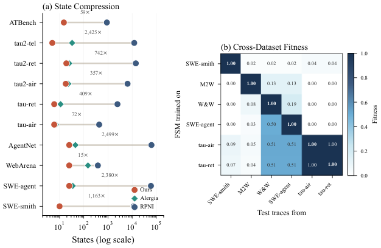
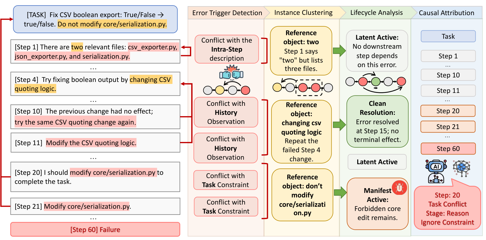
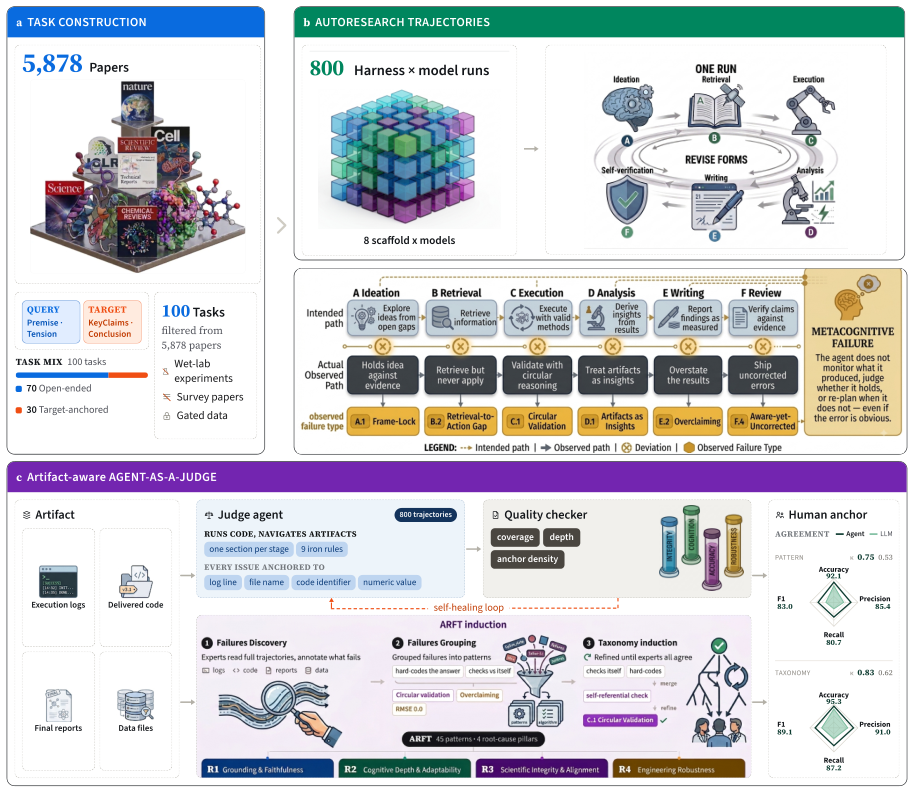

# 失敗帰属・エラー局在 研究トレンド（2026年8月）

> 対象：[failure-attribution](../../capabilities/adaptation/failure-attribution.md) の 2026年8月論文（8本）。主要論文は arXiv HTML 本文を読み、背景・考察・限界まで踏まえてまとめた。当カテゴリの初号。

## 先月からの差分

このカテゴリは8月の分類整理で新設された。7月時点では "Model or Harness?"（失敗をモデルとハーネスのどちらに帰属させるか）と SearchAuditor が並ぶ程度で、まだテーマとして立っていなかった。

8月に一気に8本が出て、しかも**問いの立て方が2段階ぶん深くなった**。

第一段階は「どこで壊れたか」から「**どの一手が致命傷だったか**」への移行だ。TRAJDEBUG が計測した数字が象徴的で、失敗した軌跡には平均 7.62 個の局所的な誤りが含まれるのに、最終的な失敗を引き起こした致命的な誤りは1つしかない。誤りを列挙する能力と、致命傷を特定する能力は別物だった。

第二段階は「**その特定は因果的に正しいのか**」という問いだ。Credit Without Ground Truth は、各決定点で方策自身の代替行動を再サンプルして最後まで走らせるという力技で因果的な正解を作り、いまエージェント学習に使われているステップ単位のクレジット信号——LLM 判定のスコア、結果で条件づけた対数確率比、方策自身の自信度——を監査した。結果は、**どれも偶然を上回って「効いた手」を当てられない**。

この2本が今月の下限と上限を作っている。片方は自動化を進め、もう片方はその自動化が測っているものを疑う。

> ※数値はモデルとデータの条件を添えて記す。1本の論文だけの結果は末尾に「要追試」としてまとめた。

## 3行サマリ

- 失敗帰属の問いが「どこで壊れたか」から「どの一手が致命傷か」へ移った。TRAJDEBUG は軌跡あたり平均 7.62 の局所誤りのうち致命的なものは1つだと計測し、SearchAuditor は 1,243 の失敗軌跡（平均 73.1 メッセージ）で最強手法でも 32.3% しか当てられないと報告した。
- Credit Without Ground Truth が、いま学習に使われているステップ単位のクレジット信号は因果的な貢献を偶然以上に当てられないと示した。暗黙のクレジットは方策の流暢さを反映している（順位相関 +0.75、流暢さを統制した因果との偏相関 −0.004）。
- 一方で、軌跡を構造として扱う路線は成果を出している。Automata from Agent Traces は12データセットの軌跡群を7〜43状態の有限オートマトンに畳み、失敗予測 AUROC 最大 0.94、平均 32% の進捗で早期停止を発火させた。

## クロス論文で見るトレンド

**継続する傾向（過去号からの延長）**

- 7月の "Model or Harness?"（失敗をモデルとハーネスのどちらに帰属させるか）の路線は今月も続く。Automata from Agent Traces は「振る舞いの構造は LLM よりも配備時のハーネスによって形づくられているように見える」と報告し、A²E は「モデルとハーネスの組合せは課題種別で大きく変動し、全課題で一貫して最良の組合せは存在しない」とした。同じ結論に別の方法で到達している。
- 長時間軌跡の監査という問題設定も継続。SearchAuditor（平均 73.1 メッセージ・65.1K トークン）と TRAJDEBUG（SWE-Bench Pro で平均 119.7 ステップ）が、人間の手作業では追いきれない長さを前提に置いている。

**今月明確になった点（複数論文で裏付け）**

1. **「誤りの検出」と「致命傷の特定」は別の問題だ。** TRAJDEBUG の予備調査が明示的にこれを測った——軌跡には平均 7.62 個の局所的な誤りがあるが、致命的なものは1つ。多くは自力で修復されるか無害に終わる。SearchAuditor も同じ構図で、致命的な誤りのステップ・検索固有の根本原因・参照となる修復の3点を専門家が注釈している。誤りを列挙するだけの評価では、直すべき場所が分からない。
2. **軌跡を「構造」として扱うと予測できる。** Automata from Agent Traces は、トレース群全体を1つのコンパクトな有限状態機械に畳む（7〜43状態、再現度 ≥0.997、構築はミリ秒）。この状態を文脈に使うと次手予測が Agent Workflow Memory を8データセットすべてで上回り（+0.8〜+25.3 ポイント）、状態ごとの振る舞いの特徴で失敗予測が AUROC 0.94 に達する。TRAJDEBUG も同じ発想を圧縮の側から使い、多粒度の軌跡ビューを外すと性能が 21.02 ポイント落ちると報告する。**遠い文脈をどう畳み、局所の証拠をどう残すか**が共通の設計問題になっている。
3. **帰属は診断で終わらず、修復と学習につながり始めた。** TRAJDEBUG の診断を再実行のフィードバックに使うとタスク成功率が平均 10.80% 上がり、失敗記憶として転移させると 5.70% 上がる。SearchAuditor も修復を出力に含め、それで失敗した実行を再開すると回復しやすくなると報告する。Towards Risk-free AI Agent Deployment は、この流れを「自動的な失敗帰属から修復、そして自己進化へ」という研究方向として明示的に位置づけた。
4. **監査は「見える化」から「主張と根拠の対応づけ」へ。** LEDGER は、可観測性が細かい実行イベントを見せてくれても、**どの行動・成果物・検証がその結論を支えているのかは依然として人間が再構成しなければならない**と指摘する。そこで実行記録を証拠ノードとワークフローノードにまとめ、主張を支える行動・成果物・検査へ型付きの意味的な辺でつなぐ。A²E も同じ方向で、正誤だけでなく実行効率・ツール使用・タスク計画・エラー回復という多次元の指標で特徴づける。
5. **判定者を「成果物まで見に行かせる」と人間と揃う。** How Do Agents Fail on AutoResearch は、最終報告だけでなく完全な軌跡と中間成果物を検査する agent-as-a-judge を人間で較正し、パターン単位で κ=0.75、分類で 0.83 を得た。単発の LLM 評価（κ=0.53 / 0.62）を大きく上回る。[評価号](evaluation_trends.md)で扱った Jagged Judges が「判定者は押されると崩れる」と示した一方で、こちらは「証拠まで見に行かせれば揃う」と示している。

**単発だがインパクトの大きい結果（裏付けは弱め・要追試）**

- Credit Without Ground Truth の否定的結果は今月最大の指摘だが、単一環境（ALFWorld）・単一スケール（7〜8B）・オフラインの LoRA 学習という条件下のものだ。著者自身も学習ループの実験に検証済みの正の対照がないことを限界として挙げている。**結論の射程は慎重に読む必要がある**が、監査の方法論自体は他の設定へそのまま持ち込める。
- How Do Agents Fail on AutoResearch の「失敗の 92.1% が認知系に集中し、最頻パターンは自己認識の未修正で 800 分析の 82.5% に出現」という分布は強烈だが、100タスク・8つのハーネスとモデルの組合せという1つのデータセットに基づく。

## 数字で見るインパクト

| 論文 | 数字 | 初見の読み方 |
|---|---|---|
| Credit Without Ground Truth | LLM 判定・結果条件つき対数確率比・方策の自信度のいずれも、因果的な正解に対して偶然（シャッフル対照）を上回らない（ALFWorld、Qwen2.5-7B 50軌跡／Llama-3.1-8B 28軌跡） | いま学習に使われているステップ単位のクレジットは、少なくともこの設定では機能していない |
| 同上 | 暗黙のクレジットは方策の流暢さと順位相関 +0.75、流暢さを統制すると因果との偏相関 −0.004 | 「うまく書けている手」を「効いた手」と取り違えている。結果で条件づけても因果情報は増えていない |
| 同上 | 因果的な効果が測れる決定点は 30.5%、測定できない割合はモデルで2倍違う（13.1% 対 26.8%） | そもそも大半の手は結果を変えていない。何を測れるかがモデル依存 |
| 同上 | 7条件の事前登録された学習実験で、未学習の方策を安定して上回る条件はなし。見かけの差は学習量（残るサンプル数の桁違いの差）で完全に説明できる | クレジット手法を比べるなら有効サンプル数を揃えないと、クレジットではなく投与量を測ることになる |
| Automata from Agent Traces | 12データセットで 7〜43 状態、テスト再現度 ≥0.997、RPNI 比で状態数 15〜3,036 分の1 | エージェントの振る舞いは驚くほど小さい状態機械に畳める。しかもハイパーパラメータなし・線形時間 |
| 同上 | 失敗予測の AUROC 最大 0.94。SWE-agent では長さだけの 0.659 に対し状態特徴で 0.790 | 「長い実行は失敗しやすい」以上の情報が状態から取れる |
| 同上 | 早期停止の監視が平均 32% の進捗で発火、適合率 85.9%・再現率 95.5% | 3分の1走った時点で失敗する実行を止められる。計算コストに直結 |
| 同上 | 次手予測で Agent Workflow Memory を8データセットすべてで上回る（+0.8〜+25.3pt） | 蓄積した記憶より、軌跡群から抽出した状態のほうが効く場面がある |
| TRAJDEBUG | 失敗軌跡は平均 7.62 の局所誤りを含むが、致命的なものは1つ | 誤りを列挙する評価では直す場所が分からない |
| 同上 | 巨視平均で 34.11%（直接プロンプト 25.69%、多エージェント手法も下回る）、最長軌跡では 20%超 対 最良ベースライン約 14% | 最良でも3分の1。長くなるほど差は開くが、絶対値としてはまだ難題 |
| 同上 | 多粒度圧縮を外すと 21.02pt 低下 | 遠い文脈を畳みつつ局所の証拠を残す設計が、この課題の中心 |
| 同上 | 診断を再実行のフィードバックに使うと成功率 +10.80%、失敗記憶として転移で +5.70% | 帰属は診断に留まらず、そのまま性能改善になる |
| SearchAuditor | 1,243 の失敗軌跡（平均 73.1 メッセージ・65.1K トークン）で、GPT-5.5 の最強ベースラインが 26.6%、提案手法 32.3% | 人手では読めない長さの軌跡。自動監査もまだ3分の1しか通らない |
| How Do Agents Fail on AutoResearch | 12,712 の失敗ヒットのうち 92.1% が認知系（根拠づけ・忠実さ／思考の深さと適応）に集中 | 失敗の主因は工学的な堅牢性ではない |
| 同上 | 最頻パターンは「自己認識の未修正」で 800 分析の 82.5% に出現 | 反証となる証拠は自分の実行ディレクトリの中に既にあるのに、突き合わせが一度も行われない |
| 同上 | agent-as-a-judge の人間との一致 κ=0.75（単発 LLM 評価 0.53） | 成果物まで見に行かせると判定は人間と揃う |
| A²E | モデルとハーネスの組合せの成績は課題種別で大きく変動し、すべての課題で一貫して最良の組合せは存在しない | 「この構成が最強」という推奨は原理的に書けない |

## 論文紹介

### ① 因果で問い直す——今月の最重要論文

[Credit Without Ground Truth: Auditing Step-Level Credit Assignment in LLM Agents Against Executed Replay](https://arxiv.org/abs/2608.19760)

エージェントを学習させるとき、どの一手が良かったのかをステップ単位で採点する信号が要る。実務では LLM に採点させるか、結果で条件づけた対数確率比を使うか、方策自身の自信度を使う。既存の評価はこれらを**注釈されたステップの正しさ**に対して採点してきた。この論文の着眼は、正しさと**貢献**は別物だという点にある。

そこで因果的な正解を作りにいく。各決定点で方策自身の代替行動を再サンプルし、そこから最後まで走らせて、結果の分布がどう変わるかを測る（executed replay）。監査対象のクレジット信号は一切参照しない。

結果は否定的だ。ALFWorld の単一エージェント環境で、Qwen2.5-7B と Llama-3.1-8B のどちらの系統でも、**どのクレジット信号もシャッフル対照を上回って重要な手を順位づけできない**。失敗の仕組みも特定されている——暗黙のクレジットは方策の流暢さと順位相関 +0.75 を示し（別の系統でも +0.70 で再現）、流暢さを統制すると因果との偏相関は −0.004 になる。つまり結果で条件づけても因果情報は加わっていない。

正解の側の構造も重要だ。因果的な貢献は疎で、正解が定義できる決定点のうち測定可能な効果を持つのは 30.5% だけ。しかも「方策が支持する反実仮想が存在しない」割合はモデルによって2倍違う（13.1% 対 26.8%）。**何を測れるかがモデル依存**なのだ。

そして事前登録した7条件の学習実験では、どの条件も未学習の方策を安定して上回らない。見かけ上の違いは、クレジットの中身ではなく**投与量**——疎なクレジットほど残る学習例が少なく、最適化ステップ数が桁違いになる——で完全に説明できた。著者の結論は方法論的な要求として書かれている。クレジット規則を比べるなら有効サンプル数を揃えよ、さもなくば測っているのはクレジットではなく投与量だ。

限界も明示されている。単一環境、7〜8B の単一スケール、オフラインの LoRA 学習、そして学習ループ実験に検証済みの正の対照がないこと。**「クレジット信号は無意味だ」ではなく「この条件では因果を捉えられていない」**と読むのが正確だろう。

### ② 軌跡を構造として扱う

[Automata from Agent Traces: Failure and Next-Step Prediction](https://arxiv.org/abs/2608.23670)

エージェントの実行トレースは長く非構造的で、配備に必要な安全監査やランタイム監視を拒む。既存手法は個々のトレース単位、あるいは成功例のみを扱うので、次手予測と失敗予測をつなぐ**実行をまたいだ位相構造**を取り逃がす。加えて、エージェントのトレースは正例しか与えないので、古典的なオートマトン学習は原理的に使えない。

著者の観察は「LLM エージェントの活動アルファベットは有界（6〜42記号）だ」という点にある。そこで、全活動列を接頭辞トライに入れ、同じ活動で到達する状態を最後の活動による右合同で併合し、一度しか観測されない遷移を落とす——これだけで決定的な有限状態機械が得られる。ハイパーパラメータなし、決定的、線形時間。

12データセット・8ドメイン（SWE-agent, WebArena, tau2-bench, Mind2Web, OSWorld ほか）で、状態数は 7〜43、学習に使っていないデータの再現度 ≥0.997、分割を変えても位相はほぼ同じ。RPNI と同じ再現度に到達するのに必要な状態数は 15〜3,036 分の1で済む。この状態を文脈に加えると次手予測の交差エントロピーが 0.155 ビット（21%）下がり、Agent Workflow Memory を8データセットすべてで上回る。状態ごとの振る舞いの特徴を使うと失敗予測の AUROC が最大 0.94（SWE-agent では長さだけの 0.659 に対し 0.790）。オンラインの監視は部分的な軌跡から失敗する実行を上位に並べ、平均 32% の進捗で早期停止を発火する（適合率 85.9%・再現率 95.5%）。

考察で述べられている一文が、[ハーネス号](harness_trends.md)と直結する——**振る舞いの位相は LLM よりも配備時のハーネスによって形づくられている**ように見える。だからこそモデル非依存の構造的な原始要素になる、という主張だ。限界も率直で、この FSM が受理するのは観測されたトレースの直後関係の閉包であって生成言語ではない。二連の統計を保つ敵対的なトレースは再生できてしまう。

> 図（Automata from Agent Traces）：トレース群を接頭辞トライから併合して1つの有限状態機械に畳む。（[論文](https://arxiv.org/abs/2608.23670)）

[TRAJDEBUG: Tracing Error Lifecycle to Identify Critical Failures in Long-Horizon Agent Trajectories](https://arxiv.org/abs/2608.06346)

問題設定の切れ味が良い。長い軌跡のデバッグには2つの困難がある。第一に、あるステップを judge するための証拠が遠く離れた指示・観測・過去の文脈に散らばっている。第二に、複数の局所的な誤りが共存し、下流への影響がそれぞれ違う——修復されるもの、無害なもの、そして最終的な失敗を引き起こすもの。予備調査では軌跡あたり平均 7.62 の局所誤りに対し致命的なものは1つで、軌跡が長くなるほど特定精度が急落した。

TRAJDEBUG はこれを3段階に分解する。まず多粒度の圧縮で、詳細・中間・粗のビューを作り、局所の証拠を保ちながら遠い文脈を畳む。次に誤りの引き金を検出する——タスク指示・履歴・ステップ内の整合性に反する、証拠に基づいた不一致だ。そして誤りの状態を分類する：参照対象ごとにまとめ、解決済みか未解決か、そして**終端的な足跡**（不可逆な変更、意味的な残存、予算の負債）が残っているかで分ける。最後に、終端に関わる候補集合の中から致命的な誤りを、証拠に基づいて選ぶ。

7ベンチマーク 869 軌跡で評価し、手作業で注釈した 486 軌跡のベンチマーク（τ²-Bench 400本、平均 29.3 ステップ／SWE-Bench Pro 86本、平均 119.7 ステップ）を新たに公開した。巨視平均で 34.11%（直接プロンプト 25.69%、多エージェント手法の AgentDebugger・CHIEF・AgentRX も下回る）。最長の軌跡では 20% 台を保ち、最良ベースラインが約 14% に落ちるところで差が開く。切り分けでは多粒度圧縮を外すと 21.02 ポイント落ちた。応用として、診断を再実行のフィードバックに使うと成功率が平均 10.80%、失敗記憶として転移させると 5.70% 上がる。段階パイプラインなので前段が失敗すると致命的な誤りを取り逃がす、という限界を著者自身が挙げている。

> 図（TRAJDEBUG）：多粒度圧縮 → 誤りの引き金の検出 → 誤りの状態分類 → 候補集合に導かれた因果的な帰属。（[論文](https://arxiv.org/abs/2608.06346)）

[SearchAuditor](https://arxiv.org/abs/2608.05212)
深い検索エージェントに特化した監査。小さな推論の誤りが長く雑音の多い軌跡を伝播して、流暢だが誤った答えになる。1,243 の失敗軌跡（8つのオープンウェイトモデル・5つのベンチマーク、平均 73.1 メッセージ・65.1K トークン）に、致命的な誤りのステップ・検索固有の根本原因・採点基準つきの参照修復を専門家が注釈した。GPT-5.5 を使った最強ベースラインでも端から端まで通る率は 26.6%、提案手法で 32.3%。**人間の手作業では追いきれない長さを前提にしている**点が、このカテゴリの現状をよく表している。

### ③ 失敗の分類学——何が壊れているのか

[How Do Agents Fail on AutoResearch](https://arxiv.org/abs/2608.14905)

研究自動化を対象に、失敗のパターンを網羅的に作った。フロンティアの査読会議の 5,878 本から 100 タスクを選び（開放的な探索 70・目標が定まった最適化 30）、7つの科学分野と研究の全工程（着想・調査・実行・分析・執筆・査読）にまたがらせる。8つのハーネスとモデルの組合せ（Claude Code, Codex, Gemini CLI に各種バックボーン）で 800 の軌跡を集め、工程の段階と根本原因（根拠づけと忠実さ／思考の深さと適応／科学的誠実性と整合／工学的堅牢性）の2軸で 45 の失敗パターンに整理した。

数字が示す構図は明快だ。12,712 の失敗ヒットのうち **92.1% が認知系の2本柱に集中**し、単一で最も多いパターンは「修正されない自己認識」で 800 分析の 82.5% に現れる。しかも著者の観察が痛烈で——**その失敗を反証する証拠は、すでにエージェント自身の実行ディレクトリの中にある。ただ突き合わせが一度も行われない**。

同じパターンが最強のモデルを含む8組合せすべてで再発することから、著者は欠落がモデル側にあり、特定の足場の問題ではないと位置づける（ただし編成レベルの介入で埋まるかは本研究では検証していないと明記）。結論は「今のエージェントにはメタ認知のループがない——作ったものを見つけたものと突き合わせ、合わなければ直し、辿った道が妥当だったかを問う能力」。

方法論として重要なのは判定の作り方だ。最終報告だけでなく完全な軌跡と中間成果物を検査する agent-as-a-judge を人間で較正すると、パターン単位で κ=0.75、分類で 0.83。単発の LLM 評価（0.53 / 0.62）を大きく上回る。

> 図（AutoResearchEval / ARFT）：論文からのタスク抽出、6段階のエージェント実行による 800 軌跡と成果物、専門家の注釈による失敗分類の導出。（[論文](https://arxiv.org/abs/2608.14905)）

### ④ 監査を運用に載せる

[LEDGER: Claim-to-Evidence Trace Graphs for Auditing LLM Agents](https://arxiv.org/abs/2608.18398)
エージェントが速く多く働くほど、生産性の隘路は**出力を作ること**から**その出力が正しいか監査すること**へ移る。既存の可観測性は細かい実行イベントを見せてくれるが、ある結論についてどの行動・成果物・検証が効いているかは、結局レビュアーが再構成しなければならない。LEDGER は実行記録を保ったまま証拠ノードとワークフローノードにまとめ、成果物を証拠の錨として表し、**主張を支える行動・成果物・検査へ型付きの意味的な辺**を張る。データ分析とコーディングの例で、ワークフロー上の判断、成果物の来歴、修復のステップ、検証の網羅度、主張を支える経路が見えるようになることを示す。

[A²E: An End-to-End Agent Auditing Engine](https://arxiv.org/abs/2608.07346)
ハーネスの能力評価を端から端まで自動化する。独自のタスクプロトコルで異なるハーネスへ評価タスクを素早く差し込み、自動で計装したモニタが標準化された実行トレースを生成する。正誤だけでなく**実行効率・ツール使用・タスク計画・エラー回復**の多次元で特徴づけるので、ハーネス間の違いが細かく出る。実験からの発見が示唆的で、モデルとハーネスの組合せは課題種別によって成績が大きく変動し、**すべての課題で一貫して最良の組合せは存在しない**。[ハーネス号](harness_trends.md)の There Is No Neutral Harness と同じ構図が、実行型のタスクでも現れている。

[Towards Risk-free AI Agent Deployment](https://arxiv.org/abs/2608.16411)
今月のこのカテゴリを俯瞰する位置づけの論文。「リスクのない配備は、エージェントの軌跡——記録された推論のステップ、ツールの呼び出し、環境の観測——に接地していなければならない。軌跡はどんなエージェントでも取れるし、多くの失敗は軌跡の中にしか現れない」という主張から出発する。テストの困難（オラクル問題、非決定性、軌跡の検証、十分性の指標の不在）を整理し、自動的な失敗帰属から修復・自己進化までをデバッグの研究方向として並べ、配備準備のチェックリストにまとめる。未解決問題として挙がるのは、形式的な十分性の指標、長期軌跡での根本原因の帰属、そして自己進化するエージェントの信頼性——最後の項目は今月の[安全性号](safety_trends.md)と直結する。

## 論点・未解決課題

1. **クレジット信号の否定的結果は、どこまで一般化するのか。** Credit Without Ground Truth は ALFWorld・7〜8B という限られた条件だが、監査の方法（方策自身の代替行動を再サンプルして最後まで走らせる）はどの環境にも移せる。長期の実タスク（TRAJDEBUG が扱う平均 119.7 ステップの SWE-Bench Pro など）で同じ監査を回したときに何が起きるかは、次の焦点になるだろう。
2. **致命的な誤りの正解を誰が作るのか。** TRAJDEBUG は手作業の注釈（486軌跡）、SearchAuditor も専門家の注釈（1,243軌跡）に依存する。一方 Credit Without Ground Truth は実行による反実仮想で正解を作った。注釈は「人間が致命的だと思う手」を、再サンプルは「実際に結果を変える手」を測る——両者が一致するかは検証されていない。
3. **構造抽出と因果の関係。** Automata from Agent Traces は状態から失敗を AUROC 0.94 で予測するが、これは相関の予測であって因果的な貢献ではない。予測が当たることと、直すべき場所が分かることは違う。
4. **帰属の粒度が揃っていない。** ステップ（Credit Without Ground Truth）、致命的な誤り1点（TRAJDEBUG・SearchAuditor）、状態（Automata）、45パターンの工程×根本原因（ARFT）、ハーネスの部品（[ハーネス号](harness_trends.md)の SHE や Recuris）——同じ「失敗の帰属」という言葉で、5つの異なる単位が使われている。
5. **メタ認知の欠落は足場で埋まるのか。** How Do Agents Fail on AutoResearch は、失敗パターンが8つのハーネスとモデルの組合せすべてで再発することからモデル側の欠落だと位置づけ、編成レベルの介入で埋まるかは検証していないと明記した。この問いは、[自己進化号](self_evolution_trends.md)の「戦略の再評価ができない」という指摘と同じものを別の側から見ている。

## 次に来るもの（Watch next）

- **実行による反実仮想を正解に据えた評価。** Credit Without Ground Truth の監査手法が、他のクレジット手法・他の環境・より大きなモデルへ適用されるか。適用のコストが高いので、近似の作り方が焦点になる。
- **構造抽出のランタイム利用。** Automata の早期停止監視（平均 32% の進捗で発火）が、実運用のコスト削減として採用されるか。
- **注釈済みベンチマークの拡大。** TrajErrBench（486軌跡）と SearchAuditBench（1,243軌跡）が今月出た。どちらも致命的な誤りに正解を付けており、この種のデータが増えると帰属手法の比較が可能になる。
- **監査結果の学習への還流。** TRAJDEBUG の「診断を再実行に使うと +10.80%」という結果が、失敗帰属を独立した診断機能から改善ループの構成要素へ移す。[自己進化号](self_evolution_trends.md)との合流点になる。

---

*本ニュースレターは各論文の arXiv HTML 本文を精読してまとめた（一部の論文は abstract を併用）。図は `newsletters/assets/` に保存。対象＝[capabilities/adaptation/failure-attribution.md](../../capabilities/adaptation/failure-attribution.md) の 2026年8月分。関連号：[8月ハーネス](harness_trends.md)・[8月評価](evaluation_trends.md)・[8月安全性](safety_trends.md)・[8月自己進化](self_evolution_trends.md)。*
