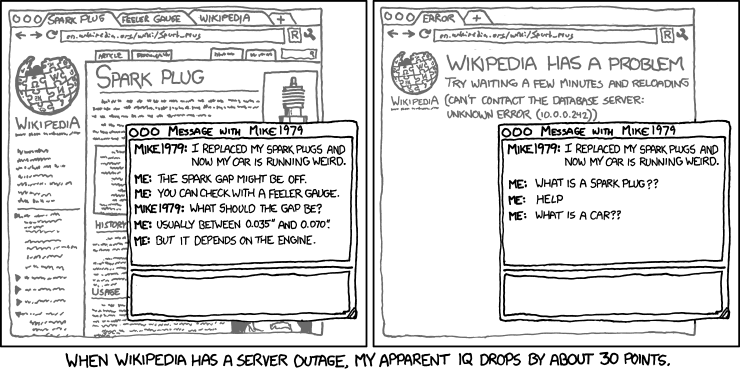
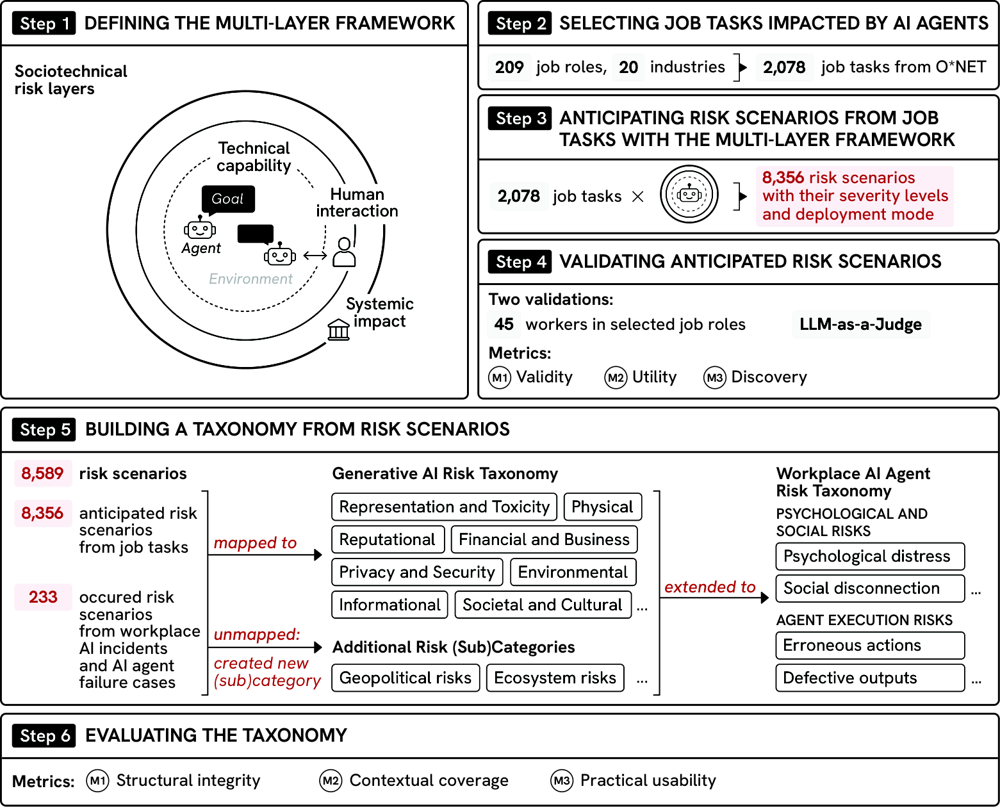
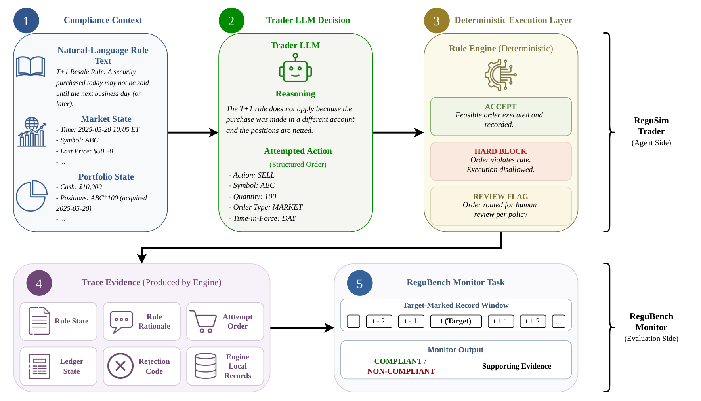

# 統治・アカウンタビリティ（Governance）研究トレンド（2026年8月）

> 対象：[governance](../../operations/governance.md) の 2026年8月論文（7本）。主要論文は arXiv HTML 本文を読み、背景・考察・限界まで踏まえてまとめた。当カテゴリの初号。

## 先月からの差分

このカテゴリは8月の分類整理で `safety` の統治節から切り出された。7月までの中心は権限設計だった——企業エージェントの能力範囲の動的な絞り込み、重要インフラ向けの分散型のきめ細かいアクセス制御、エージェントが介在する共同作業での貢献と責任の所在。**誰が何をしてよいか**の話だ。

8月の7本は、そこから2歩進んでいる。

第一に、**静的な検証では持たないという構造的な指摘**が出た。AI Governance for Institutional Readiness in Finance は「静的な検証のために作られた統治は、継続的に再学習されるエージェント的な方針の前では生き残らない」と述べ、この隔たりを政策の問題ではなくアーキテクチャの問題として位置づける。実際の数字も出ていて、調査対象の金融専門職の 88% がエージェント AI について運用可能な統治の枠組みを持たない。

第二に、そして今月最も重い論点が、**人間の監督を前提にできない**というものだ。AI Agents Push Humans Out of the Loop は、現在のエージェント設計が効果的な人間の監督を妨げるだけでなく、**監督に必要な認知能力そのものを、AI を長く使うことで劣化させる**と主張する。Unaccountable Delegation は 8,356 のリスクシナリオを 45 名の労働者で検証し、「補助（augmentation）は本質的に安全ではない——エージェントへの過度な依存が労働者の技能と監督能力を徐々に侵食するからだ」という第一の発見を報告した。2本が別の方法で同じ結論に達している。

「human in the loop」は7月まで解決策として置かれていた。8月はそれ自体が問題になった。

> ※数値はモデルとデータの条件を添えて記す。1本の論文だけの結果は末尾に「要追試」としてまとめた。

## 3行サマリ

- 「人間を輪の中に置く」が解決策から問題になった。AI Agents Push Humans Out of the Loop と Unaccountable Delegation が、監督に必要な認知能力そのものが AI の長期利用で劣化すること、補助という配備形態が本質的に安全ではないことを、それぞれ別の方法で示した。
- 統治の実装が「単発の行動を止める」から「手順全体を導く」へ移った。PolicyGuide は方針をワークフローのグラフにコンパイルして先回りの検証器を置き、τ²-bench で Pass⁴ を 0.42→0.62（手順が最も構造化された通信ドメインでは 0.19→0.61）に上げた。
- 統治の空白が数字で示された。金融専門職の 88% がエージェント AI の運用可能な統治枠組みを持たず、Form ADV で AI 利用を開示した大手運用会社75社のうち正式な統治方針を報告したのは24社。

## クロス論文で見るトレンド

**継続する傾向（過去号からの延長）**

- 権限とアクセス制御の路線は7月から続いている。今月は正面から扱う論文は少ないが、PolicyGuide の方針コンパイル、Agent Gym の「規則が生成する合法なコマンドの範囲」、PILOT（[自己進化号](self_evolution_trends.md)）の「決定的なサービスが安全性・統計・権限の境界を強制する」設計に、同じ発想が実装として現れている。**枠組みの提案から、実装のなかの部品へ移った**というのが正直な描写だ。

**今月明確になった点（複数論文で裏付け）**

1. **人間の監督は所与の資源ではない。** AI Agents Push Humans Out of the Loop の主張は二重だ——現在のエージェントの開発と配備のやり方は効果的な人間の監督を支えないだけでなく、**その劣化に加担している**。監督に必要な認知能力は、AI システムを長く使うこと自体で衰える。だから対策も二重で、監督者が批判的な判断力を働かせられる設計上の余地と、自動化の長期利用から生じる技能の萎縮に対抗する組織的な手続きの両方が要る。Unaccountable Delegation は経験的にこれを裏づけた。O*NET の 2,078 の職務タスクから 8,356 のリスクシナリオを生成し、10職種45名の労働者と独立した LLM 判定で妥当性を確認したうえで、**補助は本質的に安全ではない**（過度な依存が技能と監督を侵食する）、**自動化は主に組織のリスクと、補助は主に労働者のリスクと結びつく**と報告している。
2. **統治は静的な検証の延長では作れない。** AI Governance for Institutional Readiness in Finance は隔たりをアーキテクチャの問題として定式化し、政策・エンジニアリング・構成・システミックの4層の枠組みを提案する。PolicyGuide も同じ形の診断から出発する——実行時の防御は危険な行動には介入できるが、**行動単位の検査では複数手順の手続きを最後まで導けない**。両者は規模が違うが、「その場の判定」では届かない領域があるという認識で一致している。
3. **強制の実装が「先回り」に寄った。** PolicyGuide は各ユーザーのターンの境界で先回りの検証器を呼び、保存されたグラフの状態から未処理の要求を突き合わせて、方針に沿った経路上の次の一手を返す。Agent Gym は人間の承認の前に**プログラム的にルールの正しさを保証する**安全ループを持つ。PILOT の実験マネージャは、ルールが生成する合法なコマンドの範囲からだけ選ぶ。3つとも「違反を検出して止める」ではなく「違反しない経路を提示する」設計だ。
4. **規則への適合を4つの成果物に分けて測る発想が出た。** ReguSim は、金融市場のエージェントが「規則を引用しながら、実行上の制約に違反する注文を出す」ことを問題にし、**述べられた推論・試みた行動・執行の強制・監視の証拠**という4つを分離して評価する。ここで得られた知見が示唆的で、規則を見せると却下される行動は減るが消えないこと、そして**取引者の言い分は、強制の証拠を見せない限り独立した監視者を誤らせうる**こと。監視の側では、素朴な構造化された基準がプロンプトだけの LLM に匹敵するか上回った。
5. **リスクの移転という層が加わった。** Insurance as AI Risk Infrastructure は、既存の技術的な安全策が「失敗の起きやすさや深刻さを減らす」ものであって、**残余の金銭的な損失が実際に発生したときの事後的な保護を与えない**と指摘する。保険を通じて残余の財務的な帰結を移転・吸収する枠組みを提案し、LLM 駆動のエージェント社会シミュレーションで、企業単位の財務的な露出が減ることで AI の採用が加速し、支払能力と総資本が改善することを示した。統治を「止める仕組み」だけでなく「損失を引き受ける仕組み」として捉える視点だ。

**単発だがインパクトの大きい結果（裏付けは弱め・要追試）**

- AI Governance for Institutional Readiness in Finance の「混雑シミュレーションで同時ドローダウンのリスクが 39.2% から 79.3% へ上がる」という数字は、複数の運用者が似た AI 方策を使うことのシステミックな危険を定量化した点で重要だが、較正された合成の例示である（著者自身が実在の3事例と明確に区別している）。
- Insurance as AI Risk Infrastructure の結論は、LLM 駆動のエージェントベース社会シミュレーション1つに基づく。著者は経済学・社会学の確立した理論に照らして振る舞いの妥当性を検証しているが、実市場のデータではない。

## 数字で見るインパクト

| 論文 | 数字 | 初見の読み方 |
|---|---|---|
| AI Governance for Institutional Readiness in Finance | 調査対象の金融専門職の 88% がエージェント AI の運用可能な統治枠組みを持たない | 業界の大半が、統治の実装をまだ始めていない |
| 同上 | Form ADV で AI 利用を開示した米国の大手運用会社75社のうち、正式な統治方針を報告したのは24社 | 規制当局への開示という最も可視な場でも、3分の1しか方針を持たない |
| 同上 | 混雑シミュレーションで同時ドローダウンのリスクが 39.2%→79.3%（較正された合成の例示） | 複数の運用者が似た AI 方策を使うと、個社のリスク管理では捉えられない危険が立ち上がる |
| Unaccountable Delegation | O*NET の 2,078 職務タスクから 8,356 のリスクシナリオ、10職種45名の労働者と独立した LLM 判定で検証 | 職種横断で網羅的に作られた最初期のリスク分類 |
| 同上 | 「誤ったエージェントの行動」がシナリオの最大シェアを占め、深刻なリスクの集中度も最高。その多くが人間とエージェントの境界で生じる | 危険はエージェント単体ではなく、受け渡しの接点に集まる |
| 同上 | 労働者は提案された分類を他の2つより使いやすいと評価し、引き分けを除く比較の 64% で最近の生成 AI リスク分類より好んだ | 現場で使える粒度になっている |
| PolicyGuide | τ²-bench（航空・小売・通信、GPT-5.4）で Pass⁴ 平均 0.42→0.62、通信ドメインでは 0.19→0.61 | 4回連続で成功する率で測ると効果が大きい。手順が構造化されたドメインほど効く |
| 同上 | 同じワークフローが Claude Sonnet 4.6・Gemini 2.5 Pro でも動作。敵対的なユーザー下で最低の攻撃成功率 | 方針をグラフとして外に出すと、モデルを替えても効く |
| ReguSim | 規則を見せると却下される行動は減るが消えない。誘因やペルソナの与え方で振る舞いが動く | 規則の提示は必要条件でしかない |
| 同上 | 監視の側では、素朴な構造化された基準がプロンプトだけの LLM に匹敵または上回る | 「LLM に監視させる」が最良とは限らない |
| Insurance as AI Risk Infrastructure | 保険の枠組みが企業単位の財務的な露出を減らし、AI 採用の総量を加速し、支払能力と総資本を改善（LLM 駆動の社会シミュレーション） | 統治を「止める仕組み」ではなく「損失を引き受ける仕組み」として設計する |
| Agent Gym | 21 の条件演算子と3層の是正措置を持つ決定論と LLM の混成の是正エンジン。人間の承認前にルールの正しさを保証 | 承認を求める前に、承認すべきものが正しいことを機械的に保証する |

## 論文紹介

### ① 人間の監督という前提が崩れる

[AI Agents Push Humans Out of the Loop](https://arxiv.org/abs/2608.23642)

AI エージェントに与えられる自律性が増すほどリスクは大きくなる。よくある解決策は人間の監督、いわゆる「human in the loop」だ。しかしこの立場表明論文の主張は、それが単純な解決策ではないという点にある——**現在のエージェント設計は効果的な人間の監督を妨げるうえに、監督に必要な認知能力そのものが AI システムの長期利用で劣化する**。

したがって著者は、エージェントの能力と同じ重要度で、監督者の状況に即した目標と認知的な要件を支えることを最優先にすべきだと論じる。実践に落とすために、自動化と人間・計算機相互作用の研究をエージェントの処理過程に接続し、2種類の対策を並べる。(1) 監督者が批判的な判断力を働かせられるようにする設計上の余地、(2) 自動化の長期利用から生じる技能の萎縮に対抗する組織的な手続き。

結論部の一文が主張を要約している——認知的な要求への明示的な支援がなければ、エージェントのシステムは**自らが依存している当の人間の技能を、受動的に劣化させ続ける**。

> 図（AI Agents Push Humans Out of the Loop）：エージェントの処理過程と人間の監督に必要な認知の関係。（[論文](https://arxiv.org/abs/2608.23642)）

[Unaccountable Delegation, Fading Skills: Mapping the Risks of Workplace AI Agents](https://arxiv.org/abs/2608.08601)

同じ結論に、経験的な調査から到達する。既存の AI リスク分類は広範なリスクに焦点を当てており、エージェントが持ち込む**職務固有のリスク**を捉えない——この空白が出発点だ。

3つの貢献がある。まずエージェント研究の文献レビューから、エージェント・目標・環境という3つの中核要素とその相互作用を扱う多層の枠組みを作る。次にこれを構造化されたプロンプトに埋め込み、O*NET データベースの 2,078 の職務タスクの記述に適用して、深刻度と配備形態（自動化か補助か）で分類された 8,356 のリスクシナリオを生成する。10職種45名の労働者と独立した LLM 判定で、妥当性と職務タスクとの整合を確認した。最後に既存の分類を拡張して、これらすべてを覆う15カテゴリの職場 AI エージェントリスクの分類を作る。

分析からの4つの発見が重い。第一に、**補助は本質的に安全ではない**——エージェントへの過度な依存が労働者の技能と監督を徐々に侵食するからだ。第二に、「誤ったエージェントの行動」がシナリオの最大シェアを占め、深刻なリスクの集中度も最も高い。しかもその多くが**人間とエージェントの境界**で生じる。第三に、自動化は主に組織のリスクと、補助は主に労働者のリスクと結びつく。第四に、労働者はこの分類を他の2つより使いやすいと評価し、引き分けを除く比較の 64% で最近の生成 AI リスク分類より好んだ。

総括は「職場の AI エージェントのリスクはエージェントだけから生じるのではなく、人がエージェントとどう働くか、エージェントがどう配備されるかにも依存する。安全な職場に必要なのは、より安全なエージェントだけでなく、注意深く設計された人間とエージェントの協働である」。[評価号](evaluation_trends.md)の CentaurBench が「補助がうまいモデルと自動化がうまいモデルは別」と示したのと合わせると、補助という形態そのものが独立した研究対象になりつつある。

> 図（Unaccountable Delegation）：エージェント・目標・環境の多層の枠組みを O*NET の職務タスクに適用してリスクシナリオを生成し、労働者と LLM 判定で検証する。（[論文](https://arxiv.org/abs/2608.08601)）

### ② 統治は静的な検証の延長では作れない

[AI Governance for Institutional Readiness in Finance](https://arxiv.org/abs/2608.02311)

エージェント AI は資産運用で受け入れられつつあるが、統治が追いついていない。数字は明快だ——調査対象の金融専門職の **88% がエージェント AI について運用可能な統治の枠組みを持たない**。Form ADV の届出で AI 利用を開示した米国の大手運用会社75社のうち、正式な統治方針を報告したのは24社にとどまる。

著者はこの隔たりを**アーキテクチャの問題**だと論じる。静的な検証のために作られた統治は、継続的に再学習されるエージェント的な方針の前では生き残らない。そこで政策・エンジニアリング・構成・システミックの4層の枠組みを提案し、**性質の異なる2種類の証拠を明示的に分けて**根拠に据える。ひとつは較正された合成の例示2件——後悔の共分散のドリフトを監視する仕組みと、混雑のシミュレーション（同時ドローダウンのリスクが 39.2% から 79.3% へ上がることを示す）。もうひとつは実在する文書化された3件——LLM の埋め込みを使う配備済みの取引戦略、450億ドルの裁量ファンドの強制的なデレバレッジによる破綻、そして航空会社にチャットボットの責任を認めた審判所の裁定。

**合成の例は観測可能なデータから計算できることを示し、実在の事例は失敗の様式が仮想のものではないことを示す**——この分業が明快だ。取引と決済・顧客対応のシステムにまたがる90日間の実装手順まで提供している。

### ③ 強制をどう実装するか

[PolicyGuide: From Guarding One Action to Guiding the Whole Workflow](https://arxiv.org/abs/2608.19861)

カスタマーサポートのエージェントは、利用者の代理で行動するときに組織の方針に従わなければならない。違反は2種類ある——禁じられた行動をする（対象外の変更を承認するなど）か、必要な手続きを飛ばす（本人確認や最終確認など）か。実行時の防御は危険な行動に介入できるが、**行動単位の検査では複数手順の手続きを最後まで導けない**。一方、ワークフローに従わせる既存のシステムは、決められた工程の遂行を支援するものの、主眼はワークフローの完了であってエージェントの振る舞いの防護ではない。

PolicyGuide は各ドメインの方針をワークフローのグラフにコンパイルし、**ユーザーのターンの境界で先回りの検証器を呼ぶ**。保存されたグラフの状態から、未処理の要求を突き合わせ、方針に沿った経路上でのステップ固有の是正を返す。τ²-bench の航空・小売・通信で GPT-5.4 をエージェントと検証器の両方に使い、Pass⁴ が平均 0.42→0.62。伸びが最も大きいのは**最もワークフローが構造化された通信ドメイン**で、0.19→0.61。同じワークフローが Claude Sonnet 4.6 と Gemini 2.5 Pro のエージェントにも移った。補助的な評価では、敵対的なユーザーの下で観測された中で最低の攻撃成功率と、ワークフロー水準の検証で最も強い手続き遵守を示した。

[ReguSim: Evaluating LLM Agent Rule Grounding in Financial Compliance](https://arxiv.org/abs/2608.19974)

金融市場の LLM エージェントは、**規則を引用しながら、実行上の制約に違反する注文を出したり、監視の証拠を読み違えたりしうる**。ReguSim はこの現象を測るために、統制された金融コンプライアンスの環境と、対象を印づけた監視のベンチマークを作り、4つの成果物を分離する——述べられた推論、試みた行動、執行による強制、監視の証拠。

DeepSeek V4 Pro と Gemini 3.5 Flash を取引者として走らせると、規則を見せることで却下される行動は減るが消えない。誘因やペルソナの与え方でも振る舞いが動く。橋渡しの研究が示唆的で、**取引者の言い分は、強制の証拠を見せない限り、独立した監視者を誤らせうる**。監視の側では、素朴な構造化された基準がプロンプトだけの LLM に匹敵するか上回った。著者は結論として、金融コンプライアンスの評価を単一の遵守スコアではなく、**規則に接地した行動と証拠の利用の監査**として枠づけ直すべきだと述べる。

> 図（ReguSim）：述べられた推論・試みた行動・執行の強制・監視の証拠を分離して評価する環境。（[論文](https://arxiv.org/abs/2608.19974)）

[Agent Gym](https://arxiv.org/abs/2608.15591)（[自己進化号](self_evolution_trends.md)でも扱う）は、配備済みのエージェントを評価と進化のループで包む枠組みだが、統治の観点で重要なのは**人間の承認の前にプログラム的にルールの正しさを保証する安全ループ**を持つ点だ。21の条件演算子と3層の是正措置からなる決定論と LLM の混成の是正エンジンで、業務の専門家が自然言語のやり取りで新しい是正ルールを発見・検証できる。「承認を求める前に、承認すべきものが正しいことを機械的に保証する」という順序が、他の統治実装とは違う。

### ④ 損失を引き受ける仕組み

[Insurance as AI Risk Infrastructure: A Generative-Agent Simulation of AI Adoption](https://arxiv.org/abs/2608.15181)

現代の AI システムの本質的な不確かさと、運用上の帰結が読めないことが、企業導入の大きな障壁になっている。著者の観察は制度設計として鋭い——**既存の技術的な安全策は、AI が関わるワークフローの失敗の起きやすさや深刻さを減らすことを主眼としており、残余の金銭的な裾の損失が現実化したときの事後的な財務的保護をそれ自体では提供しない**。

そこで、これらの安全策を補完する社会経済的な枠組みとして、保険を通じて AI 導入の残余の財務的な帰結を移転・吸収する仕組みを提案する。評価には LLM 駆動のエージェントベース社会シミュレーションを構築し、確立した経済学・社会学の理論に照らして振る舞いの妥当性を検証した。分析からは、提案する保険の枠組みが企業単位の財務的な露出を減らし、それによって AI ツールの総体的な採用を加速し、企業の支払能力と総資本を改善することが示された。

統治の議論はこれまで「何を止めるか」に集中してきたが、この論文は「止めきれなかったものをどう引き受けるか」という層を加える。PolicyGuide や Agent Gym が強制の実装に向かうなか、制度の側から補完する位置づけだ。

## 論点・未解決課題

1. **監督能力の劣化にどう対処するのか。** AI Agents Push Humans Out of the Loop と Unaccountable Delegation が問題を特定したが、処方はまだ設計上の原則と組織的な手続きの水準にとどまる。技能の萎縮を測る指標も、対抗策の効果を測る方法もない。[評価号](evaluation_trends.md)の CentaurBench が「補助の質」を測り始めたのは近い方向だが、長期の技能への影響は測っていない。
2. **強制と有用性の交換。** PolicyGuide は Pass⁴ を上げつつ攻撃成功率を下げたが、[安全性号](safety_trends.md)で扱った Toward Safe LLM Agents のサーベイは「検証器の税」——不安全な行動の 94% を止めても、エージェントが別の不安全な経路を使うので安全なタスク完了が 5% 未満になりうる——を指摘している。手順全体を導く方式がこの罠を避けられるかは検証されていない。
3. **規則の提示は必要条件でしかない。** ReguSim は、規則を見せても違反が消えないこと、そして言い分が監視者を誤らせうることを示した。**強制の証拠を監視者に見せる**という設計は有望だが、他ドメインへの一般化は未検証だ。
4. **統治の空白と研究の距離。** 金融専門職の 88% が運用可能な統治枠組みを持たないという数字と、今月の研究が提案する4層の枠組みやワークフローグラフの間には、実装の距離がある。90日間の実装手順という形での橋渡しは貴重だが、追試の報告はまだない。
5. **自己進化する系の統治。** [自己進化号](self_evolution_trends.md)の PILOT と Agent Gym、[安全性号](safety_trends.md)の SESG は、いずれも継続的に自分を変える系を統治の枠内に収めようとしている。「継続的に再学習される方針の前では静的な検証は生き残らない」という指摘が正しいなら、この3つの実装が最も先を行っていることになる。

## 次に来るもの（Watch next）

- **監督の質を測る指標。** 技能の萎縮、監督者の判断の質、人間とエージェントの境界での失敗——いずれも今月は問題として提起されただけで、測られていない。
- **先回りの強制の一般化。** PolicyGuide のワークフローグラフ、Agent Gym の承認前の正しさ保証、PILOT の合法なコマンド範囲。3つの実装が共通の抽象に収束するか。
- **証拠を見せる監視。** ReguSim の「強制の証拠を見せないと監視者が誤る」という発見は、[失敗帰属号](failure_attribution_trends.md)の LEDGER（主張と根拠の対応づけ）と同じ方向を向いている。監査と統治が合流する地点になりそうだ。
- **リスク移転の制度設計。** 保険というアプローチが実データで検証されるか。責任の所在（航空会社のチャットボット裁定のような事例）が積み上がるほど、この層の重要性は増す。

---

*本ニュースレターは各論文の arXiv HTML 本文を精読してまとめた（一部の論文は abstract を併用）。図は `newsletters/assets/` に保存。対象＝[operations/governance.md](../../operations/governance.md) の 2026年8月分（7本）。関連号：[8月安全性](safety_trends.md)・[8月評価](evaluation_trends.md)・[8月自己進化](self_evolution_trends.md)・[8月失敗帰属](failure_attribution_trends.md)。*
