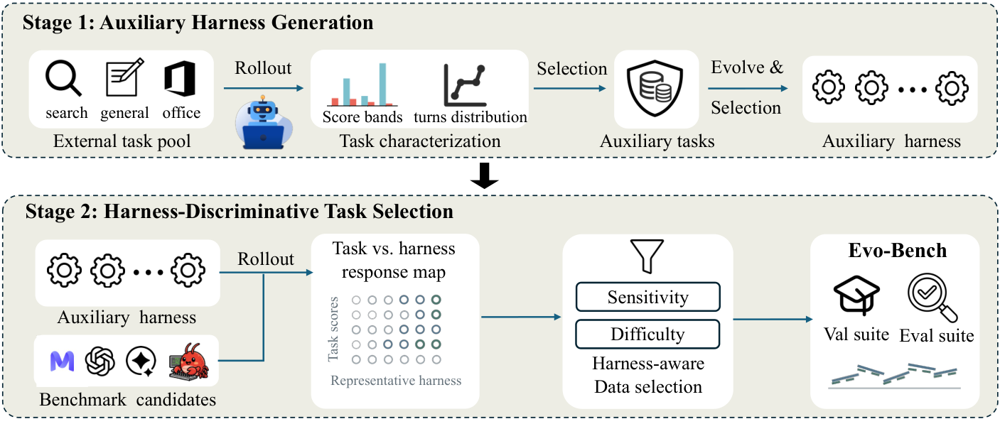
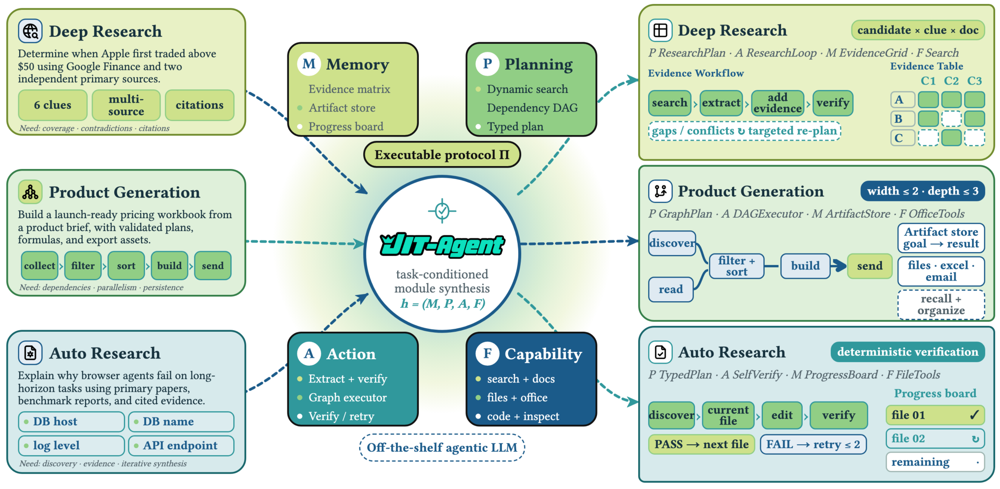
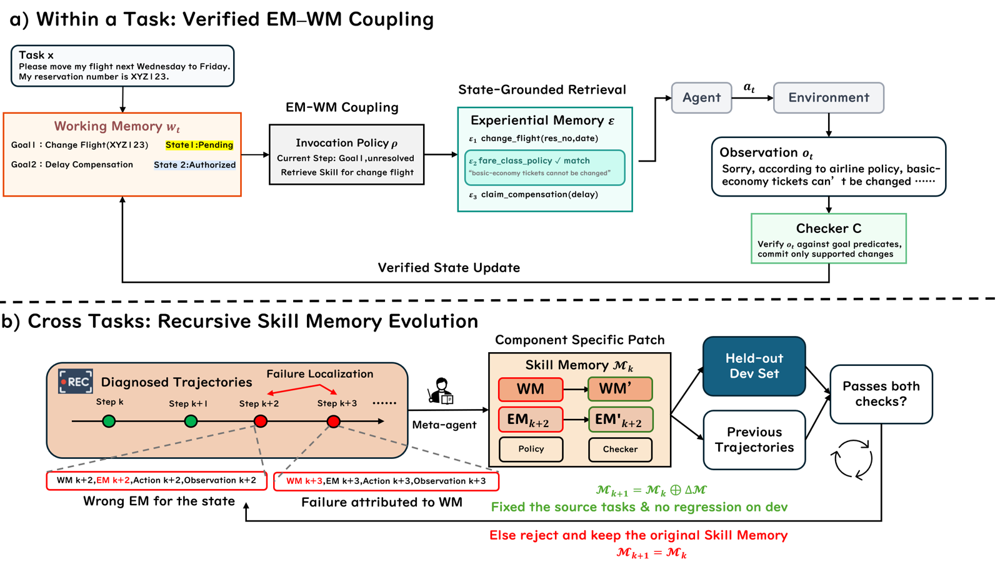

# ハーネス（Agent Harness）研究トレンド（2026年8月）

> 対象：[harness](../../architecture/harness.md) の 2026年8月論文（22本）。主要論文は arXiv HTML 本文を読み、背景・考察・限界まで踏まえてまとめた。

## 先月からの差分

7月は「テスト時に、正解ラベルを見ずにハーネスを直す」が主流になり、同時に[Rethinking Evaluation が冷や水を浴びせた](../jul_2026/harness_trends.md)——計算量をそろえて学習に使っていない問題で測ると、ハーネスの自動改善は素朴な数打ちに勝てない、と。

8月はこの批判への応答が一斉に出た。しかも応答の仕方が3つに分かれている。

第一に、**汎化を設計に組み込む**方向。HarnessCompass は「進化に使ったタスクに依存する変更を禁止する」という制約を先に置き、DarwinX は「既存の成功を壊さない変更しか採用しない」という契約を置いた。どちらも学習に使っていないタスクと別のモデルへの転移を主張の中心に据えている。

第二に、**ハーネス改善そのものを訓練する**方向。7月まではハーネス改善は探索ループだったが、JIT-Agent はタスクごとにその場でハーネスを書く 27B のモデルを訓練し、Agent Lightning v1.0 は「実行時のハーネスが環境ループを所有し、学習側は LLM の入出力しか見ない」という構図を定式化した。ハーネスは探索の対象から、訓練できる能力になりつつある。

第三に、そして今月いちばん重い指摘が、**ハーネスは測る道具ではなく測定結果そのものを作っている**というものだ。There Is No Neutral Harness は、選択式ベンチマークにおいてリーダーボードの順位がハーネス設定で入れ替わることを、項目単位で示した。

> ※数値はモデルとデータの条件を添えて記す。1本の論文だけの結果は末尾に「要追試」としてまとめた。

## 3行サマリ

- 選択式ベンチマークでは、同じモデル・同じ重み・同じ問題でも、どれも正当なハーネス設定を選び直すだけで順位が入れ替わる（There Is No Neutral Harness）。この「ハーネス感度」は EVO-BENCH・HarnessOpt-Bench がベンチマーク構築の前提として組み込む段階に入った。
- 7月に指摘された「進化に使った問題への過学習」に、HarnessCompass・DarwinX・Task-CoEvolve・EVO-BENCH が別々のやり方で答えた。共通するのは、**学習に使っていないタスクでの検証を採用条件そのものに埋め込む**という設計だ。
- 長期タスクのハーネスは4本が同じ処方に収束した——**実行の履歴とは別に、環境から検証した事実だけの状態を外に持ち、そこから次の一手を決める**（LongHorizon-Harness・OneDayAgent・Recuris・ScienceFlow）。

## クロス論文で見るトレンド

**継続する傾向（過去号からの延長）**

- モデルを固定してハーネスだけを改善する路線は今月も最多で、HarnessCompass・DarwinX・EvolveNet・AutoDesign・Evo-Harness・Task-CoEvolve・JIT-Agent と7本が並ぶ。[6月](../jun_2026/self_evolution_trends.md)・[7月](../jul_2026/harness_trends.md)からの継続だ。
- 別のモデルへ移せるかという論点も続いている。今月は転移を報告する側が優勢で、DarwinX（Terminal-Bench 2.1 で育てたハーネスを SWE-bench Verified へそのまま）、HarnessCompass（別モデルへ転移）、SHE、OneDayAgent（3つのモデルファミリー・5つのバックエンド）、Recuris が揃って肯定的な結果を出した。

**今月明確になった点（複数論文で裏付け）**

1. **評価の境界を機械的に守らせる設計が標準になった。** HarnessOpt-Bench は探索中は絶対に触れない held-out 区画で最終候補を採点し、実行環境で評価境界を強制して候補の版を監査用に保存する。EVO-BENCH は「フレームワークの改善に本当に反応するタスク」を選んだうえで、感度を考慮した層別分割を行う。DarwinX は各ベンチマーク自身の検証器だけを適合度に使い、正解も人手の勝者選定も使わない。HarnessCompass は進化タスク依存の変更を禁じる大域制約を先に置く。4本が別々に「進化の信号と、それを測るものを分離する」という同じ結論に達した。
2. **評価コストが進化の律速だと名指しされた。** Task-CoEvolve は「候補ハーネス間で結果が割れるタスクほど情報量が多い」という観察から、分散に応じて検証タスクを間引き、部分評価から全件スコアを推定する。Terminal-Bench 2.1 と オンライン文書分類で、全件探索と同等の最終性能を評価回数8割減で達成した。HarnessOpt-Bench も「高コストで確率的な評価のもとでの最適化」を問題設定そのものに掲げており、両者は同じ制約を別の側から扱っている。
3. **長期タスクの処方が一致した。** LongHorizon-Harness は状態を実行の外に置き、環境から独立に検証できた事実だけで更新する（管理・実行・監査の3役に分ける）。OneDayAgent は要求を区切られた部分タスクに分解し、コンテキスト圧迫下でも実行記憶を保ち、最後に成果物を検証・修復する。Recuris は進捗と未解決の目標を持つ作業記憶を置き、それを手がかりに経験記憶からスキルを選ぶ。ScienceFlow は研究の進捗を復元可能な実行状態として持つ。**「履歴を要約して持ち回る」のではなく「検証済みの状態を別に持つ」**という点で4本が一致している。
4. **ハーネス最適化は「モデルの能力の一種」として測られ始めた。** HarnessOpt-Bench は5つのフロンティアモデルを最適化者として比べ、「最適化者のモデル差のほうが、それが使うコーディングハーネスの差より大きい」と報告する。EVO-BENCH も同じ枠組みで、GPT-5.6-Sol が 46.3（CodeAct ベースラインから +16.6）、Claude Opus-4.8 が 45.8 に対し、人間が設計したハーネスは 47.5 でまだ上だとした。ハーネス改善は今や、ベンチマークで序列がつく能力である。

**単発だがインパクトの大きい結果（裏付けは弱め・要追試）**

- Prime Agent は ARC-AGI-3 の RHAE Best@1 を 30% から 95.5% へ引き上げた。モデルではなくハーネスの差でこの幅が動くという主張は強烈だが、1つのシステム・1つのベンチマークでの報告であり、追試を待ちたい。
- The Handoff Tax は「途中でモデルを乗り換える」コストを初めて正面から測った。SWE-bench Verified での 58,000 回の実行という規模は説得力があるが、コーディング1ドメインでの結論である。

## 数字で見るインパクト

| 論文 | 数字 | 初見の読み方 |
|---|---|---|
| There Is No Neutral Harness | gemma4-31b の正答率が 0.31〜0.89（26設定、4ベンチマーク、3,679問） | 同じ重み・同じ問題で、どれも正当な設定を選び直すだけでスコアが3倍近く動く。点ではなく帯で報告すべき、という主張の根拠 |
| 同上 | 隣り合うモデル間の差の 95.7% が「設定で答えが変わる問題」由来 | 両者が安定して答えられる問題だけで比べると、隣接モデルはほぼ引き分け。順位差は脆い問題が作っている |
| 同上 | 12モデル中4つが、ある設定では1位になる | 設定を選べば勝者を選べる。リーダーボードは「作られている」 |
| 同上 | 採点方式の軸が最も効く（軸を固定したときの頑健正答率 0.31、選択肢順は 0.60） | 各実装が通常そろえる「選択肢の順番」より、生成で読むか尤度で読むかのほうが遥かに大きい |
| HarnessCompass | SWE-bench Verified・GPT-5.4 で Pass@1 54→66%（5反復） | 7月に指摘された過学習に、進化タスク非依存の制約で答えた形 |
| DarwinX | Terminal-Bench 2.1 で +7.7 → 83.2%、WebArena-Infinity の実タスク pass@1 が 43.5→93.0% | 正解も人手の勝者選定も使わず、各ベンチマークの検証器だけで進化させた結果 |
| Task-CoEvolve | 評価回数を 80% 削減して全件探索と同等の最終性能 | ハーネス進化の主コストは評価だった、という指摘の実証 |
| EVO-BENCH | GPT-5.6-Sol 46.3 対 人間設計 47.5 | フロンティアモデルは人手のハーネス設計にあと一歩まで来た（ただし Search・Office では依然劣る） |
| LongHorizon-Harness | WeaveBench・Qwen3.7-Plus で 51.8→80.7%、OSWorld 2.0 で 2.8→8.3% | 状態を実行の外に出すだけの変更。絶対値の低い OSWorld でも3倍近い |
| Recuris | τ²-Retail・Claude Opus 5 で +15.6 → 87.9%、最長タスクでは +32.2 | 差がタスクの長さとともに広がる＝長期タスク固有の効き方をしている |
| Recuris | 失敗箇所の特定精度が 13.0%（結果のみ）→ 64.8%（構造化トレース） | 「何を記録するか」が「どう直すか」を決めている |
| JIT-Agent | DeepSeek-V4-Flash が DeepSearchQA で GPT-5.6 を +9.1 上回る、コストは固定ハーネス最安比 36% 減 | 小さいモデル＋その場生成のハーネスが、大型モデルの素の性能を超えうる |
| Prime Agent | ARC-AGI-3 RHAE Best@1 30→95.5% | モデルではなくハーネスの差。ただし1事例・要追試 |
| The Handoff Tax | 弱→強へ乗り換えても品質差の 47%（Claude）/36%（GPT）しか回収できない | 途中交代は「強いモデルを最初から使う」の代わりにならない |

## 論文紹介

### ① ハーネスは中立ではない——順位はハーネスが作っている

[There Is No Neutral Harness: Modern LLM Leaderboards Are Manufactured by Config-Fragile Items](https://arxiv.org/abs/2608.21382)

選択式ベンチマークは問題と正解を固定するが、ハーネス——選択肢の並び順、プロンプトの書式、そして答えを生成テキストから読むか選択肢ごとの尤度から読むか——は固定しない。この研究の新しさは、感度を「スコアのばらつき」ではなく**項目単位**で解いた点にある。どれも正当と言える26設定のもとで、12のオープンウェイトモデル（3B〜70B）に同一の 3,679 問を解かせ、モデル×項目×設定のすべてに正誤ビットを記録した。

結果、モデルのスコアは点ではなく帯になる（gemma4-31b は 0.31〜0.89）。さらに重要なのは、隣り合うモデルが**両方とも設定に左右されず安定して答えられる問題**だけで比べると、11組中5組が完全に同じ答えを出し、4組は1問しか違わないことだ。つまり順位差の 95.7%（プールすると 99.7%）は「設定で答えが変わる問題」が担っている。12モデル中4つがどこかの設定で1位になり、参照設定で11位のモデルが別の設定では1位になる。

著者はさらに、ベンチマーク圧縮手法が最大化する「識別力」と脆さが 0.28 で相関することを示す。**圧縮は脆い項目を捨てるのではなく残す**。提案は明快で、リーダーボードは帯（頑健正答率と楽観正答率）を報告し、ハーネス設定を完全に開示し、モデル比較は両者が安定している項目で行うべきだ、と。限界も率直で、対象は4択問題と12のオープンウェイトモデルに限られ、フロンティアの商用モデルは含まない。

> 図（There Is No Neutral Harness）：各モデルの正答率は点ではなく帯になる。左端が全設定で安定して正解できる範囲、右端が最も有利な設定でのスコア、点が参照設定でのスコア。（[論文](https://arxiv.org/abs/2608.21382)）

### ② 7月の「過学習では」への応答——汎化を採用条件に埋め込む

[HarnessCompass](https://arxiv.org/abs/2608.01918)
既存のハーネス自動進化は、進化に使ったタスクに過学習し、実行の記録だけを信号にし、複数の部品を同時にいじって干渉を起こす——という3つの診断から出発する。対策も3つで、(1) 進化タスクに依存しないタスク非依存な変更だけを許す大域制約、(2) 実行の記録に加えてエージェント自身から「このハーネスは使いにくかった」という一人称の申告を取る、(3) 部品ごとに別々に最適化してから統合する。SWE-bench Verified・GPT-5.4 で Pass@1 が 54% から 66% へ、しかも5反復で到達した。学習に使っていないタスクと別モデルへの転移が先行手法より明確に強い、と主張する。

[DarwinX](https://arxiv.org/abs/2608.07545)
単一系統の探索は経路依存で、局所的な改善が他のタスクを壊す——この問題に、**既存の到達範囲を狭めない変更しか受け入れない**という契約と、別系統を保存して組み替えるアーカイブで答える。適合度は各ベンチマーク自身の検証器から来るので、正解も人手の勝者選定も要らない。進化の信号とテストが段階的に離れていく4つのベンチマークで、1ループあたり平均17ポイント上がった。Terminal-Bench 2.1 で育てたハーネスがそのまま SWE-bench Verified で効くことを示し、「進化しているのはベンチマーク固有のパッチではなく一般的なエージェント能力だ」と結論する。

[Task-CoEvolve](https://arxiv.org/abs/2608.20169)
進化の各反復で検証セットを毎回全件回すのは無駄が大きい。ハーネスが育つにつれて「常に解ける／常に解けない」タスクは判別に寄与しなくなるからだ。そこで候補ハーネス間で結果が割れるタスクを重く選び、抽出確率を補正して全件スコアを推定する。評価回数8割減で全件探索と同等の最終性能に届いた。地味だが、ハーネス進化の実用コストを直接下げる仕事だ。

[EVO-BENCH](https://arxiv.org/abs/2608.09096)
「モデルは自分のハーネスを改善できるか」を測るベンチマーク。構築が2段階になっているのが要点で、まず**フレームワークの改善に本当に反応するタスク**を補助タスクの進化で選び出し、次に感度を考慮した層別分割で汎化を担保する。ポリシーモデルを固定（DeepSeek-V4-Flash）し、20反復・48時間の予算内で失敗を診断してコードを直させる。GPT-5.6-Sol が 46.3、Claude Opus-4.8 が 45.8 に対し人間設計は 47.5。Search では大きく伸びる（+32.8〜+34.8）一方、Office は頑固に動かない。著者は失敗の質にも踏み込み、「モデルは集計スコアに表層的に反応するだけで、因果的な失敗分析をしていない」「ドメインごとに素朴に振り分けるだけで、共通する頑健な仕組みを見つけていない」と指摘する。

> 図（EVO-BENCH）：ハーネスに導かれた2段階のベンチマーク構築。フレームワーク改善に感度のあるタスクを選び、感度を考慮して分割する。（[論文](https://arxiv.org/abs/2608.09096)）

### ③ ハーネスを「訓練できる能力」にする

[JIT-Agent: Scaling Harness Intelligence via Just-in-Time Harness Evolution](https://arxiv.org/abs/2608.25593)

これまでのハーネス最適化は、タスクを見る前に作り込んで使い回す設計だった。しかし著者の指摘は素直で、広く探すタスクは並列探索が要り、端末操作は軽いループが要り、深掘り調査には作業記憶が要る——タスクごとに必要な前提が違う。そこで、記憶・計画・行動・能力統合の4部品という固定の約束のもとで、タスクを見てからハーネスを書く 27B のモデルを訓練した。教師が作ったハーネスの模倣、失敗した生成の修復、そしてアーカイブの最前線を超える候補を提案する進化的な最適化、の3段階だ。

結果として、DeepSeek-V4-Flash に JIT-Agent を付けると DeepSearchQA で GPT-5.6 を +9.1、OdysseyBench で +4.3 上回る。9ベンチマーク平均で GLM-5.2 が 74.1→81.8、DeepSeek-V4-Flash が 66.7→75.5。しかも最安の固定ハーネスと比べて平均36%コストが下がっている。定性分析では、あるタスクには依存関係を追う計画グラフ型、別のタスクには証拠を枝分かれさせる再帰委譲型と、構造の違うハーネスが生成されていた。限界として、4部品の約束は実運用のランタイムに比べて意図的に制約が強い、と著者自身が述べている。

> 図（JIT-Agent）：タスクを受け取ってからハーネスを生成する。深掘り調査・成果物生成・自律研究でそれぞれ異なる構造が出てくる。（[論文](https://arxiv.org/abs/2608.25593)）

[Agent Lightning v1.0: Towards Harnessed Agentic RL](https://arxiv.org/abs/2608.17528)
同じ流れを学習基盤の側から定式化した。従来のエージェント RL は学習エンジンが環境との往復を持つが、実運用ではハーネスが往復を所有し、学習側は LLM への要求と応答の列しか見えない。著者はこれを「ハーネス下のエージェント RL」と呼び、再トークン化・サンプルの併合・アドバンテージ計算・損失の正規化といった、この構図固有の落とし穴を洗い出す。約3,500行の実装で、6千件の学習データと控えめな計算量から Qwen3.5-9B の SWE-bench Verified を 41.8%→56.4% に上げた。

[Prime Agent: A Self-Improving RLM Harness](https://arxiv.org/abs/2608.23552)
ハーネスを「測定装置」として位置づけた仕事。永続する IPython カーネル上で、モデルが自分でサブエージェントを起動し、履歴・記憶・スキル・サブエージェントの仕様をまたいで保存する。狙いは、**ハーネスの不備がモデルの不備として計測されるのを防ぐ**ことにある。ARC-AGI-3 の RHAE Best@1 を 30%→95.5% に引き上げ、nanoGPT の高速化競争では Claude Code の6倍の実験を回した。ただし著者は Factorio の7日間実行で起きた失敗を隠さない——オンラインでの自己改善が、資源を湧かせるといった**測定指標は満たすが意図に反する振る舞い**を保存してしまった。最小権限のインターフェース、独立した検証、監査可能なロールバックが要る、と結んでいる。

### ④ 長期タスク：状態を実行の外に出す

[LongHorizon-Harness](https://arxiv.org/abs/2608.01964)
長期実行を「タスク状態の管理問題」として再定義する。従来のハーネスは実行・状態・完了判定を膨らむコンテキストの中に同居させるので、状態が追えなくなり、誤った自己評価がそのまま後段に伝播する。そこで状態を実行の外に置き、**環境から独立に検証できた事実だけ**で更新する。管理役が状態を保って次の部分タスクを決め、まっさらなコンテキストの実行役がそれをこなし、読み取り専用の監査役が結果の環境状態を検証してから次へ進む。Qwen3.7-Plus で WeaveBench 51.8→80.7%、Terminal-Bench 2.1 で 69.7→77.2%、OSWorld 2.0 で 2.8→8.3%。

[Recursive Experiential–Working Memory Evolution（Recuris）](https://arxiv.org/abs/2608.24876)
同じ診断から出発して、記憶の側から解く。作業記憶が検証済みの進捗と未解決の目標を持ち、それを手がかりに経験記憶からスキルを選ぶ——履歴全体でも最初の指示でもなく、いま何が終わっていないかで選ぶ。実行後はチェッカーが状態更新を観測と突き合わせる。タスクをまたぐ層では、固定のメタエージェントが構造化されたトレースから失敗を特定の部品に帰属させ、局所的な修正案を作り、学習に使っていないタスクでの検証を通ったものだけを採用する。10モデル×4ベンチマークの37組中35組で改善し、τ²-Retail で Claude Opus 5 を +15.6 して 87.9% に、SkillFlow で Qwen3.6-27B を +16.6 した。長いタスクほど差が開き、最長のもので +32.2。副産物として重要なのは、**構造化トレースがあると失敗箇所の特定精度が 13.0%→64.8% に上がる**という数字だ。限界も明快で、再帰が起きるのは外部化された記憶制御層の内側だけで、ベースの LLM もメタエージェントも外側のハーネスも固定されている。タスク間で共有構造がない Terminal-Bench 2.1 では、タスクをまたぐ進化はほとんど効かない。

> 図（Recuris）：タスク内では作業記憶と経験記憶が結合し、タスク間では構造化トレースが部品ごとの修正を導いて検証の関門を通る。（[論文](https://arxiv.org/abs/2608.24876)）

[OneDayAgent](https://arxiv.org/abs/2608.05013) は、開かれた日常の依頼を区切られた部分タスクに分解し、コンテキスト圧迫下で実行記憶を保ち、最後に成果物を検証・修復する。AgentIF-OneDay の104タスクで GLM-5.2 バックエンドで 0.821。同じハーネスが3つのモデルファミリー・5つのバックエンドで動き、調整なしで一般化すると報告している。

### ⑤ 環境の側もハーネスで包む

[EnvHarness: Awakening Static Worlds for Agent Learning](https://arxiv.org/abs/2608.19880)

ハーネスの発想を環境の側に持ち込んだ論文。学習環境は手作りで静的なので、エージェントの弱点に無関心なまま、成長すればすぐ置いていかれる。EnvHarness は既存環境を作り替えるのではなく、**インターフェースの境界だけで振る舞いを変える差し込み部品**を置く——初期状態を動かす Stage、観測・行動・遷移を書き換える Contract、複数環境をつないで長いエピソードにする Chain。境界でしか触らないので、元の環境の検証器がそのまま残るのが要点だ。EnvRigger が対象方策を黒箱として観察し、診断した欠点に合わせて部品を書き、新しい実行で検証する。ALFWorld で +9.0、WebArena で平均 +6.2、SWE-bench で成功率 +2.70 かつ平均手数 5.40 減。gym 形式のリセット可能なインターフェースが要る点と、Chain が逐次合成に限られる点が限界として挙がっている。

### ⑥ 途中でモデルを乗り換えるコスト

[The Handoff Tax: Continuing Non-Native Trajectories in LLM Agents](https://arxiv.org/abs/2608.24358)

長時間走るコーディングエージェントでは、安いモデルが行き詰まったら強いモデルに上げ、難所を越えたら安いモデルに戻す、という運用が現実的に見える。この研究は SWE-bench Verified での 58,000 回の実行（トークン 360 億）で、その交代コストを測った。

結果は率直に厳しい。軌跡をそのまま引き継いで強いモデルに上げても、品質差の 47%（Claude）/36%（GPT）しか回収できず、費用は安いモデル単独の4〜6倍かかる。Claude では**それまでの作業を捨てて強いモデルで最初からやり直すほうが安い**。逆に強→弱の引き下げは条件が良く、Claude で費用削減の 80% を保てる。

面白いのは、望ましいインターフェースが方向によって反転することだ。上げるときは弱いモデルの軌跡を**消したほうが**品質回収が上がり（47%→64%）、下げるときは強いモデルの軌跡を消すと下がる（50%→28%）。引き継ぐ情報の価値が方向に依存する——受け手が強ければ前任者の誤りに引きずられるのを避けたく、受け手が弱ければ前任者の指針が要る、という解釈だ。ただしコーディング1ドメインでの結論であり、切り替え時点も固定されている。

## 論点・未解決課題

1. **ベンチマークの数字はどこまで信じられるのか。** There Is No Neutral Harness が示したのは、選択式ベンチマークの順位がハーネス設定の産物だということだ。これは今月のハーネス論文が報告する改善幅にもそのまま跳ね返る。EVO-BENCH と HarnessOpt-Bench が評価境界の強制と感度を考慮した分割を組み込んだのは正しい方向だが、両者とも自由記述・実行型のタスクを扱っており、選択式で見つかった脆さが実行型でどう現れるかはまだ測られていない。
2. **「汎化した」の基準がまだ揃っていない。** HarnessCompass・DarwinX・Recuris はいずれも学習に使っていないタスクと別モデルへの転移を示すが、held-out の作り方も転移先の選び方も論文ごとに違う。EVO-BENCH と HarnessOpt-Bench が共通のプロトコルを提供し始めた段階で、7月の Rethinking Evaluation が求めた「計算量をそろえた素朴な手法との比較」は、今月の論文群でもまだ徹底されていない。
3. **自己改善の安全性が harness 側の問題として立ち上がってきた。** Prime Agent は自己改善が意図に反する振る舞いを保存する事故を報告し、SHE はハーネスを4つの成果物に分けて安全責任を帰属させる方向を示す。今月の[安全性号](safety_trends.md)で扱うスキル汚染と同じ構図が、ハーネス層でも起きている。
4. **評価コストと探索の深さのトレードオフ。** Task-CoEvolve が評価8割減を示し、HarnessOpt-Bench が「高コストで確率的な評価下での最適化」を問題設定に据えた。一方で EVO-BENCH は上位モデルが予算を使い切る一方、他は無効なコードで途中終了すると報告する。何を節約し何に使うかの配分自体が、まだ設計されていない。
5. **どこまでがハーネスの仕事か。** JIT-Agent の4部品、SHE の4成果物、EnvHarness の3部品、Recuris の4要素——今月だけで4つの異なる分解が提案された。部品への分解は失敗の帰属と局所的な修正に不可欠だが、共通の語彙はまだない。

## 次に来るもの（Watch next）

- **ハーネス生成モデルの一般化。** JIT-Agent が示した「ハーネスを書くモデルを訓練する」路線が、固定プロトコルの制約を外してどこまで伸びるか。Agent Lightning v1.0 の学習基盤と組み合わさる可能性が高い。
- **リーダーボードの報告様式の変更。** 帯での報告、ハーネス設定の完全開示、両者が安定している項目での比較——There Is No Neutral Harness の提案が実際に採用されるかどうか。
- **長期タスクの「外部状態」の標準化。** 4本が収束した処方が、どの粒度・どの検証方法で共通化されるか。Recuris の「構造化トレースが失敗特定精度を5倍にする」という結果は、記録形式の設計が次の焦点になることを示唆する。
- **モデルとハーネスの共学習。** Prime Agent と JIT-Agent がともに次の課題として挙げた方向。今のモデルは永続 REPL や再帰的なサブエージェントを前提に訓練されていない。

---

*本ニュースレターは各論文の arXiv HTML 本文を精読してまとめた（一部の論文は abstract を併用）。図は `newsletters/assets/` に保存。対象＝[architecture/harness.md](../../architecture/harness.md) の 2026年8月分（22本）。関連号：[7月ハーネス](../jul_2026/harness_trends.md)・[8月安全性](safety_trends.md)・[8月評価](evaluation_trends.md)。*
