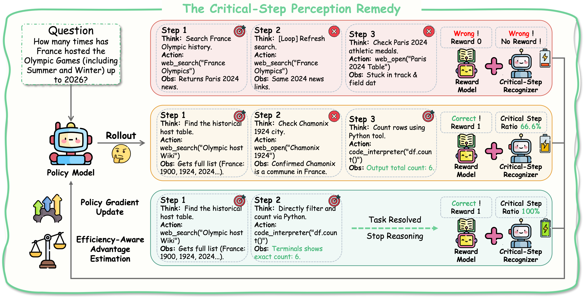
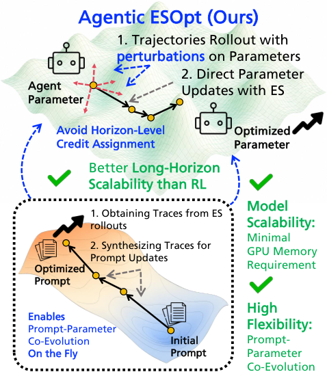

# エージェント学習（Agent Tuning）研究トレンド（2026年8月）

> 対象：[learning](../../capabilities/adaptation/learning.md) の 2026年8月論文（8本）。主要論文は arXiv HTML 本文を読み、背景・考察・限界まで踏まえてまとめた。

## 先月からの差分

このカテゴリは「重みを更新してエージェントを強くする」路線を扱う（重みを触らない改善は[自己進化](self_evolution_trends.md)と[ハーネス](harness_trends.md)へ）。7月は "Next-Generation Agentic Reinforcement Learning Systems" のような枠組みの提案が中心だった。

8月の8本は、**エージェント RL の詰まりどころを3つに名指しした**という点で揃っている。

第一に**環境の供給**。SPADE は「検証可能な報酬を持つ対話的なタスクの供給が、いまや進歩の制約になっている」と述べ、環境設計そのものを学習可能な要素にした。Scaling AutoResearch via World Models は別の側から同じ壁を突く——生成側はバッチで計算を共有できるが、環境の実行は各軌跡が専用のサンドボックスと実時間を占有するので、軌跡が長くなるほど実行が学習コストを支配する。

第二に**報酬とクレジットの粗さ**。Credit Without Ground Truth は、ステップ単位のクレジット信号が因果的な貢献を捉えていないことを実行による反実仮想で示した（詳細は[失敗帰属号](failure_attribution_trends.md)）。CRISP は効率化の報酬設計を問題にし、「ツール使用を一律に罰すると、必要な証拠を集める手まで抑えてしまう」と指摘する。

第三に**計算資源**。Agentic ESOpt は逆伝播に依存する学習スタックが大きいモデルの微調整を非現実的にしていると述べ、進化戦略で推論レベルのメモリだけで全パラメータ最適化を行う。

つまり今月は、手法の新規性より**何が律速かの特定**が進んだ月だった。

> ※数値はモデルとデータの条件を添えて記す。1本の論文だけの結果は末尾に「要追試」としてまとめた。

## 3行サマリ

- 環境の供給が律速だと3本が別々に名指しした。SPADE は環境設計を学習可能にし（Qwen3-30B-A3B で学習に使っていない8ベンチマークの平均 +8.1、固定環境の最強手法比 +5.3）、Scaling AutoResearch は環境実行を世界モデルで置き換えて学習を3〜4倍速くした。
- 報酬とクレジットの粗さが2本から問われた。Credit Without Ground Truth はステップ単位のクレジットが因果を捉えていないと示し、CRISP はツール使用を一律に罰する効率化をやめて証拠を集める手だけ残す設計で、対話ターンを 15.1%／33.2% 削った。
- 計算制約への回答も出た。Agentic ESOpt は逆伝播を使わない進化戦略で 27B の全パラメータを推論レベルのメモリだけで最適化し、Scaling AutoResearch の 4B・9B は 48B・120B のオープンウェイトを学習に使っていないベンチマークで上回った。

## クロス論文で見るトレンド

**継続する傾向（過去号からの延長）**

- エージェント RL の枠組みを整備する路線は7月から継続していて、今月は Agent Lightning v1.0 が「実行時のハーネスが環境ループを所有し、学習側は LLM への要求と応答の列しか見ない」という構図を定式化した（[ハーネス号](harness_trends.md)で詳述）。方向は変わらず、扱いが具体的になっている。
- 応用ドメインでの事後学習も継続。今月は Training AI Scientists to Replicate Research（論文の再現）と Clearing the Fog（先を見越した探索）。

**今月明確になった点（複数論文で裏付け）**

1. **学習環境の供給がボトルネックである。** SPADE はこれを正面から主張し、環境プールが手作りでも静的合成でも凍結された検証器でも、学習者が強くなると目標の分布が固定されたままになると述べる。Scaling AutoResearch via World Models は同じ壁をコストの側から特定した——AutoResearch の軌跡は生成と環境実行という2つの要素からなり、**生成はバッチで計算を共有できるが実行は共有できない**ので、軌跡が伸びるほど実行が学習コストを支配する。[ハーネス号](harness_trends.md)の EnvHarness も「環境は手作りで静的なので、エージェントの弱点に無関心なまま、成長すればすぐ置いていかれる」と同じ診断から出発する。3本が別々の解（環境を設計させる／世界モデルで置き換える／既存環境を包んで作り替える）に向かっている。
2. **粗い報酬設計への疑いが強まった。** CRISP は既存の効率化手法が「ツールの呼び出しを一律に減らすよう促す」ことを問題視し、**必要な証拠を集める手と冗長な手を区別しない**と指摘する。Credit Without Ground Truth はさらに根本的で、いま使われているステップ単位のクレジット信号（LLM 判定、結果条件つき対数確率比、方策の自信度）が因果的な貢献を偶然以上に当てられないと示した。両者は「何に報酬を与えるか」の粒度と正しさを、別の角度から問うている。
3. **重み更新の入り口が広がった。** Agentic ESOpt は逆伝播に依存しない進化戦略を使うことで、推論レベルのメモリだけで全パラメータを最適化する。Scaling AutoResearch は世界モデルで実行を置き換えることで、4B・9B のエージェントが 48B・120B のオープンウェイトを上回るところまで持っていった。どちらも**大きなモデルを訓練できないという制約**への回答で、方向は違うが動機は同じだ。
4. **学習の対象が「方策」から「方策と周辺の共進化」へ広がった。** SPADE は環境設計者と推論エージェントを同じモデルの2つの役割として交互に学習させ、Agentic ESOpt は「パラメータと文脈の共進化」を掲げてプロンプト空間の進化と組み合わせる。[ハーネス号](harness_trends.md)の Co-Harness、[自己進化号](self_evolution_trends.md)の CoEvo-Mem も同じ形だ。

**単発だがインパクトの大きい結果（裏付けは弱め・要追試）**

- Training AI Scientists to Replicate Research は、27B の Faraday が論文再現の学習に使っていないタスクで Claude Opus 4.8 と GPT-5.5 を上回ったと報告する。「複雑なハーネスなしで長期の科学的な革新へ向かう足がかり」という主張は強いが、自動生成のルーブリック判定を報酬にした1つの系での結果だ。
- Scaling AutoResearch via World Models は、世界モデルの報酬に偏りと雑音があっても、オンラインでの偏り除去と逆分散による雑音抑制を加えれば収束保証が厳密に改善すると理論的に示したうえで、実際に3〜4倍の高速化を報告した。理論と実験の両輪は説得力があるが、AutoResearch と身体性 VLA という2領域での確認である。

## 数字で見るインパクト

| 論文 | 数字 | 初見の読み方 |
|---|---|---|
| SPADE | Qwen3-30B-A3B で学習に使っていない8ベンチマーク（AIME 2025/2026, GPQA-Diamond, LiveCodeBench-v6, Reasoning-Gym）平均 +8.1、固定環境の最強手法（RLVE）比 +5.3 | ゲームで学ばせたものが数学・科学・コードへ移る。環境を作らせること自体が効いている |
| 同上 | ツール利用では BFCL v4 多ターンで +5.7、ACEBench-Agent で +13.9（いずれも 30B-A3B） | 単発の推論と多段のツール利用を、同じコードとしての環境表現で扱えている |
| 同上 | 環境設計者の学習と環境メモリを両方外すと、学習前のベースより 9.7 ポイント低下 | 環境を作らせるだけでは逆効果。何を作ったかを覚えて避ける仕組みが要る |
| Scaling AutoResearch via World Models | 各種タスク・各種規模で学習が 3〜4倍速く、標準 RL の性能も上回る | 環境実行という律速を外した効果。速度と性能を同時に取っている |
| 同上 | 事後学習した 4B・9B が 48B・120B のオープンウェイトを学習に使っていないベンチマークで上回る | 学習の回数を稼げることが、モデルの大きさを補う |
| CRISP | BrowseComp で平均対話ターン −15.1%、HLE-Verified で −33.2%、最終正答率は競争力を維持 | ツール使用を一律に減らすのではなく、証拠を集める手を残したまま冗長な手だけ削る |
| Credit Without Ground Truth | ステップ単位のクレジット信号は、因果的な正解に対してシャッフル対照を上回らない（ALFWorld、7〜8B） | いま学習に使われている報酬の粒度そのものが疑わしい |
| Agentic ESOpt | WebArena-Lite で Qwen-3.5-27B の全パラメータ最適化により、スキルなしの基準から +6.69%。テスト時の自動ヒューリスティック設計では36設定中28で基準を改善 | 逆伝播なしで 27B の全パラメータを動かせる。必要なのは推論レベルのメモリのみ |
| Training AI Scientists | 27B の Faraday が、学習に使っていない再現タスクで Claude Opus 4.8 と GPT-5.5 を上回る | 小さいモデルを課題特化で事後学習すると、フロンティアを超えうる |
| Clearing the Fog | 探索に富んだ軌跡の合成と、対比的な軌跡対による RL 最適化 | 「後知恵のバイアス」を持つ標準的なお手本を避けて、探索そのものを学習させる |

## 論文紹介

### ① 環境をどう供給するか

[SPADE: Self-Play in Adaptive Synthetic Executable Environments](https://arxiv.org/abs/2608.19197)

継続的な自己改善には、自ら生成する多様で適応的な目標が尽きずに供給される必要がある。ところが既存の学習環境プールは、手作りでも静的合成でも凍結された検証器でも、**学習者が強くなっても目標の分布が固定されたまま**だ。著者は「検証可能な報酬を持つ対話的なタスクの供給が、エージェント AI の進歩を制約している」と明言する。

SPADE では1つの LLM が2つの役割を交互に務める。環境設計者は、完全で長期的な学習環境を `reset()`／`step()` を備えた実行可能なコードとして書く。推論エージェントはその中で行動を学ぶ。各環境は状態遷移・報酬関数・検証コードを持つ多ターンの環境なので、**1つのインターフェースが単発の推論問題から多段のツール利用までを覆う**。

報酬設計が要点だ。推論エージェントの後悔を、特権的なヒントがある場合とない場合の報酬の差で推定する。この後悔を最大化するよう環境設計者を最適化すると、**エージェントの能力の縁——ヒントがあれば解けるが、なければ難しい——に狙いを定めた環境**が生まれる。加えて2つの仕掛けが不可欠だと分かった。環境設計者を大規模な事前学習コーパスの文書に接地させること（ゲームには数学・科学、ツール利用にはコード）と、過去の環境を後悔スコア付きで蓄える環境メモリを持たせること。

Qwen3 の 4B・8B・30B-A3B を GRPO で 400 反復。30B-A3B では学習に使っていない8ベンチマークの平均で学習前から +8.1、固定環境の最強手法（RLVE）比で +5.3。利得はモデルが大きいほど伸びる（4B: +5.2、8B: +5.7、30B: +8.1）。ツール利用では BFCL v4 多ターンで +5.7、ACEBench-Agent で +13.9。切り分けが厳しく、**環境設計者の学習と環境メモリを両方外すと学習前のベースを 9.7 ポイント下回る**——環境を作らせるだけでは逆効果になる。限界として、環境の複雑さがモデル規模に縛られること、学習則そのものはメタ学習せず人間が設計した GRPO を固定で使っていること、開放的な成長の指標ではなく固定のベンチマークで測っていることが挙げられている。

> 図（SPADE）：環境設計者が実行可能な環境とヒントを作り、推論エージェントがヒントあり・なしで解く。その差（後悔）が設計者の報酬になる。（[論文](https://arxiv.org/abs/2608.19197)）

[Scaling Automatic Research Agents via World Models](https://arxiv.org/abs/2608.12564)

同じ壁をコストの構造から突く。AutoResearch の軌跡は、エージェントの生成と環境の実行という2つの要素からなるが、**両者のスケールのしかたがまったく違う**。生成はバッチで計算を共有できるのに対し、実行は各軌跡が専用のサンドボックスと実マシンの時間を占有する。結果として、軌跡が伸びるほど環境実行が学習コストを支配し、律速になる。

World Model RL（WMRL）は環境実行を世界モデルで置き換えてこの律速を外す。ただし世界モデルは不完全で、その報酬は偏りと雑音に汚染される。そこで2つの補正——オンラインでの偏り除去と、逆分散による雑音抑制——を加え、**どちらも収束保証を厳密に改善する**ことを理論的に示した。実験では各種タスク・各種規模で学習が 3〜4倍速くなり、標準的な RL の性能も上回る。事後学習した 4B・9B のエージェントが、学習に使っていないベンチマークで 48B・120B のオープンウェイトを上回った。手法は AutoResearch を越えて、身体性を持つ VLA の方策の事後学習にも移った。

### ② 何に報酬を与えるか

[CRISP: Critical Step Perception for Training Efficient Deep Search Agents](https://arxiv.org/abs/2608.01867)

深い検索エージェントは、冗長な問い合わせ・非効率な探索・無関係な観測を含む長い軌跡を生み、計算と対話のコストが膨らむ。既存の効率化はツールの呼び出しを一律に減らすよう促すが、著者の指摘は的確だ——**すべてのツール利用を同じ扱いにすると、必要な証拠を集める手まで抑えてしまう**。

CRISP は証拠を集める相互作用と冗長なものを区別し、前者を保ちながら後者を刈る形に報酬を整える。ラベルの作り方が面白く、後ろ向きの証拠帰納を使う——最終的な答えから出発して、強いモデルが完了した検索の軌跡を逆にたどり、各ツール利用の手が最終的な答えの証拠を提供したか保存したかを判定する。この手ごとの判定を小さい認識器に蒸留すると、軌跡全体を一度に解析できるようになる。方策の最適化では、効率を意識した報酬を**成功した実行にだけ**適用する。

BrowseComp と HLE-Verified で、最終正答率の競争力を保ったまま平均対話ターンを 15.1%・33.2% 削った。「効率化」と「正確さ」を交換しない設計として、報酬の粒度を上げることの効果を示している。

> 図（CRISP）：最終的な答えから軌跡を逆にたどって各手が証拠に寄与したかを判定し、小さい認識器に蒸留して効率報酬に使う。（[論文](https://arxiv.org/abs/2608.01867)）

[Credit Without Ground Truth](https://arxiv.org/abs/2608.19760) は同じ「何に報酬を与えるか」を、既存手法の監査という形で問う。各決定点で方策自身の代替行動を再サンプルして最後まで走らせ、因果的な正解を作ってから、LLM 判定・結果条件つき対数確率比・方策の自信度を採点する。結果は、どれも偶然（シャッフル対照）を上回れない。しかも7条件の学習実験で、どの条件も未学習の方策を安定して上回らず、見かけの差は**クレジットの中身ではなく残る学習例の数**で説明できた。詳細は[失敗帰属号](failure_attribution_trends.md)。

### ③ 計算制約のもとで重みを動かす

[Agentic ESOpt: Fine-Tuning Long-Horizon LLM Agents with Minimal GPU Requirements](https://arxiv.org/abs/2608.17310)

RL は単発の微調整では有望だが、長期のエージェント推論に持ち込むと2つの限界が露呈する。相互作用が枝分かれし報酬が疎になること、そして逆伝播に基づく重い学習スタックが大きなモデルの微調整を非現実的にすることだ。著者は進化戦略（ES）のほうが長期エージェントの微調整には向くと主張し、3つの利点を挙げる。**推論レベルの GPU メモリだけで全パラメータ最適化ができる**こと、黒箱のフィードバックという軽いインターフェースなのでプロンプト空間の進化（スキルの最適化やテスト時の計算）と組み合わせやすいこと、そして報酬を時間方向に分解せず軌跡単位でパラメータに帰属させるので、地平が伸びてもスケールしやすいこと。

Agentic ESOpt は各ステップで現在のパラメータの周りに摂動を撒き、得られたエージェントを報酬で評価し、報酬で重みづけたオンライン更新をかける。探索と適応の釣り合いのために、摂動の大きさに余弦の減衰スケジュールを入れた。WebArena-Lite で Qwen-3.5-27B の全パラメータ最適化により、スキルなしの基準から +6.69%。テスト時の自動ヒューリスティック設計では、プロンプトとパラメータをオンラインで共進化させ、36設定中28で対応する基準を改善した。

> 図（Agentic ESOpt）：現在のパラメータの周りに摂動を撒き、報酬で重みづけて更新する。逆伝播を使わないので推論レベルのメモリで足りる。（[論文](https://arxiv.org/abs/2608.17310)）

### ④ 応用ドメインでの事後学習

[Training AI Scientists to Replicate Research](https://arxiv.org/abs/2608.13331)
論文の再現性は科学的知識の基礎であり、既存の結果の信頼性を担保して次の実験の土台になる。しかも再現という行為は、それまで曖昧だった細部を照らし出すので、開放的な研究と同じく仮説駆動の探索を要する——この着眼から、再現タスクの拡張可能な課題空間（Replica）を作った。報酬信号には、雑音が少なく人間の再現品質の評価と一致する、自動生成のルーブリックに基づく判定器を用いる。コーディングエージェントを道具として使う 27B の「AI 科学者」エージェント Faraday を事後学習させ、学習に使っていない再現タスクで Claude Opus 4.8 と GPT-5.5 を上回った。個々の実行の定性分析では、Faraday がより科学的に筋の通った進め方を採ると報告されている。著者は「複雑なハーネスを要さずに長期の科学的革新へ向かう足がかり」と位置づけるが、[ハーネス号](harness_trends.md)の主張と正面から食い違う点は留意したい。

[Clearing the Fog](https://arxiv.org/abs/2608.14339)
先を見越した探索——将来の意思決定を良くする情報を得るために環境を探る能力——を扱う。2つの根本的なボトルネックを特定したうえで、探索に富んだ軌跡を合成して標準的なお手本が持つ**後知恵のバイアス**を打ち消す部分と、対比的な軌跡の対を使って生産的な探索と無駄なさまよいを区別する RL 最適化の部分を組む。探索という能力を、重み更新で植え付けようとする試みだ。

## 論点・未解決課題

1. **環境を作らせることの限界。** SPADE は環境の複雑さがモデル規模に縛られること、学習則そのものはメタ学習していないこと（人間が設計した GRPO を固定で使う）を限界に挙げた。一方 AI4AI-Bench（[自己進化号](self_evolution_trends.md)）は、エージェントが学習アルゴリズムを設計する能力を測って平均 0.166 だと報告している。**環境は作らせられるが学習則はまだ作らせられない**、というのが今の位置だ。
2. **世界モデルで実行を置き換える境界。** Scaling AutoResearch は偏りと雑音への補正で収束保証を改善したが、世界モデルが再現できない環境の性質（副作用、外部サービスの応答、長期の状態）がどこまで許容されるかは測られていない。[ハーネス号](harness_trends.md)の EnvHarness が「インターフェースの境界だけで触れば元の検証器が残る」という保守的な設計を選んだのと対照的だ。
3. **報酬の粒度をどう決めるか。** CRISP は「証拠を集めたか」で手を分類し、Credit Without Ground Truth は「実際に結果を変えたか」で分類する。前者は強いモデルの判定、後者は実行による反実仮想に依存する。両者が同じ手を選ぶのかは検証されていない。
4. **進化戦略と方策勾配の使い分け。** Agentic ESOpt は長期・疎報酬では ES が有利だと主張するが、比較はスキルなしの基準と対応する基準に対してで、同条件の agentic RL との正面対決ではない。
5. **「ハーネスなしで済む」のか。** Training AI Scientists は複雑なハーネスなしで長期の科学的革新へ向かえると主張し、[ハーネス号](harness_trends.md)の Prime Agent と JIT-Agent はハーネスこそが能力を決めると主張する。今月の中で最も直接的に対立している論点で、条件を揃えた比較はまだない。

## 次に来るもの（Watch next）

- **環境設計の共通インターフェース。** SPADE の「コードとしての環境」、EnvHarness の差し込み部品、Scaling AutoResearch の世界モデル——3つの解が同じ律速に向かっている。どれかに収束するか、役割分担が定まるか。
- **因果に基づいた報酬設計。** Credit Without Ground Truth の監査手法を通過するクレジット信号が出てくるかどうか。CRISP の後ろ向きの証拠帰納が、その候補になりうる。
- **逆伝播を使わない学習の適用範囲。** Agentic ESOpt が示した「推論レベルのメモリで全パラメータ」が、どの規模・どの課題まで伸びるか。
- **モデルとハーネスの役割分担。** 小さいモデルを課題特化で事後学習する路線（Faraday 27B、Scaling AutoResearch の 4B/9B）と、ハーネスで補う路線（[ハーネス号](harness_trends.md)の JIT-Agent）の比較が待たれる。

---

*本ニュースレターは各論文の arXiv HTML 本文を精読してまとめた（一部の論文は abstract を併用）。図は `newsletters/assets/` に保存。対象＝[capabilities/adaptation/learning.md](../../capabilities/adaptation/learning.md) の 2026年8月分（8本）。関連号：[8月ハーネス](harness_trends.md)・[8月自己進化](self_evolution_trends.md)・[8月失敗帰属](failure_attribution_trends.md)。*
