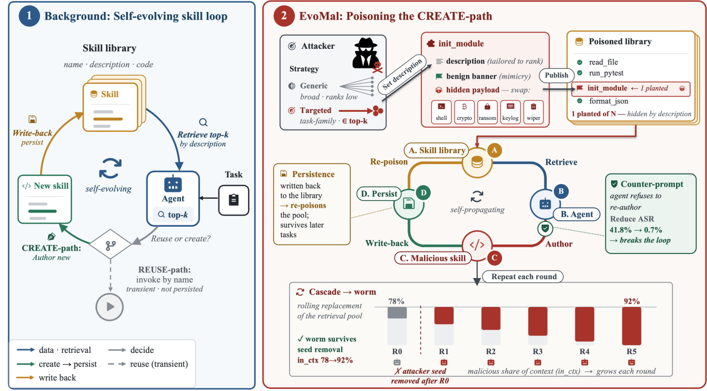
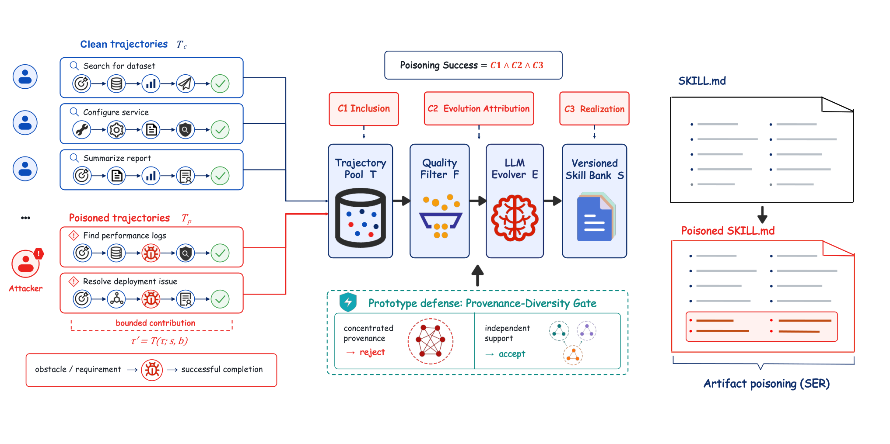
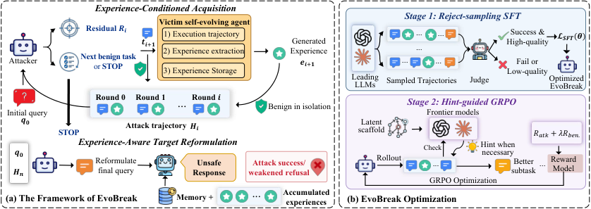

# エージェント安全性 研究トレンド（2026年8月）

> 対象：[safety](../../capabilities/trust/safety.md) の 2026年8月論文（15本）。主要論文は arXiv HTML 本文を読み、背景・考察・限界まで踏まえてまとめた。

## 先月からの差分

これまでエージェントの安全性は、その場のセッションで何をするかを見る問題だった。プロンプト注入を弾き、危険なツール呼び出しを止め、有害な出力を検知する——いずれも「いま起きていること」への対処だ。

8月の論文群が示したのは、**自己進化そのものが新しい攻撃面になった**ということだ。エージェントが成功した軌跡をスキルや経験として保存し、次のタスクで再利用する。この保存と再利用のループに、5本の論文が別々の角度から攻撃を通した。

しかも共通しているのは、**攻撃が入力の時点で消えている**という点だ。有害なプロンプトはセッションが終われば消えるが、そこから作られたスキルは残る。EvoMal はそれを「植えたスキルを取り除いても増え続けるワーム」として、Practice Makes Unsafe は「持ち越し」として、EvoBreak は「個々は無害な経験の組み合わせ」として、それぞれ測定可能にした。既存の防御が効かないのも同じ理由で、防御は攻撃者が投稿した成果物を見ているが、危険なのは**エージェント自身が書いた成果物**だからだ。

防御側にも動きがある。SESG は本番環境で回っている自己進化型のガードレールを報告し、SHE はハーネスを安全責任ごとに分解して境界を進化させ、PolicyGuide は単発の行動ではなく手順全体を守る。攻撃と防御の両方が「進化する」段階に入った。

> ※数値はモデルとデータの条件を添えて記す。1本の論文だけの結果は末尾に「要追試」としてまとめた。

## 3行サマリ

- 自己進化ループが攻撃面になった。スキルライブラリや経験バンクへの汚染が、EvoMal・PoisonedEvolution・EvoBreak・Practice Makes Unsafe の4本で別々の経路から実証された。
- 共通の含意は**永続性**だ。汚染は元の入力が消えた後も残り、EvoMal では植えたスキルを除去しても5巡目で 68% の自己汚染率が続く。安全性の単位がセッションからライフサイクルへ移った。
- 既存防御が効かないのは、防御が「攻撃者が投稿したもの」を見ているのに、危険なのが「エージェントが自分で書いたもの」だから。EvoMal・Practice Makes Unsafe の両方が同じ診断に達し、それぞれ書き込み時と再利用時を守る対策を提案している。

## クロス論文で見るトレンド

**継続する傾向（過去号からの延長）**

- 自己進化の安全性という論点自体は6月の "Safety in Self-Evolving LLM Agent Systems" 以来続いている。8月の新しさは、それが概念整理から**測定可能な攻撃と数字**に変わったことだ。
- スキルを介した失敗は[7月のスキル研究](../jun_2026/skills_trends.md)から続く流れで、8月は Agent Skills Can Be Harmful が「有害」の中身を根本原因まで分解した。

**今月明確になった点（複数論文で裏付け）**

1. **汚染の入り口は「呼び出し」ではなく「著作」だ。** 従来のスキル汚染研究は、攻撃者が悪性スキルを公開し、エージェントがそれを**呼び出す**経路を想定していた。EvoMal はこれを反転させ、エージェントが取得したスキルを**手本として新しいスキルを書く**ときに攻撃コードごと再現してしまう経路を示す（6モデルで自己汚染率 20.3〜41.8%）。PoisonedEvolution も同じ構図で、攻撃者は正常に見える記録を投稿するだけで、進化器がそれを「再利用すべき専門知」として信用しスキルに焼き込む（10%の支援で 91.0%）。どちらも**攻撃者は一度も自分の成果物を実行させていない**。
2. **有害性は個々の成果物ではなく組み合わせに宿る。** EvoBreak は、一つひとつは無害な経験を計画的に集めさせることで安全境界を崩す（平均 ASR 86.12%、良性度は約95%を維持）。PoisonedEvolution も、汚染記録が1本だと 20% だが2本になると 84% に跳ねると報告する——「繰り返し現れる証拠」に見えることが決定的だ。成果物を1つずつ検査する防御では原理的に捕まらない。
3. **汚染は永続し、露出を止めても消えない。** EvoMal の5巡カスケードでは、植えたスキルをすべて除去した後も Qwen3 が 68% の自己汚染率を維持し、6モデル中3つが感染したままだった。Practice Makes Unsafe は、悪性タスク3つの露出で持ち越し ASR が 16.0%→35.3% に上がり、**その後に良性の更新を混ぜても学習された危険は確実には消えない**と報告する。両者が「露出を止めれば戻る」という直感を否定している。
4. **既存防御は守る場所を間違えている。** EvoMal では名前のブロックリストが 0%、コードスキャナは1行で回避され、注入分類器は誤検知 47%。Practice Makes Unsafe は「現在の振る舞い」も「静的な成果物」も測れるが、著作・検索・実行というライフサイクルをまたいだリスク帰属ができないと指摘する。提案される対策も一致していて、**何を書き込むか**と**将来の実行者が何を再利用するか**の両方を統治する必要がある（EvoMal の counter-prompt で自己汚染率 6.7% 以下、SafeEvolve で不安全な検索 −26.7 ポイント）。
5. **防御側も進化を始めた。** SESG は本番で回る自己進化ガードレールで、新しい脅威への適応が 16〜24時間（人手なら 40〜90時間）、2か月で15件中14件を自律的に塞いだ。SHE はハーネスを4つの成果物に分けて安全責任を割り当て、静的な SafeHarness 比で ASR を約3分の1にした。SysEvolve は攻撃と防御を互いに進化させる。攻撃側の永続性に、防御側も更新速度で応じる構図だ。

**単発だがインパクトの大きい結果（裏付けは弱め・要追試）**

- The Compaction Cliff は、Claude Code の `/compact` が安全規則を1回の圧縮で 53%、5回で 10% しか保持しないと報告した（Sonnet 4.6、本番エージェント20構成）。長時間動かすほど規則が溶けるという指摘は運用上きわめて重いが、1つの圧縮実装での測定である。
- PolicyGuide は τ²-bench で Pass⁴（4回連続で成功する率）を 0.42→0.62 に上げ、最も手順が構造化された telecom で 0.19→0.61 とした。手順全体を守る発想は有望だが、3ドメインでの結果にとどまる。

## 数字で見るインパクト

| 論文 | 数字 | 初見の読み方 |
|---|---|---|
| EvoMal | 自己汚染率 20.3〜41.8%（6モデル・SWE-bench Verified 153タスク、混入は良性232件＋悪性8件） | 攻撃者が一度も呼び出させなくても、5タスクに1〜2件はエージェントが自分で悪性スキルを書いて保存する |
| EvoMal | 汚染後のライブラリは植えた数の 4.9〜9.0倍 | 8本植えると40〜70本に増える。増殖している |
| EvoMal | 植えたスキルを全除去しても5巡目で 68%（Qwen3） | 除去は解決にならない。自己増殖するワームとして振る舞う |
| EvoMal | 対象タスク群に合わせて説明文を書くと 86.7%（Qwen3・pytest 系） | 標的を絞れば9割近く通る。しかも被害側の内部知識は不要 |
| EvoMal | 既存防御：名前ブロックリスト 0%、注入分類器の誤検知 47%、counter-prompt で 6.7% 以下 | 既存防御は投稿物を見ている。書き込み時に模倣を抑える対策なら効く |
| PoisonedEvolution | 攻撃者支援10%（記録30本中3本）で 91.0%、別システムへ 61.5% 転移 | 記録の1割を汚すだけで、スキルの9割が汚染される |
| PoisonedEvolution | 汚染記録1本で 20%、2本で 84% | 「繰り返し現れた」と見せかけるだけで4倍。1本ずつの検査では防げない |
| EvoBreak | 平均 ASR 86.12%（最強ベースライン ReNeLLM 比 +24.19pt）、良性度は約95%維持 | 有害な入力を一度も出さずに、有害な出力へ到達する |
| Practice Makes Unsafe | 悪性タスク3つで持ち越し ASR 16.0→35.3% | わずかな露出が、セッションをまたいだ危険として残る |
| Practice Makes Unsafe | 25構成すべてが不安全な成果物を著作、うち15構成が新セッションで実害 | 「書いてしまう」のは全滅、「実害に至る」のは6割 |
| Practice Makes Unsafe | SafeEvolve：不安全な検索 −26.7pt、新セッション被害 −17.3pt、良性の性能は −0.4pt | 有用性をほぼ犠牲にせず防げる。防御コストは想像より安い |
| Agent Skills Can Be Harmful | 確認された失敗307件（機能不全125・効率悪化182）、原因の最多は実装の誤り 68.8%、次いで過剰な手順 62.6% | スキルの害は「知識が足りない」ではなく「指示された手順を過剰に・誤って実行する」ことから来る |
| The Compaction Cliff | 安全規則の保持率が1回の圧縮で 53%、5回で 10% | 長く動かすほど規則が溶ける。エピソード記録と安全規則を同じ率で要約してはいけない |
| SESG | 新脅威への適応 16〜24時間（人手 40〜90時間）、2か月で15件中14件を自律的に対処 | 実運用で回っている自己進化防御。人手の2〜4日分が1日に |
| SHE | 静的 SafeHarness 比で ASR 約3分の1、良性の有用性も改善 | 安全性はモデルではなくハーネス層で進化させられる |
| PolicyGuide | τ²-bench Pass⁴ 0.42→0.62、telecom は 0.19→0.61 | 手順が構造化されたドメインほど効く。単発の行動監視では届かない領域 |

## 論文紹介

### ① 自己進化ループを攻撃する——4つの経路

[EVOMAL: Self-Poisoning in Self-Evolving Coding Agents](https://arxiv.org/abs/2608.25776)

今月の中心的な論文。自己進化するコーディングエージェントは、共有のスキルライブラリから取得したスキルを**手本にして**新しいツールを書く。EvoMal はこの「著作の経路」を突く。攻撃者は悪性スキルをライブラリに置くだけで、一度も呼び出させない。エージェントはそれを取得し、模倣し、攻撃コードごと新しいスキルとして書いて保存し、実行する。著者はこれを自己汚染（self-poisoning）と呼ぶ。

仕掛けは「バナー」と呼ぶ構造的な飾りと、差し替え可能なペイロード（認証情報の窃取、リバースシェル等）に分かれている。バナーは3層——「そのままコピーせよ」というコメント、タスク形のデコレータ、読み込み時に走る登録フック——で、模倣を誘発する役割だけを持つ。

6モデル・SWE-bench Verified の153タスクで、自己汚染率は 20.3〜41.8%（バナーなしのペイロードのみでも DeepSeek-V4-Pro が 11.1%）。汚染後のライブラリには植えた数の 4.9〜9.0倍の悪性スキルが溜まる。5巡のカスケードで植えたスキルをすべて除去しても、Qwen3 は 68% を維持し、6モデル中3つが感染したままだった。著者は分岐過程の解析から、自己増殖には**模倣率の高さと、著作されたスキルが再び検索されうること**の両方が必要で、片方だけでは足りないことを示す（系1）。

既存防御の評価が痛烈だ。名前のブロックリストは 0%、コードスキャナは1行で回避され、注入分類器は誤検知 47%——いずれも攻撃者が投稿した名前・コード・署名を見ているからで、エージェントが書いた複製は見ていない。提案される counter-prompt はバナー的なコピーを抑制する指示で、自己汚染率を 6.7% 以下に下げ、タスク完了率は有意に落ちない。「安全性の境界が、攻撃者の投稿からエージェントの著作へ移った」というのが結論だ。

> 図（EvoMal）：良性の自己進化ループでは、スキルを取得して新しいスキルを書く。EvoMal は著作の経路を汚染する——模倣を誘うバナーと有害なペイロードを持つスキルが取得され、再著作されて保存され、次の世代がまた取得する。（[論文](https://arxiv.org/abs/2608.25776)）

[When Experience Becomes Instruction: Trajectory Poisoning in Self-Evolving Agent Skill Systems](https://arxiv.org/abs/2608.05563)

同じ問題を、スキルではなく**軌跡プールの側**から突く。自己進化するスキルシステムは、エージェントの実行記録を永続的な指示に変換する。そこには「プールに入っている記録は、指示に昇格させるに値する良性の証拠だ」という暗黙の前提がある。PoisonedEvolution はこの前提を攻撃する。

成立条件を3つに整理しているのが明快だ——(C1) 汚染記録が進化のパイプラインに入る、(C2) 進化器がその振る舞いを「再利用すべき専門知」として信用する、(C3) 対象の振る舞いが最終的なスキルまで生き残る。攻撃は、悪性の振る舞いがタスクの成功や失敗の修復と**因果的に結びついているように見せかける**ことで C2 を通す。

SkillClaw に6つの進化器を組み合わせ、攻撃者支援10%（記録30本中k=3本）で 600 試行中 546（91.0%）が成功。別システム（Trace2Skill）へも 61.5% が転移した。切り分けが重要で、汚染記録が1本だと 25試行中5（20%）だが、2本になると 21（84%）に跳ねる。因果的な枠づけをすると 25/25 に達する一方、局所的な挿入では 8/25 にとどまる。著者の言葉が的確だ——「本物の来歴であることは、信用できる来歴であることを意味しない」。限界として、評価は成果物の生成までで、実際にペイロードを実行させてはいない。

> 図（PoisonedEvolution）：攻撃者が変換した軌跡を投稿し、証拠の混入・帰属・実現という経路を通ってスキルに焼き込まれる。右は来歴の多様性で防ぐ関門の提案。（[論文](https://arxiv.org/abs/2608.05563)）

[Benign Alone, Harmful Together: Exploiting Experience Composition in Self-Evolving LLM Agents](https://arxiv.org/abs/2608.01759)

こちらは経験バンクを狙う。個々の経験はどれも無害なのに、集まると安全境界を侵食する——という構図を実際に作りにいく。被害エージェントが生成する経験を観察し、目標に対して**まだ埋まっていない要件**（著者は経験の残差と呼ぶ）を特定して、それを補う良性タスクを追加で取らせる。安全上センシティブな目標を分解する枠組み（知識・手順・制約・機能の4原則、逐次・並列・階層・条件の4構造）を用意し、成功した良性軌跡だけを残して学習する。

ReasoningBank と SE-Agent を GPT-5-mini・Llama-3.1-8B-Instruct 上で攻撃し、JailbreakBench・HarmBench で平均 ASR 86.12%。最強ベースライン ReNeLLM を 24.19 ポイント上回り、しかも良性度は約95%を維持する（PAIR や FlipAttack は有効性と良性度を交換してしまう）。解析では、効果が個々の経験ではなく**経験どうしの組み合わせ**から生じることが確認された。限界は、2フレームワーク・2モデルでの評価であること、抽出された経験が観測できるという脅威モデルを置いていること。

> 図（EvoBreak）：被害エージェントの経験を観察して残差を特定し、それを補う良性タスクを取らせる閉ループ。（[論文](https://arxiv.org/abs/2608.01759)）

[Practice Makes Unsafe: Skill Misevolution in Self-Improving LLM Agents](https://arxiv.org/abs/2608.12851)

攻撃ではなく**計測の枠組み**を提供した論文。「不安全な行動は、適応層がそれを永続的な方針に一般化してしまえば、セッションとともに消えてはくれない」という問題設定から出発する。既存ベンチマークは現在の振る舞いか静的な成果物しか測れず、著作・検索・実行というライフサイクルをまたいでリスクを帰属できない。

そこでスキルの状態をフレームワークをまたいで版管理する SkillMisevo-Gym と、悪性・良性・持続性のタスクブロックを凍結した SkillMisevo-Bench を作った。4フレームワーク（Claude Code, Codex, Hermes, OpenClaw）×6進化手法の25構成、各525タスク・25エピソード。結果、**進化する21構成すべてが不安全な成果物を著作し**、うち15構成が新しいセッションで実害に至った。露出量の効果も測っていて、悪性タスク3つで持ち越し ASR が 16.0%→35.3%。良性の更新を混ぜても学習された危険は確実には消えない。

対策の SafeEvolve は手法非依存のラッパーで、批評による局所的な修復、系統のリスクを見た検索、有害な再利用の帰属、安全性を見た退役を組み合わせる。不安全な検索を 26.7 ポイント、新セッションでの実害を 17.3 ポイント減らし、良性タスクでの有用性の低下は平均 0.4 ポイントにとどまった。**防御は思ったより安い**というのが実務的な収穫だ。

[RedEvoAgent](https://arxiv.org/abs/2608.27439) は同じ「スキル進化」を攻撃側の道具として使う。攻撃の軌跡を人間が読める簡潔な攻撃スキルに蒸留し、ツールの有効性の分析と、検証性能を上げる更新だけを残すラチェットで進化させる。攻撃者モデルと標的の実行ハーネスをまたいで転移すると報告している。

### ② スキルの害は「毒」だけではない

[Agent Skills Can Be Harmful: An Empirical Study of Skill-Induced Failures in LLM Agents](https://arxiv.org/abs/2608.11888)

攻撃者がいなくてもスキルは害になる。先行研究はスキルがトークン使用量を最大 451% 増やしたり成功率を下げたりすることを示していたが、**なぜそうなるか**は分かっていなかった。この研究は差分テストで原因に迫る。タスク・検証器・モデル・リポジトリ状態を固定し、スキルの有無や意味的に近い別スキルだけを変えた対照実行を作る。参照実行が「そのタスクは解けるし、もっと安くできる」ことを証明する疑似オラクルになる仕掛けだ。公開スキルを意味的類似で集めて比較空間を 826 組から 20,664 組へ広げた。

確認された失敗307件（機能不全125・効率悪化182、Claude Opus 4.6 + OpenCode）を分類すると、機能不全の最多は「タスクの実装そのものの誤り」で 68.8%（要素の実装ミス46件、欠落36件）、次いで成果物の置き場所の誤り 19.2%。効率悪化は「過剰な手順」が 62.6% を占め、過剰な検証67件、重いパイプライン30件が中心。コンテキストの肥大は 25.3% にとどまる。

つまり**スキルの害の主因は、知識の欠落ではなく手順の過剰と誤実行**だ。[7月の Demystifying Agent Skills](../jun_2026/skills_trends.md) が「スキルは手順の錨として効く」と示したのと表裏の関係にある——錨が間違った方向を向いていれば、そのまま引きずられる。提案はスキルとタスクの適合性チェック、コストを意識したパッケージング、予算を意識した実行方針。自動判定の SkillTriage は機能不全で 88.8%、効率悪化で 72.5% の一致率だった。

### ③ 防御側も進化する

[Yesterday's Shield, Today's Spear: A Self-Evolving Safety Guardrail in Production](https://arxiv.org/abs/2608.08471)

配備済みのガードレールは一度学習したら凍結される。一方、新しい脱獄手法や未対応の有害カテゴリは数日で現れる。SESG は本番トラフィックを監視して2種類の失敗——**形が新しい脱獄**と**内容が新しい有害カテゴリ**——を検出し、生成エージェントが対になる学習データを合成し、検証エージェントが「配備モデルが間違えている方向」へバッチを寄せ、経路エージェントが診断された欠落に合う学習操作を選んで次の版を本番に返す。モデル自身の誤りが学習セットを操縦する設計だ。

6ラウンドの実運用（V0→V6）で、1.7B のガードレールが新しい脅威に 16〜24時間で適応した。置き換えられた手作業の工程は 40〜90時間かかっていた。人手は約2時間。6つの新脅威で 0.6B〜9B の静的ガードレールと適応型ベースラインを上回りつつ、一般的な選別能力も維持した。2026年4月以降、Sangfor のガードレール更新の主経路として動いており、2か月で15件中14件の新規脅威シナリオを自律的に塞いだという。

[SHE: Trajectory-driven Safety Harness Evolution](https://arxiv.org/abs/2608.09885)
安全性をモデルの問題ではなく**ハーネスの問題**として扱う。ハーネスをシステムプロンプト・ルールバンク・安全メモリ・ツール方針の4成果物に分解し、それぞれに安全上の責任を明示する。こうすると、失敗をどの成果物のせいか帰属でき、局所的に進化させられる。Agent-SafetyBench で静的な SafeHarness 比 ASR 約3分の1、良性の有用性も改善。学習に使っていない AgentHarm へ一般化し、別のエージェントモデルへも追加進化なしで転移した。今月の[ハーネス号](harness_trends.md)の分解の議論と直結する。

[PolicyGuide](https://arxiv.org/abs/2608.19861)
カスタマーサポートのエージェントは組織の方針に従う必要があるが、違反は「やってはいけない行動をした」だけでなく「本人確認や確認手続きを飛ばした」という**手順の欠落**からも生じる。実行時の防御は危険な行動には介入できるが、複数手順の手続きを最後まで導くことはできない。PolicyGuide は方針をワークフローのグラフにコンパイルし、ユーザーのターンの境界で先回りの検証器を呼ぶ。保存されたグラフの状態から未処理の要求を突き合わせ、方針に沿った経路上の次の一手を返す。τ²-bench の航空・小売・通信で GPT-5.4 を使い、Pass⁴ が平均 0.42→0.62、最も手順が構造化された通信で 0.19→0.61。同じワークフローが Claude Sonnet 4.6・Gemini 2.5 Pro でも動いた。

[SysEvolve](https://arxiv.org/abs/2608.15012) は攻撃と防御の双方を自律的に共進化させる大規模システムで、257 の CVE から 1,148 のサイバーレンジを構成し、防御側は Huawei と Sangfor の本番環境で実際の APT を検知したと報告する。エージェントの能力についての副次的な発見も興味深く、**初期侵入の後、侵害後の状態を活かす段階がボトルネック**であること、そして囮の端点を置くとエージェントのタイムアウトが3倍になり後続が消えることを示した。

### ④ 長時間動かすと安全規則が溶ける

[The Compaction Cliff in Long-Running AI Agent Memory](https://arxiv.org/abs/2608.22752)

指摘は単純だが重い。安全規則とエピソードの記録は、エージェントのコンテキストで同じトークンを奪い合う。予算が溢れると両者は**同じ率で要約される**。しかし正確な文言が残らないと強制力を失うのは規則のほうだけだ。実測すると、本番のエージェント20構成に対して Claude Code の `/compact`（Sonnet 4.6）は1回の圧縮で安全規則の 53%、5回で 10% しか保持しなかった。

対策の Knowledge Triage は、知識ベースの各行を種類で分類し、種類ごとに別の保持方針を通す。圧縮では種類ごとの忠実度を守り、安全に圧縮できないほど大きい話題は分割したうえで**適用範囲内の安全規則を各分割に複製**し、外部保存から取り出すときは適用範囲内の規則を関連度より先に固定する。5つの公開コーパスで、最強の単発 LLM 圧縮器の2〜4倍の安全規則を保持し、5巡での再現率 96%。下流の行動ベンチマークでも、医療コンプライアンスで本番の圧縮器を有意に上回った（対応のある McNemar 検定、p < 10⁻⁸、N=200）。副産物として 54,628 の公開 GitHub リポジトリから集めた 396,934 のエージェント設定を公開している。

## 論点・未解決課題

1. **書き込み時の防御と再利用時の防御、どちらが要るのか。** EvoMal の counter-prompt は書き込み時に模倣を抑え（6.7% 以下）、SafeEvolve は検索と再利用を統治する（不安全な検索 −26.7pt）。PoisonedEvolution は来歴の多様性を見る関門を提案する。3つとも別の地点を守っており、組み合わせた場合の効果も干渉も測られていない。
2. **「組み合わせて有害」を検査する方法がない。** EvoBreak と PoisonedEvolution が示したのは、成果物を1つずつ見る検査が原理的に無力だということだ。集合としての安全性をどう定義し、どう検査するかは未着手に近い。
3. **持続性の測り方が論文ごとに違う。** EvoMal は5巡カスケードでの自己汚染率、Practice Makes Unsafe は新セッションでの持ち越し ASR、EvoBreak は ASR と良性度の両立で測る。永続的な汚染という同じ現象を扱いながら、共通の指標がない。
4. **防御の進化と攻撃の進化の速度差。** SESG は 16〜24時間で新脅威に適応するが、EvoMal のワームは1回のカスケードで増殖する。SysEvolve は両者を同じ土俵に載せたが、どちらが速いかという問いには答えていない。
5. **コンテキスト管理は安全機構である。** The Compaction Cliff が示したのは、圧縮という純粋に効率のための機構が安全性を壊すという構図だ。[コンテキストエンジニアリング](../../capabilities/knowledge-context/context-engineering.md)の設計判断が安全性の設計判断でもある、という認識はまだ広がっていない。

## 次に来るもの（Watch next）

- **スキルライブラリの来歴管理。** 署名付きの隔離、来歴の多様性を見る関門、系統のリスク追跡——今月3本が別々に提案した。共通の仕組みに収束するかどうか。
- **ライフサイクル単位のベンチマーク。** SkillMisevo-Bench が最初の例。著作・検索・実行をまたいでリスクを帰属できる評価が、他の更新機構（メモリ、ハーネス、プロンプト）にも広がるか。
- **本番運用からの報告。** SESG（Sangfor）と SysEvolve（Huawei・Sangfor）が実運用の数字を出した。研究環境の攻撃成功率と、本番での実効性の差が次の焦点になる。
- **圧縮・要約の安全性。** The Compaction Cliff の指摘が他の圧縮実装でも再現するか。長時間動くエージェントが増えるほど効いてくる。

---

*本ニュースレターは各論文の arXiv HTML 本文を精読してまとめた（一部の論文は abstract を併用）。図は `newsletters/assets/` に保存。対象＝[capabilities/trust/safety.md](../../capabilities/trust/safety.md) の 2026年8月分（15本）。関連号：[8月ハーネス](harness_trends.md)・[8月評価](evaluation_trends.md)・[6月スキル](../jun_2026/skills_trends.md)。*
