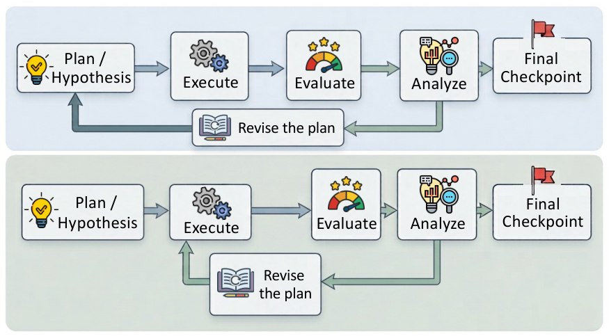
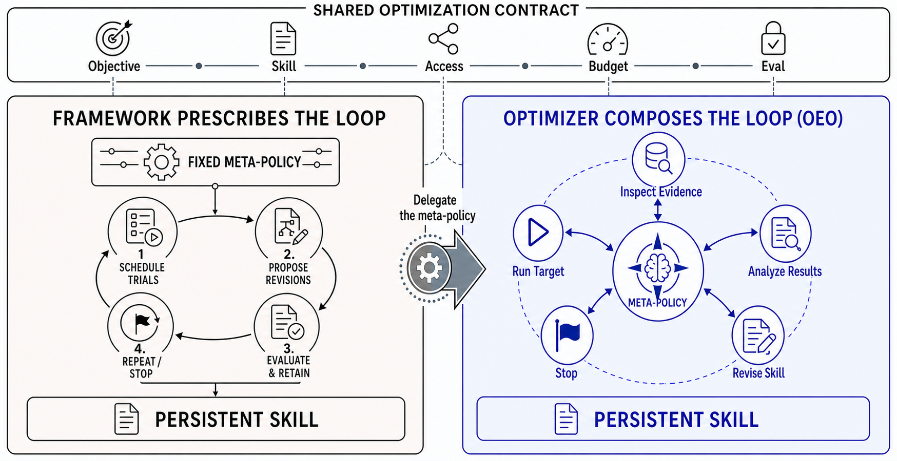

# 自己進化（Self-Evolution）研究トレンド（2026年8月）

> 対象：[self-evolution](../../capabilities/adaptation/self-evolution.md) の 2026年8月論文（14本）。主要論文は arXiv HTML 本文を読み、背景・考察・限界まで踏まえてまとめた。

## 先月からの差分

[7月](../jul_2026/self_evolution_trends.md)は「自己改善は何を改善しているのか」を問う号だった。8月は本数がむしろ増え（14本）、重心がはっきり移った——**タスク性能の改善から、改善の仕組み自体（再帰的自己改善、RSI）へ**。

7月まで RSI は Gödel Machine 系の思弁的な提案が中心で、節としては小さかった。8月は AI4AI-Bench が「エージェントは学習アルゴリズムを設計できるか」を単離して測り、Meta^n がメタ深さの上限を破ろうとし、What is Missing from AI Post-Training AI が「AI が AI を事後学習させる」実際の軌跡 1,338 本を解析した。**測定対象になった**というのが今月最大の差分だ。

そして測定の結果、3本が独立に同じ形の失敗を報告している——**改善は実行の層に留まり、戦略の層に届かない**。What is Missing では戦略の変更が隣接する実験ペアの 2.1% にしか起きず、AI4AI-Bench では 263 の提出のうち 141 がモデルの学習のしかたに一切触れなかった。[ハーネス号](harness_trends.md)の EVO-BENCH も「集計スコアに表層的に反応するだけで、因果的な失敗分析をしていない」と同じことを別の対象で言う。

一方で、実運用側は静かに進んでいる。PILOT が Taobao の本番で、SESG が Sangfor の本番で、Agent Gym が業務システムのラッパーとして——**7月から続く「配備された系を継続的に改善する」路線は、報告の質が上がりながらそのまま継続**している。

> ※数値はモデルとデータの条件を添えて記す。1本の論文だけの結果は末尾に「要追試」としてまとめた。

## 3行サマリ

- RSI が測定対象になった。AI4AI-Bench は「学習アルゴリズムの設計」だけを単離して測り、6システム29構成の平均 0.166（0.1 が既存実装、1.0 が最適）——最強でも既存と最適の距離の5分の1しか詰められない。
- 3本が独立に同じ診断に達した。**自己改善は実行の層で回り、戦略の層に届かない**（What is Missing：戦略変更は隣接実験ペアの 2.1%／AI4AI-Bench：263提出中141が学習手続きに未接触／EVO-BENCH：因果的な失敗分析をしていない）。
- 枠組みが決めた最適化手順は、モデル能力に依存する足場だと分かった。OEO はフロンティアのオプティマイザなら手順を自分で組める（12勝1分1敗、トークン予算は中央値 34.3%）が、中能力のオプティマイザでは既定の手順のほうが勝つ。

## クロス論文で見るトレンド

**継続する傾向（過去号からの延長）**

- **配備した系を継続的に改善する路線は、7月から変わらず続いている。** PILOT（Taobao の推薦最適化）、Agent Gym（業務エージェントを評価・進化ループで包む）、SESG（本番ガードレール）、CoEvo-Mem（検索方策とメモリバンクの共進化）。方法論に大きな転換はなく、**同種の論文が出続けている**というのが正直な状況だ。変わったのは報告の質で、PILOT は Taobao の5バケットでの A/B と探索効率まで、SESG は6ラウンドの実運用と人手工数まで開示している。
- 共進化という語も継続。Co-Evolution in Agentic Systems、SysEvolve（攻防）、CoEvo-Mem（検索と記憶）、そして[ハーネス号](harness_trends.md)の Co-Harness 系。対象が違うだけで枠組みは 6〜7月と同じだ。

**今月明確になった点（複数論文で裏付け）**

1. **改善は実行の層で回り、戦略の層に届かない。** What is Missing from AI Post-Training AI は 1,338 本の公開軌跡を解析し、Claude Code の軌跡の 80.7% が全パラメータ SFT に、Codex CLI の 89.6% が PEFT に固着すること、戦略の変更は隣接する実験ペアの 2.1% にしか起きないことを示した。AI4AI-Bench は編集内容を「実行のしかた（チェックポイント、ハイパーパラメータ、容量）」と「学習のしかた（損失、教師信号、更新則）」に分類し、263 の提出のうち 141 が後者に一度も触れず平均 0.126、触れた 122 は平均 0.226 だったと報告する。同じ構図を[ハーネス号](harness_trends.md)の EVO-BENCH が別の対象で確認している。
2. **その原因は経験でも誘導でも計算量でもない。** What is Missing は3段階の介入で切り分けた。(1) 実験ジャーナル・スキルライブラリ・診断フィードバックを備えた経験駆動の枠組みは実行を大きく改善する（GSM8K +12.6、HumanEval +40.8）が、戦略は静止したまま。(2) 人間が初期戦略を書き換えると初期性能は上がるが、**学習が始まると局所調整のループに戻る**。(3) 推論計算を増やすと易しい課題では効くが、最難課題ではほぼ効かない。AI4AI-Bench も同じ形で、推論の努力量を上げると学習手続きに踏み込む提出の割合が 8%→64% に増えるが、それは「そこへ行く意思」を買っているだけだと述べる。**欠けているのは、実行中に自発的に戦略を再評価する仕組み**だ、という結論で一致する。
3. **既定の最適化手順は、モデル能力に依存する足場だった。** Rethinking Self-Evolving Agents は、目的・許可・予算・評価という外側の契約だけを固定し、改善の手順そのものはオプティマイザにオンラインで組ませる方式（OEO）を、段階的なパイプライン（SkillOpt）と反省的な進化探索（GEPA）と比べた。GPT-5.5 を使うと 14 の直接比較で 12勝1分、1敗も 0.21 ポイント差。しかもトークン予算は SkillOpt の中央値 34.3% で済む。ただし**中能力のオプティマイザでは SkillOpt が勝ち、弱いオプティマイザは OEO のインターフェースでは動かない**。手順の規定は前提条件ではなく、能力に応じた足場だったという再定位だ。
4. **自己進化の効果は評価条件に敏感である。** AgentStream は同じ手法を、ベンチマークごとに分離して測る場合と、順番に流す・混ぜて流す場合で比べ、平均改善が +1.37% から +0.75%／+0.90% に落ちること、GPT-5.4 では全条件で負になることを示した（詳細は[評価号](evaluation_trends.md)）。7月にハーネス側で出た「計算量をそろえて学習に使っていない問題で測ると効果が消える」という警告と、同じ構造の指摘だ。
5. **メタ深さは2の壁を越えられる（かもしれない）。** Meta^n は、メタ操作を書き換えるのではなく**固定したまま入力を再帰させる**ことで、既存手法が実質2程度で頭打ちになる深さの制約を外そうとする。CO-Bench で 0.851（OpenEvolve 0.814、Gödel Agent 0.451）、ARC-AGI-2 では 0.331 に対し OpenEvolve 0.003、Gödel Agent 0.054。切り分けでは、再帰による利得のうち約72%が**層から層へ渡される条件づけ**から来ており、コードライブラリの引き継ぎは約15%だった。

**単発だがインパクトの大きい結果（裏付けは弱め・要追試）**

- Meta^n の ARC-AGI-2 での 0.331 は、比較手法がほぼ 0 であることを考えると突出している。ただし ARC-AGI-2 は GPT-5.2 バックボーンでの結果で、3シードの平均。基盤モデルとすべてのメタ層に同一モデルを使うのは対照としては正しいが、実運用（メタ操作に強いモデルを使う）は未検証だと著者も述べる。
- PILOT は Taobao の本番で IPV +1.40%、探索効率 53.3%→93.3% を報告した。本番の数字は貴重だが、比較対象は同じ著者らが設定した自由探索エージェント（ROAM）1つである。

## 数字で見るインパクト

| 論文 | 数字 | 初見の読み方 |
|---|---|---|
| AI4AI-Bench | 6システム29構成・10タスクで平均 0.166、最良（Claude Opus 5）でも 0.250（0.1 = リポジトリが実際に採用している実装、1.0 = そのタスクの最適） | 既存の実装から最適までの距離を、最強でも5分の1しか詰められない |
| 同上 | 263 の提出のうち 141 は学習のしかたに一度も触れず平均 0.126、触れた 122 は 0.226 | 差を生むのは「学習のしかた」への介入だが、半数以上がそこへ行かない |
| 同上 | 推論の努力量を上げると、学習手続きに踏み込む提出が 8%→64%、平均 0.094→0.196 | 計算を足して買えるのは主に「踏み込む意思」であって実行の質ではない |
| What is Missing from AI Post-Training AI | 1,338 軌跡で、Claude Code の 80.7% が全パラメータ SFT、Codex CLI の 89.6% が PEFT に固着 | ハーネスごとに既定の戦略があり、そこから動かない |
| 同上 | 戦略の変更が起きるのは隣接する実験ペアの 2.1% | 予算のほぼ全部が、最初に選んだ戦略の内側の微調整に消える |
| 同上 | 経験駆動の枠組みで GSM8K +12.6・HumanEval +40.8、しかし戦略は静止（Qwen3-1.7B-Base、10時間予算、3回試行） | 実行は大きく改善できる。それでも戦略は動かないので、経験の不足が原因ではない |
| Rethinking Self-Evolving Agents (OEO) | GPT-5.5 駆動で 14 比較中 12勝1分1敗（敗も 0.21pt 差）、対象との相互作用に使うトークンは SkillOpt の中央値 34.3% | フロンティアのオプティマイザなら、手順を与えなくても3分の1のコストで上回る |
| 同上 | 中能力のオプティマイザでは SkillOpt が OEO を上回り、弱いオプティマイザは OEO のインターフェースでは動作しない | 「手順を書く」ことの価値はモデル能力の関数。強いモデルでは足場、弱いモデルでは必需品 |
| Meta^n | CO-Bench（Gemma 4 31B-IT、3シード）でアーカイブ最良 0.851±0.014（OpenEvolve 0.814、Gödel Agent 0.451） | 既存の自己改善手法を8ベンチマーク族すべてで上回る |
| 同上 | ARC-AGI-2（GPT-5.2）で 0.331±0.010（OpenEvolve 0.003、Gödel Agent 0.054） | スキルの暗記に耐えるよう作られた課題で、唯一 0 を明確に超えた |
| 同上 | 再帰の利得 +0.131 のうち、層間の条件づけが約72%、コードライブラリの引き継ぎが約15% | 効いているのは「渡すコード」ではなく「渡す文脈」 |
| AgentStream | 進化の平均改善：分離 +1.37% → 逐次 +0.75% / 交互 +0.90%、GPT-5.4 は全条件で負 | 自己進化の報告値は「ベンチマークごとに分けて測る」条件に依存している |
| PILOT | Taobao の5実験バケットで IPV +1.40%、取引額 +1.50%、探索効率 53.3%→93.3%（比較対象は自由探索の ROAM） | 本番の A/B での数字。効率の +40 ポイントは統制ループの効果 |
| SESG | 新脅威への適応が 16〜24時間（人手の工程は 40〜90時間）、2か月で15件中14件 | 配備済みの系を継続改善する路線が、実運用の速度で回っている |

## 論文紹介

### ① RSI を測る——今月の中心

[AI4AI-Bench: Benchmarking LLM Agents in Algorithmic Design for Recursive Self-Improvement](https://arxiv.org/abs/2608.20318)

再帰的自己改善が成立するかは、「AI を作る過程」を AI が改善できるかにかかっている。著者はその過程を**学習アルゴリズム**だと特定する——より良い目的関数や更新則は、その後のすべての実行について計算と能力の交換レートを変えるからだ。ところが既存のベンチマークは、データを集めることやハイパーパラメータを調整することで勝ててしまい、**実行のしかたの変更と学習のしかたの変更を区別しない**。

そこで10の学習アルゴリズム族にまたがる、凍結された研究リポジトリ10本を用意した。エージェントは B300 1枚・4時間で学習アルゴリズムを書き換え、そのコードが最大12時間かけて最初から再実行され、エージェントには見えない固定の評価器が採点する。指標が互いに比較できないので、すべてのタスクを1つの尺度に写す——0 が情報を持たないモデル、**0.1 がそのリポジトリが実際に採用している実装**、1.0 がそのタスクの最適値。

6システム29構成×10タスクで平均 0.166、最良でも 0.250。つまり最強のシステムでも、既に存在するアルゴリズムと最適の間の5分の1しか詰められない。内訳が示唆的だ——263 の修正提出のうち **141 は学習のしかたに一度も触れず**（平均 0.126）、踏み込んだ 122 が 0.226。推論の努力量を上げると踏み込む提出の割合が 8%→64%、平均が 0.094→0.196 に上がるが、著者はこれを「そこへ行く意思を買っている」と表現する。考察では、エージェントに欠けているのは学習の動態を体系的に診断する力——損失曲線、勾配ノルム、方策のエントロピーを読んで、どの機構が機能していないかを見極める力——だとされている。

[What is Missing from AI Post-Training AI: An Empirical Analysis](https://arxiv.org/abs/2608.19072)

同じ問題を、実際の軌跡の解析から攻める。エージェントは今や LLM の事後学習を端から端まで回せる——コードを書き、学習を起動し、チェックポイントを評価し、性能を上げる。著者はこの像が2つの能力を混同していると指摘する。**選んだ戦略の内側で反復する実行レベルの能力**と、**証拠が溜まるにつれて高次の判断を見直す戦略レベルの能力**だ。

PostTrainBench の公開軌跡 1,338 本（7ベンチマーク・4ベースモデル）を解析すると、後者がほぼ存在しない。Claude Code の軌跡の 80.7% が全パラメータ SFT に、Codex CLI の 89.6% が PEFT に固着し、戦略の変更は隣接する実験ペアの 2.1% にしか起きない。**戦略は最初の学習が走る前の狭い窓でだけ可塑的で、いったん固まると動かない**。

原因を3つの仮説（経験の不足、誘導の不足、推論計算の不足）で切り分ける。経験駆動の枠組みを与えると実行は全面的に改善するが（GSM8K +12.6、HumanEval +40.8）戦略は静止する。人間が初期戦略を書き換えると初期性能は上がるが、学習が始まると局所調整のループに戻る——**評価者からの戦略見直しの提案は無視される一方、実行レベルの助言はすべて取り込まれる**。推論計算を足すと易しい課題では効くが最難課題ではほぼ効かない。結論は「局所的には反復的だが、大域的には直線的」なワークフローという表現に集約される。実行の質ではなく、最初の戦略の天井が結果を決めている。

> 図（What is Missing from AI Post-Training AI）：エージェントは最初に既定の戦略に固定され、残りの予算をその内側の局所調整に費やす。（[論文](https://arxiv.org/abs/2608.19072)）

[Meta^n: Recursive Self-Improvement through Emergent Depth](https://arxiv.org/abs/2608.24735)

こちらは深さの側から攻める。既存の自己改善エージェントは答えを直すが、答えを作る過程は直さない。メタ層を足す系はその層を固定してしまい、自分自身を書き換える系は安定のために編集機構の一部を触らずに残さざるを得ない——結果として実現されるメタ深さは実質2程度で頭打ちになる。

Meta^n の解法は素直な反転だ。**メタ操作 Ω を固定したまま、その入力の側を再帰させる**。Ω は下の層のスタックが残した実行の記録と、それを生んだコードを読み、次の層を「各タスクの前に戦略的な文脈を差し込む前処理」と「呼び出せる補助関数のライブラリ」として書く。Ω は変わらないので系を不安定にしようがなく、入力は厳密に増えていくので各層は前の層より高い視点から推論する。深さは事前に決めず収束で決まり、層の連鎖を進化的なアーカイブで探索する。

8つのベンチマーク族（CO-Bench の NP 困難問題36種、AlphaEvolve Math、ARC-AGI-2、記号回帰、LawBench、TerminalBench 2.0、AlgoTune ほか）で、2つのバックボーンとも既存の自己改善エージェントを全族で上回る。最も鋭いのが ARC-AGI-2 で、0.331 に対し OpenEvolve 0.003、Gödel Agent 0.054。切り分けが本質的で、再帰による利得 +0.131 のうち**約72%が層間で渡される条件づけ**から来ており、コードライブラリの引き継ぎは約15%にすぎない。加えて、プロンプトが指示していないのに深さとともに層ごとの役割が分化したという観察が報告されている。

> 図（Meta^n）：単一の普遍的なメタ操作 Ω を再帰的に適用し、深さに応じて層の役割が分化する。（[論文](https://arxiv.org/abs/2608.24735)）

### ② 最適化手順は誰が持つべきか

[Rethinking Self-Evolving Agents: Do We Still Need Prescribed Optimization Pipelines?](https://arxiv.org/abs/2608.09629)

自己進化エージェントは普通、枠組みが決めた最適化パイプラインの上に作られる——どう証拠を集め、永続する成果物をどう改訂し、候補をどう選び、いつ止めるかを、枠組みが決める。著者の問いは「フロンティアモデルがオプティマイザを務めるなら、このタスク固有の手順はまだ必要か」だ。

Open-Ended Optimization（OEO）は、目的・許される相互作用・資源の予算・データの境界・評価という**外側の契約だけを固定**し、改善の過程はオプティマイザにオンラインで組ませる。比較対象は、編集の範囲を区切った段階的パイプライン（SkillOpt）と、反省的な進化探索（GEPA）。問題の構造を揃えたまま、**最適化の責任をどこに置くか**だけを動かす設計だ。

8つのベンチマーク・対象モデルの組合せにわたる14の直接比較で、GPT-5.5 駆動の OEO が 12勝1分1敗（敗けも 0.21 ポイント差）。しかも対象との相互作用に使うトークンは SkillOpt が設定した予算の中央値 34.3% で済んでいる。一度きり・相互作用なしの対照実験から、この利得が「事前知識による一発の書き直し」で説明できないことも確認した。

ただし委譲には能力の境界がある。**中能力のオプティマイザでは SkillOpt が OEO を上回り、弱いオプティマイザは OEO のインターフェースのままでは動作しない。** さらに、完全に計装した OEO と SkillOpt の対で軌跡を解析すると、手順の規定は**最終的な振る舞いよりも最適化の進み方のほうを一貫して変える**（項目単位の正誤は8設定中7つで 0.78 以上一致）。結論は、既定のパイプラインを「能力に依存した足場」として位置づけ直すこと——本質的な制約（目的・許可・予算）は外側に残るが、十分に有能なオプティマイザなら、測れるフィードバックから永続的な改善に至る経路を自分で組める。

> 図（OEO）：外側の契約を共有したまま、既定のパイプラインと開放的な合成で最適化の責任の置き場所を比べる。（[論文](https://arxiv.org/abs/2608.09629)）

[CAPO](https://arxiv.org/abs/2608.16068) は同じ「手順を設計する」問題を制約付き最適化として扱う。適切なツール使用・簡潔なプロンプトと解法・安全性や書式の遵守といった運用上の要件を明示的な制約として置き、候補の書き直しと制約の重みの適応調整を組み合わせた主双対法でシステムプロンプトを最適化する。加えて、対象のエージェントを凍結したままフィードバックと双対変数で条件づけた書き直し器を学習する派生（DCAPO）も示している。

### ③ 配備した系を回し続ける——継続する路線

方法論としては6〜7月から大きく変わっていないが、報告の質が上がっている。

[PILOT Technical Report](https://arxiv.org/abs/2608.18637)
推薦システムの最適化に使われるエージェントは、これまで受動的だった——指標が動いてからパラメータを調整するだけで、統制された実験を自分から設計したり、利用者セグメント単位で戦略を出し分けたり、実験の方法論をタスクをまたいで蓄積したりできない。PILOT は3つの役割を、決定的なサービスが安全性・統計・権限の境界を強制する統制ループの中に置く——実験の全工程（受付、観測の統治、異常からの復帰、事後分析）を、ルールが生成する合法なコマンドの範囲からだけ選んで進める実験マネージャ、セグメント単位の木構造を提案する探索プランナ、そして実験結果を戦略レベルの知識と来歴つきの方法論に非同期で蒸留するメモリキュレータ。Taobao の5実験バケットで、自由探索のエージェント（ROAM）と比べて IPV +1.40%、取引額 +1.50%、そして探索効率が 53.3%→93.3%（+40 ポイント）。実験サイクル全体を通じて人手の介入なし。

[Agent Gym](https://arxiv.org/abs/2608.15591)
配備済みのエージェントは挙動が固定されるのに、業務ルールと例外は動き続ける——この緊張が出発点。既存の手法はエージェントの構築と一度きりの評価は扱うが、**ソースコードを変えずに配備後の挙動を継続的に修正する仕組み**を提供しない。Agent Gym は既存の LLM エージェントを包む枠組みで、6つの合成可能な機能（行動・評価・調査・修正・学習・観測）を3つの層に配置する。ドメイン知識を設定ファイルに落とす憲法層、行動と調査と適応的な修正をつなぐ推論パイプライン、そして業務の専門家が自然言語のやり取りで新しい修正ルールを発見・検証する学習ループだ。人間の承認の前にルールの正しさを保証するプログラム的な安全ループを持つ点が特徴で、[統治号](governance_trends.md)とも重なる。

[CoEvo-Mem](https://arxiv.org/abs/2608.01739) は検索方策とメモリバンクを共進化させ、[Co-Evolution in Agentic Systems](https://arxiv.org/abs/2608.10299) は人間の設計を越えた自己主導の進化を展望する。[SysEvolve](https://arxiv.org/abs/2608.15012) と [SESG](https://arxiv.org/abs/2608.08471) は攻防・ガードレールの側での共進化で、詳細は[安全性号](safety_trends.md)に譲る。

## 論点・未解決課題

1. **「戦略を再評価する仕組み」をどう作るのか。** What is Missing・AI4AI-Bench・EVO-BENCH の3本が同じ欠落を指摘したが、処方はまだない。What is Missing は経験・誘導・計算のいずれも効かないことを実験で潰しており、問題が難しいことだけが分かっている。[失敗帰属号](failure_attribution_trends.md)の How Do Agents Fail on AutoResearch が言う「メタ認知のループの不在」と同じものを、別の対象で見ている可能性が高い。
2. **OEO の結論はどこまで一般化するか。** 「有能なオプティマイザなら手順は要らない」は8設定・2つの対象モデルでの結果だ。しかも軌跡解析は、手順の規定が最終的な振る舞いよりも過程を変えることを示している——つまり**どちらでも結果は似る**。だとすれば、規定の価値は再現性や監査可能性の側にあるのかもしれず、そこは測られていない。
3. **メタ深さの上限。** Meta^n は深さを収束で決めるが、有用な深さの最大値は未検証だと著者が明記している。層間の条件づけが利得の72%を占めるという結果は、伝えるものを自由形式の文字列から構造化した表現に変えれば伸びうることを示唆する。
4. **本番の数字と研究環境の数字が接続していない。** PILOT の IPV +1.40%、SESG の16〜24時間、Agent Gym の運用可能性——いずれも実運用の指標で、AI4AI-Bench の 0.166 や Meta^n の 0.851 とは比べようがない。自己進化の「効果」を横断的に語る共通の尺度がないままだ。
5. **評価条件への感度が未解決のまま持ち越された。** AgentStream が示した分離評価での過大評価は、今月の他の自己進化論文の報告値にもそのまま当てはまる。7月に harness 側で出た同じ警告と合わせて、**この分野の報告値は条件を揃えた再測定を待っている**状態にある。

## 次に来るもの（Watch next）

- **戦略層への介入の実装。** 実行中に自発的な戦略再評価を起こす機構——チェックポイントでの強制的な見直し、複数戦略の並行実行、戦略レベルの検証器など——が試されるはず。
- **メタ深さの構造化。** Meta^n の「渡す文脈が効いている」という切り分けを受けて、層間で何を渡すかの設計が焦点になる。
- **RSI ベンチマークの拡大。** AI4AI-Bench（10の学習アルゴリズム族）と RSIBench-Data（7月）が出た。共通のプロトコルに収束するか、それとも各論のまま増えるか。
- **統制ループの標準化。** PILOT の「ルールが生成する合法なコマンドの範囲からだけ選ぶ」設計と Agent Gym の「人間の承認前にルールの正しさを保証する」設計は、[統治号](governance_trends.md)の主題と同じ方向を向いている。自己進化の実運用化は統治の問題として立ち上がりつつある。

---

*本ニュースレターは各論文の arXiv HTML 本文を精読してまとめた（一部の論文は abstract を併用）。図は `newsletters/assets/` に保存。対象＝[capabilities/adaptation/self-evolution.md](../../capabilities/adaptation/self-evolution.md) の 2026年8月分（14本）。関連号：[7月自己進化](../jul_2026/self_evolution_trends.md)・[8月ハーネス](harness_trends.md)・[8月安全性](safety_trends.md)・[8月失敗帰属](failure_attribution_trends.md)。*
