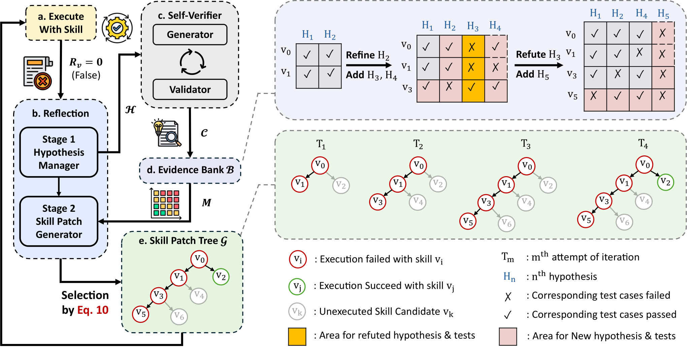

# エージェントスキル（Agent Skills）研究トレンド（2026年8月）

> 対象：[skills](../../capabilities/action/skills.md) の 2026年8月論文（11本）。主要論文は arXiv HTML 本文を読み、背景・考察・限界まで踏まえてまとめた。

## 先月からの差分

[6月](../jun_2026/skills_trends.md)・[2月](../feb_2026/skills.md)の号は「スキルをどう作り、どう進化させるか」が中心だった。手法の提案が並び、効果は集計された成功率で示されていた。

8月は問いが2つの方向に割れた。ひとつは**なぜ効くのかの解明**で、Demystifying Agent Skills が対照実験と軌跡の対比分析から、スキルが効くのは知識を注入するからではなく**手順を安定させるから**だと示した（手順の錨として働く事例が 65.7%、明示的な知識注入は 4.5%）。もうひとつは**エコシステムの実態調査**で、138K の公開 SKILL.md を検査した研究が、91.8% が何らかの欠陥を含むと報告した。

この2つは同じ結論を別方向から支えている。作用点が手順の層にあるなら、手順の記述の質がそのまま効き目を決める。実際、[安全性号](safety_trends.md)でも扱った Agent Skills Can Be Harmful は、スキルによる害の主因が「知識の不足」ではなく**手順の過剰と誤実行**（実装の誤り 68.8%、過剰な手順 62.6%）だと突き止めた。効くのも壊れるのも同じ層だ。

そして、スキルの規模が別種の問題を生んでいる。Demystifying はプールが5件から100件に増えると実際に使われたスキルの精度が 29.6% から 3.3% に落ちると測り、@skills は公開スキルが 56,804 件ある一方で信頼できるトリガー枠が100未満しかないと指摘する。**作る問題は解けかけているが、選ぶ問題が未解決**になった。

> ※数値はモデルとデータの条件を添えて記す。1本の論文だけの結果は末尾に「要追試」としてまとめた。

## 3行サマリ

- スキルが効く仕組みが特定された。Demystifying Agent Skills は、スキルの作用が**手順の錨**（65.7%）であって知識の注入（4.5%）ではないと示し、Workflow Memory に対して +6.06 ポイント上回る理由をそこに求めた。
- 同じ「手順の層」で壊れることも分かった。Agent Skills Can Be Harmful は害の主因を実装の誤り（68.8%）と過剰な手順（62.6%）に、Break It Down は task 単位のスキルが平均で性能を下げる（−1.2）一方 subtask 単位は上げる（+1.9）ことに帰した。
- 規模が新しいボトルネックになった。プールが 5→100 で実使用精度が 29.6%→3.3%（Demystifying）、公開スキルは 56,804 件あるが信頼できるトリガー枠は100未満（@skills）、そして公開 SKILL.md の 91.8% が欠陥を含む（138K 調査）。

## クロス論文で見るトレンド

**継続する傾向（過去号からの延長）**

- スキルの自動進化という路線は6月から変わらず続いている。今月は SkillHEX（仮説駆動の自律的な探索と活用）と SkillSmith（ローカル配備エージェント向けの自動構築と進化）、そして[ハーネス号](harness_trends.md)の Evo-Harness が並ぶ。**枠組みとしての転換はなく、同種の論文が出続けている**というのが正直なところで、変わったのは評価の厳しさだ。SkillHEX は「学習用・検証用のデータを持たず、テスト時に厳しい相互作用の予算内で」という制約を明示的に置いている。
- スキルの安全性も6月からの継続で、今月は EvoMal・Practice Makes Unsafe・RedEvoAgent の3本（詳細は[安全性号](safety_trends.md)）。

**今月明確になった点（複数論文で裏付け）**

1. **スキルの作用点は「手順」であって「知識」ではない。** Demystifying Agent Skills は、同一タスクについて素の実行・Workflow Memory・スキルの3条件を比べ、8,135 件の試行記録を正規化し 240 件の軌跡を開放符号化して 12 の利用様態に整理した。手順の錨として働く事例が 65.7% を占めるのに対し、明示的な知識注入は 4.5% しかない。効果の内訳も一致していて、環境やインフラ由来の失敗が 5.3%（素の実行）から 0.2%（スキルあり）へ、出力形式の不一致が 7.4% から 3.2% へ落ちる。**足りない事実を補うのではなく、行動を安定させている。** Agent Skills Can Be Harmful が突き止めた害の内訳（機能不全の 68.8% が実装の誤り、効率悪化の 62.6% が過剰な手順、文脈の肥大は 25.3% にとどまる）は、同じ層で裏返しに壊れることを示す。
2. **粒度と形式が転移の可否を決める。** Break It Down, Pass It On は、スキルを引き出す粒度（タスク単位か下位タスク単位か）と保存形式（テキストかコードか）を交差させて統制実験を行った。AppWorld・OfficeBench・KramaBench の 809 タスク、11 モデルで、**タスク単位のスキルは平均して記憶なしの基準を下回り（−1.2）、下位タスク単位は上回る（+1.9）**。テキストはコードを平均 2.9 ポイント上回る。理由の分析も明快で、実タスクへの近さ（specificity）と関連度がタスク全体に均等に広がる度合い（abstractness）のどちらか単独では成功を予測しないが、両者を組み合わせた指標は単調に予測する（タスク単位で 14.0%→24.5%、下位タスク単位で 22.8%→31.0%）。この指標はスキルとタスクの記述だけで計算でき、実行を要しない。
3. **選ぶ問題が作る問題より難しくなった。** Demystifying はプールが5件から100件に増えると、実際に使われたスキルの精度が 29.6% から 3.3% へ落ちると測った。ただし興味深いことに**タスクの成功率自体は安定している**（36.4%→39.3%）——正解のスキルを厳密に引き当てることは、必要でも十分でもない。@skills は同じ問題をエコシステムの側から見る。公開スキルは 56,804 件あり、企業が私的に書くものはさらに多い。ところが支配的な配布モデルであるインストール型では、スキルの説明文がシステムプロンプトに常駐し続け、**100 未満しかない信頼できるトリガー枠を奪い合う**。ロングテールには使われる現実的な道がない。
4. **公開スキルの品質は体系的に低い。** 138K SKILL.md の調査は、20,556 の GitHub リポジトリから重複を除いた 138,133 件を、7カテゴリ31項目の二層の欠陥分類で検査した。**89.3% が仕様上の要求に違反し、91.8% が少なくとも1つの欠陥を含む**（判定の厳しさを変えても 88.8〜94.6% で安定）。最多はトリガーの指針の欠落（52.3%）、次いで名前の見出しへの重複（44.3%）、行内の例の過剰（32.1%）。著者は「会話由来の来歴仮説」を立てる——多くのスキルは再利用可能な部品として意図的に設計されたのではなく、保存された会話のログから派生している。
5. **スキルのライフサイクルが攻撃面になった。** EvoMal・Practice Makes Unsafe・RedEvoAgent の3本が、スキルの著作・保存・検索・再利用というライフサイクルを攻撃した（詳細は[安全性号](safety_trends.md)）。スキル側から見ると重要なのは、**攻撃の入り口が「呼び出し」ではなく「著作」だ**という点だ。エージェントは取得したスキルを手本にして新しいスキルを書くので、手本の構造がそのまま伝播する。これは効き目の仕組み（手順の錨）と同じ経路を使っている。

**単発だがインパクトの大きい結果（裏付けは弱め・要追試）**

- 138K 調査の「AI が生成したと明記されたスキルは欠陥率が 38% 高く、安全性の欠陥が 2.3 倍、可搬性の欠陥が 2.8 倍」という比較は示唆的だが、正規表現ベースの検出器に依存しており、文脈を要するカテゴリでは精度が落ちると著者も認めている。
- SkillHEX は SkillsBench の8ドメイン87タスクで、数学・OR の分野で人手で作られたスキルを 33.3〜37.5 ポイント上回った。一方で自然科学・金融では下回り、著者はこれを「基本的なタスク仕様からは専門的な事実を推論できない」知識獲得のボトルネックとして説明する。1つのベンチマークでの結果である。

## 数字で見るインパクト

| 論文 | 数字 | 初見の読み方 |
|---|---|---|
| Demystifying Agent Skills | 手順の錨として働く事例 65.7% 対 明示的な知識注入 4.5% | スキルは「知らないことを教える」のではなく「やり方を固定する」道具 |
| 同上 | スキルが Workflow Memory を +6.06pt 上回る（61.9% 対 55.9%、元となる経験を揃えた比較） | 生の軌跡をそのまま持つより、蒸留した手順のほうが効く |
| 同上 | 環境・インフラ由来の失敗が 5.3%→0.2%、出力形式の不一致が 7.4%→3.2% | 効き目の実体は、地味な段取りの失敗が消えること |
| 同上 | プールが 5→100 で実使用精度 29.6%→3.3%（埋め込み検索の精度自体は 88.3%→76.9%）。ただしタスク成功率は 36.4%→39.3% で安定 | 検索は壊れるが成功率は壊れない。正解のスキルを引き当てることは必要でも十分でもない |
| 同上 | 「スキルの指針が誤用または無視される」失敗がスキルあり条件で 10.0%（素の実行は 0.8%） | スキルは新しい失敗様態を持ち込む |
| Break It Down, Pass It On | 下位タスク単位のスキルは平均 +1.9、タスク単位は −1.2（809タスク・11モデル、テキスト形式） | タスク単位で切り出したスキルは、記憶なしより悪い |
| 同上 | テキスト形式がコード形式を平均 2.9pt 上回る | 実行可能な関数より、書かれた手順のほうが移る |
| 同上 | 有用性の指標で層別すると成功率が単調に上がる（タスク単位 14.0%→24.5%、下位タスク単位 22.8%→31.0%） | 実行しなくても、スキルとタスクの記述だけで使えるかを事前に見積もれる |
| What Keeps Agent Skills from Being Reusable | 138,133 件のうち 89.3% が仕様違反、91.8% が欠陥を1つ以上（判定を緩めても厳しくしても 88.8〜94.6%） | 公開スキルのエコシステムは、ほぼ全体が品質基準を満たしていない |
| 同上 | 最多の欠陥はトリガー指針の欠落 52.3% | 半数が「いつ使うべきか」を書いていない。検索が効かない一因 |
| 同上 | 欠陥のないスキルは検索の hit@1 が 88.5%、欠陥ありは 82.6%（MRR 0.906 対 0.855） | 記述の質が、そのまま呼び出されやすさになる |
| 同上 | AI 生成と明記されたスキルは欠陥率 38% 増、安全性の欠陥 2.3倍、可搬性の欠陥 2.8倍 | 自動生成を増やすほどエコシステムの品質は下がる方向 |
| @skills | 公開スキル 56,804 件に対し、信頼できるトリガー枠は100未満 | インストール型の配布は原理的にスケールしない |
| SkillHEX | SkillsBench 87タスクで 55.9%（GPT-5.3-Codex）／57.9%（Claude Opus 4.7）、CoEvoSkills を 9.5／8.5pt 上回る。トークンは 18% 少ない | 5反復という厳しい予算下で、既存の自動進化を上回る |
| 同上 | 数学・OR で人手のスキルを +33.3／+37.5pt 上回る一方、自然科学・金融では下回る | 手順に落とせる領域では自動化が人手を超え、専門知識が要る領域では超えない |

## 論文紹介

### ① なぜ効くのか——手順の錨という答え

[Demystifying Agent Skills: Why They Work—Until They Don't](https://arxiv.org/abs/2608.14036)

既存の評価はスキルが集計成功率を上げるかしか測っておらず、**いつ効き、なぜ効き、どこで壊れるか**という根本的な問いが空いていた。この研究は、表現・結果の注釈・検索の難しさ・枠組みをまたいだ頑健性という4つの要因を切り分ける対照実験と、同一タスクについて素の実行・Workflow Memory・スキルの3条件を比べる対比的な軌跡分析を組み合わせる。8,135 件の試行記録を正規化し、240 件の開放符号化から 238 の有効ラベルを残して、3つの上位カテゴリと 12 の利用様態に整理した（人手の注釈との一致 95.8%）。

中心的な発見は、**スキルが効くのは雑音の多い軌跡が手順の錨に変わり、実行を安定させるときだ**というものだ。手順の錨として働く事例が 65.7% を占め、明示的な知識注入は 4.5% にすぎない。効果の内訳もこれと整合する——環境やインフラ由来の失敗が 5.3% から 0.2% へ、出力形式の不一致が 7.4% から 3.2% へ落ちる。元となる経験を揃えた比較で、スキルは Workflow Memory を 6.06 ポイント上回る（61.9% 対 55.9%）。生の軌跡をそのまま抱えるより、蒸留した手順のほうが効く。

検索は独立したボトルネックとして扱われている。プールが5件から100件に増えると、実際に使われたスキルの精度が 29.6% から 3.3% へ落ちる（埋め込み検索そのものの精度は 88.3%→76.9% と緩やかな低下）。にもかかわらずタスク成功率は 36.4%→39.3% で安定していて、著者は「正解のスキルを厳密に引き当てることは、必要でも十分でもない」と結論する。紛らわしい候補があるとオフラインでの同定は悪化するが、下流の成功は揺るがない。

失敗の側も見落とされていない。スキルは新しい失敗様態を持ち込む——「スキルの指針が誤用または無視される」がスキルあり条件で 10.0%（素の実行では 0.8%）。脆い前提、合わない文脈、適応の不足がスキルを壊す。著者の総括は、スキルの有用性が単一の性質ではなく**多段のパイプライン**（適切な抽象化、枠組みをまたいだ可搬性、大きなプールでの検索、適切な呼び出し）に依存するということ、そして「スキルの利用はライフサイクルの問題であり、記憶を積み増すだけでは解けない」ということだ。

> 図（Demystifying Agent Skills）：同一タスクについて素の実行・Workflow Memory・スキルの3条件を揃えて比較する実験パイプライン。（[論文](https://arxiv.org/abs/2608.14036)）

### ② どの粒度で切り出すと移るのか

[Break It Down, Pass It On: Cross-Task Skill Transfer in LLM Agents](https://arxiv.org/abs/2608.20274)

エージェントは完了したタスクからスキルを引き出して後で再利用できるが、実際には転移が信頼できず、引いてきたスキルがかえって足を引っ張ることがある。この研究は、既存手法が分かれている2つの軸——引き出す粒度（タスク単位か下位タスク単位か）と保存形式（テキストの覚書かコードの関数か）——を交差させ、同一の抽出プロンプトで統制した。

AppWorld（417タスク）・OfficeBench（300タスク）・KramaBench（92タスク）で、Qwen3・Gemma-3・GPT-OSS・Nemotron・Gemini-3.1-Pro を含む11モデル。結果は明快で、**タスク単位のスキルは平均して記憶なしの基準を下回り（−1.2）、下位タスク単位は上回る（+1.9）**。テキストはコードを平均 2.9 ポイント上回る。タスク単位で切り出すと過剰に専門化するか、無関係な文脈を持ち込んでモデルの注意を逸らす——というのが著者の説明だ。

さらに踏み込んで、スキルの2つの性質を測る。実タスクにどれだけ近いか（specificity）と、関連度がタスク全体にどれだけ均等に広がっているか（abstractness）。**どちらか単独では成功を予測しないが、組み合わせた効果は予測する。** これを有用性の指標として提案し、層別すると成功率が単調に上がることを示した（タスク単位で 14.0%→24.5%、下位タスク単位で 22.8%→31.0%）。この指標はスキルとタスクの記述だけで計算でき、実行を要さない——**新しいタスクを走らせる前に、手元のスキル記憶が使えるかを診断できる**わけだ。限界として、3つのベンチマーク（ツール利用・オフィス業務・データサイエンス）に限られ、コンピュータ操作や Web 検索では別途検証が要ること、記憶の操作を固定しており進化する記憶は扱っていないことが挙げられている。

> 図（Break It Down, Pass It On）：タスク単位の抽出では共有が起きないが、下位タスク単位ならタスクをまたいで再利用できるスキルが生まれる。（[論文](https://arxiv.org/abs/2608.20274)）

### ③ エコシステムの実態

[What Keeps Agent Skills from Being Reusable? Evidence from 138K SKILL.md Files](https://arxiv.org/abs/2608.08453)

スキルは会話を超えて手順を再利用するための仕組みだが、公開されているものの多くは、再利用可能な部品として設計されたのではなく個別のタスクや会話から生まれている。先行研究では、人手で整備したスキルがタスク完遂を 16.2 ポイント上げる一方、自己生成のスキルには測定可能な効果がないと報告されており、品質管理の穴が示唆されていた。

そこで7カテゴリ31項目の二層の欠陥分類を作る。第1層（14項目）は仕様への適合——呼び出しのためのメタデータ、本文、リソースの構成。第2層（17項目）は良い作法——禁止された内容、振る舞いの安全性、可搬性、ペルソナの衝突。20,556 の GitHub リポジトリから重複を除いた 138,133 件を、変異テストで検証した正規表現ベースの検出器にかけた。

結果は厳しい。**89.3% が仕様上の要求に違反し、91.8% が少なくとも1つの欠陥を持つ。** 最多はトリガーの指針の欠落（52.3%）——半数が「いつ使うべきか」を書いていない。次いで名前を見出しに重複させる（44.3%）、行内の例が過剰（32.1%）。検索の負荷試験では、欠陥のないスキルの hit@1 が 88.5% に対し欠陥ありは 82.6%（MRR 0.906 対 0.855）で、記述の質がそのまま呼び出されやすさになる。プラットフォーム差もあり、Cursor 由来が最も良く（平均欠陥 1.55、欠陥なし 13.5%）、OpenClaw が最も悪い（2.29、3.1%）。AI 生成と明記されたスキルは欠陥率が 38% 高く、安全性の欠陥が 2.3 倍、可搬性の欠陥が 2.8 倍だった。

著者の解釈は「会話由来の来歴仮説」——多くのスキルは保存されたチャットのログから派生している。処方として、仕様を意識したプロンプト、軽量な静的検査、自動修復、安全性の関門という4段階の品質保証の流れを提案する。限界は、正規表現の発見的手法への依存（文脈を要するカテゴリで精度が落ちる）、検索の評価に BM25 を下限の代理として使っていること、GitHub のデータのみで企業内のスキルを含まないこと。

[@skills: Attention Is All You Have](https://arxiv.org/abs/2608.12610)
同じ規模問題を配布の仕組みから解く提案。公開スキルは 56,804 件あり、企業が私的に書くものはさらに多い。ところが支配的な配布モデルであるインストール型では、いったん入れるとスキルの説明文がシステムプロンプトに常駐し、**100 未満しかない信頼できるトリガー枠を奪い合う**。結果としてロングテールには使われる道がなく、各チームの手順書も同じ狭い場所を取り合うことになる。

著者の観察は、インストールが3つの分離可能な機能——内容・常駐・自動的な起動——を束ねているというもので、常駐を要するのは最後だけだ。そこでパスでスキル・部分木・コレクションを指し、**読むだけで使える**ようにする（インストールも常駐もしない）。プロジェクトの Git 管理下に同じパスで複製を取り込めるので、改変と所有ができる。常駐コストを払うのは `.gitignore` 形式の1行だけ。ディレクトリがそのままメニューになるので、バンドルは「全部入れるか入れないか」の単位ではなく普通のディレクトリになる。マニフェストもロックファイルも登録も不要で、SKILL.md 自体は変えない。パスは指せても探せないので、コーパス横断の検索と順位づけを行う無料のハブと組み合わせる設計だ。

### ④ 予算の中で自動進化させる

[SkillHEX: Improving Agent Skills via Hypothesis-Driven Autonomous Exploration and Exploitation](https://arxiv.org/abs/2608.05628)

スキルの手入れを人手でやるのは高コストで規模が出ない。実配備で必要なのは、**学習用・検証用のデータを持たず、厳しい相互作用の予算内で、テスト時に必要に応じてスキルを進化させる**ことだ。ここで問題になるのが報酬の疎さで、失敗は複数の潜在的な原因を覆い隠すため、貪欲に手直しする方法は早い段階の誤診で限られた試行を空費してしまう。

SkillHEX は2つの機構を組む。ひとつは仮説駆動の自己検証で、反証可能な失敗の仮説を実行可能なテストに変え、**環境への追加の試行なしに**濃い診断の証拠を作る。もうひとつは証拠に導かれた木探索で、スキルの改訂の枝を保持し、証拠に支持された編集の活用と、もっともらしい代替の探索を PUCT 型の選択で釣り合わせる。

SkillsBench の8ドメイン87タスク、5回の進化反復という予算で、GPT-5.3-Codex で 55.9%、Claude Opus 4.7 で 57.9%。CoEvoSkills をそれぞれ 9.5・8.5 ポイント上回り、しかもトークンは 18% 少ない。切り分けでは自己検証を外すと 11.1 ポイント、パッチの木を外すと 6.8 ポイント落ちる。数学・OR では人手で整備したスキルを 33.3〜37.5 ポイント上回った一方、自然科学・金融では下回る。著者はこれを知識獲得のボトルネックと呼び、**専門的な事実は基本的なタスク仕様から推論できない**と説明する。人手のスキルで初期化すると性能が大きく上がることから、この手法は知識をゼロから発見するのではなく、広い領域知識をタスク固有の実行上の制約に翻訳しているのだ、と位置づけている。

> 図（SkillHEX）：失敗から仮説を立て、実行可能なテストで証拠を集め、証拠行列を更新し、木探索でスキル候補を選ぶ。（[論文](https://arxiv.org/abs/2608.05628)）

[SkillSmith](https://arxiv.org/abs/2608.08037) はローカルに配備したエージェント向けの自動構築と進化を扱い、[Evo-Harness](https://arxiv.org/abs/2608.15071)（[ハーネス号](harness_trends.md)）は雑音の多い一度きりの実行から再利用可能なスキルのハーネスへ蒸留する。方向は6月から変わらないが、**一度きりの機会で学ぶ**という制約設定が今月は共通している。

### ⑤ スキルのライフサイクルという攻撃面

[EVOMAL](https://arxiv.org/abs/2608.25776)・[Practice Makes Unsafe](https://arxiv.org/abs/2608.12851)・[RedEvoAgent](https://arxiv.org/abs/2608.27439) の3本は[安全性号](safety_trends.md)で詳述したが、スキル研究の側から見ると重要な含意がある。

EvoMal が突いたのは、**エージェントが取得したスキルを手本にして新しいスキルを書く**という経路だ。これは Demystifying が特定した効き目の仕組み——手順の錨として働き、行動を安定させる——とまったく同じ経路である。手本を真似ることが効き目の源泉なら、手本の構造がそのまま伝播することも避けられない。6モデルで自己汚染率 20.3〜41.8%、汚染後のライブラリは植えた数の 4.9〜9.0 倍。

Practice Makes Unsafe は、スキルの状態を著作・検索・実行というライフサイクルをまたいで版管理する評価環境を作った。これは Demystifying の「スキルの利用はライフサイクルの問題だ」という結論と、安全性の側から同じ地点に到達している。**スキルを単体の成果物として検査する発想では、効き目も危険も測れない。**

## 論点・未解決課題

1. **検索を直すのか、検索を要らなくするのか。** Demystifying はプールが増えると実使用精度が 3.3% に落ちるがタスク成功率は安定すると測り、「正解の呼び出しは必要でも十分でもない」と結論した。一方 @skills は、常駐を伴わない参照モデルでロングテールへの道を開こうとする。両者は「検索の精度を上げる」以外の解を示唆しているが、では何を最適化すべきかは定まっていない。
2. **有用性の事前診断は一般化するか。** Break It Down の有用性の指標は実行なしで計算でき、成功率を単調に予測する。これが3ベンチマーク以外でも成立するなら、スキル記憶の保守（何を捨てるか）に直接使える。
3. **エコシステムの品質をどう上げるか。** 138K 調査は 91.8% が欠陥ありと報告し、AI 生成のスキルほど品質が低いとした。一方で SkillHEX・SkillSmith・Evo-Harness は自動生成をさらに進める。**自動生成の量と品質の関係**は、まだ誰も測っていない。
4. **粒度の設計原理。** Break It Down は下位タスク単位が良いと示したが、下位タスクの切り方そのものは所与としている。Demystifying が言う「適切な抽象化」も同じ問題で、どこで切るかを決める原理はまだない。
5. **効き目の経路と危険の経路が同一である。** 模倣による手順の安定化がスキルの効き目の 65.7% を占め、同じ模倣が EvoMal の自己汚染を成立させる。防御（counter-prompt によるバナー的な複製の抑制）が効き目そのものを削らないかは、今月の論文では測られていない。

## 次に来るもの（Watch next）

- **常駐しない配布モデル。** @skills が提案したパス参照方式が実装として広がるか。トリガー枠の希少性という制約は、スキルが増えるほど厳しくなる。
- **スキル記憶の保守。** 有用性の事前診断（Break It Down）と欠陥の静的検査（138K 調査）が組み合わされば、蓄積したスキルを剪定する運用が可能になる。
- **粒度の自動決定。** 下位タスク単位が良いことは分かったので、次は切り方をどう決めるか。
- **効き目と安全性の同時測定。** 手順の錨という仕組みが判明したことで、防御がその仕組みをどれだけ削るかを測る土台ができた。

---

*本ニュースレターは各論文の arXiv HTML 本文を精読してまとめた（一部の論文は abstract を併用）。図は `newsletters/assets/` に保存。対象＝[capabilities/action/skills.md](../../capabilities/action/skills.md) の 2026年8月分（11本）。関連号：[6月スキル](../jun_2026/skills_trends.md)・[8月安全性](safety_trends.md)・[8月ハーネス](harness_trends.md)・[8月自己進化](self_evolution_trends.md)。*
